# Compression Audit Report

## Overall

**Compression Fraction**

| Facet | Min | Q0.1 | Median | Mean | Q0.9 | Max | Count |
| --- | ---: | ---: | ---: | ---: | ---: | ---: | ---: |
| overall | 0.0005 | 0.0005 | 0.1295 | 0.1295 | 0.2665 | 0.3445 | 1171892 |

**Compressed Shard Size (MB)**

| Facet | Min | Q0.1 | Median | Mean | Q0.9 | Max | Count |
| --- | ---: | ---: | ---: | ---: | ---: | ---: | ---: |
| overall | 0.1783 | 1.5625 | 82.2064 | 185.9243 | 548.4279 | 1048.4192 | 1171892 |

**Avg Compressed Chunk Size (MB)**

| Facet | Min | Q0.1 | Median | Mean | Q0.9 | Max | Count |
| --- | ---: | ---: | ---: | ---: | ---: | ---: | ---: |
| overall | 0.0010 | 0.0085 | 0.5692 | 1.0517 | 2.9041 | 4.6144 | 1171892 |

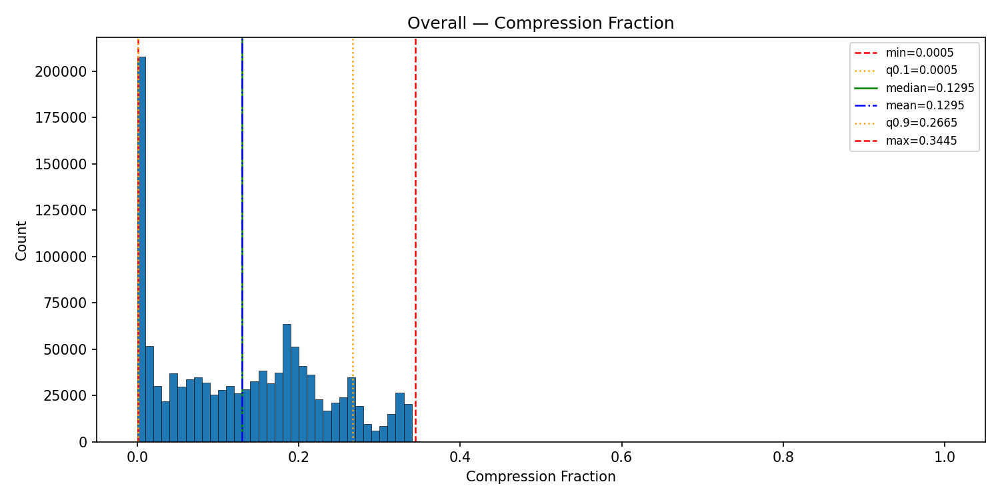

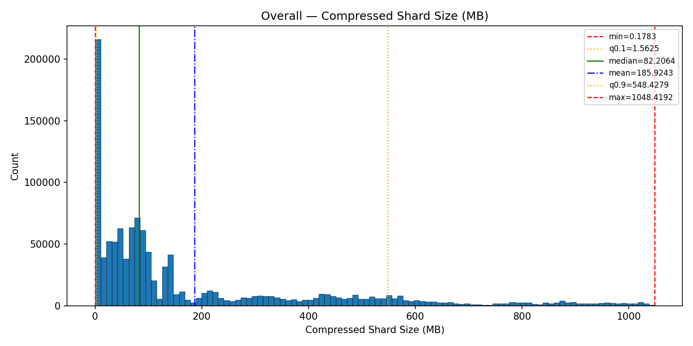

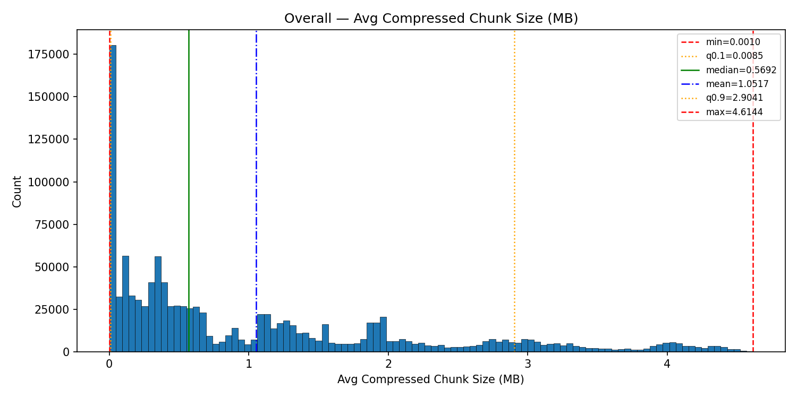

## By Dataset

### ecmwf-ifs-ens-forecast-15-day-0-25-degree

**Compression Fraction**

| Facet | Min | Q0.1 | Median | Mean | Q0.9 | Max | Count |
| --- | ---: | ---: | ---: | ---: | ---: | ---: | ---: |
| ecmwf-ifs-ens-forecast-15-day-0-25-degree | 0.0005 | 0.0065 | 0.0795 | 0.1017 | 0.2435 | 0.2725 | 195540 |

**Compressed Shard Size (MB)**

| Facet | Min | Q0.1 | Median | Mean | Q0.9 | Max | Count |
| --- | ---: | ---: | ---: | ---: | ---: | ---: | ---: |
| ecmwf-ifs-ens-forecast-15-day-0-25-degree | 0.8467 | 11.0068 | 134.6221 | 172.1986 | 412.3330 | 461.4404 | 195540 |

**Avg Compressed Chunk Size (MB)**

| Facet | Min | Q0.1 | Median | Mean | Q0.9 | Max | Count |
| --- | ---: | ---: | ---: | ---: | ---: | ---: | ---: |
| ecmwf-ifs-ens-forecast-15-day-0-25-degree | 0.0085 | 0.1101 | 1.3462 | 1.7220 | 4.1233 | 4.6144 | 195540 |

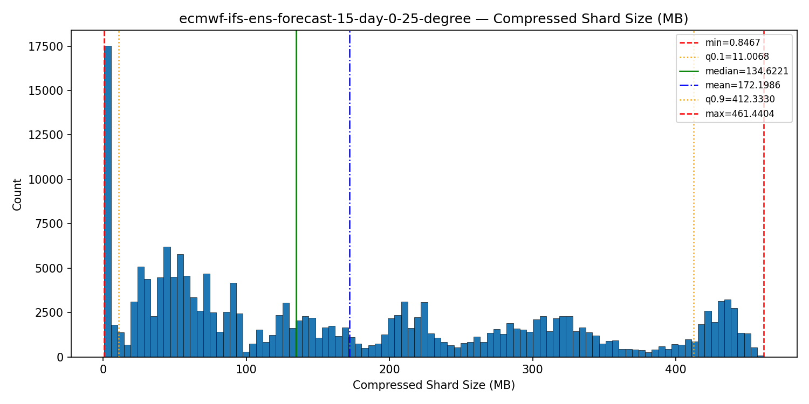

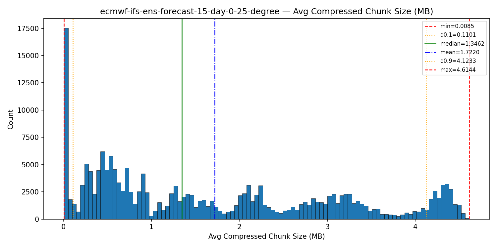

### noaa-gefs-analysis

**Compression Fraction**

| Facet | Min | Q0.1 | Median | Mean | Q0.9 | Max | Count |
| --- | ---: | ---: | ---: | ---: | ---: | ---: | ---: |
| noaa-gefs-analysis | 0.0005 | 0.0005 | 0.1175 | 0.1191 | 0.2565 | 0.3445 | 4752 |

**Compressed Shard Size (MB)**

| Facet | Min | Q0.1 | Median | Mean | Q0.9 | Max | Count |
| --- | ---: | ---: | ---: | ---: | ---: | ---: | ---: |
| noaa-gefs-analysis | 0.8100 | 0.8100 | 190.3500 | 193.0118 | 415.5300 | 558.0900 | 4752 |

**Avg Compressed Chunk Size (MB)**

| Facet | Min | Q0.1 | Median | Mean | Q0.9 | Max | Count |
| --- | ---: | ---: | ---: | ---: | ---: | ---: | ---: |
| noaa-gefs-analysis | 0.0028 | 0.0028 | 0.6609 | 0.6702 | 1.4428 | 1.9378 | 4752 |

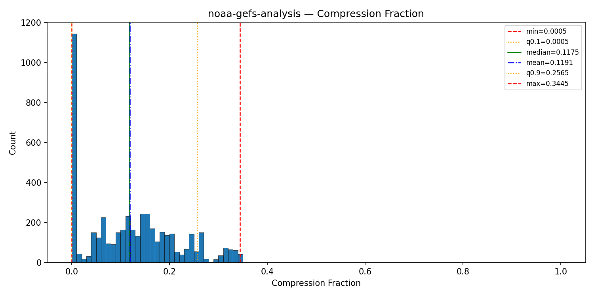

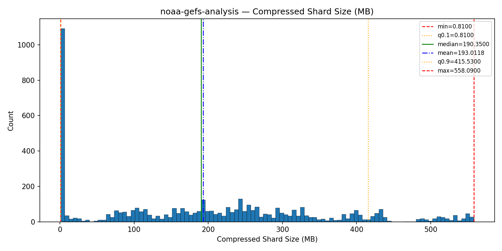

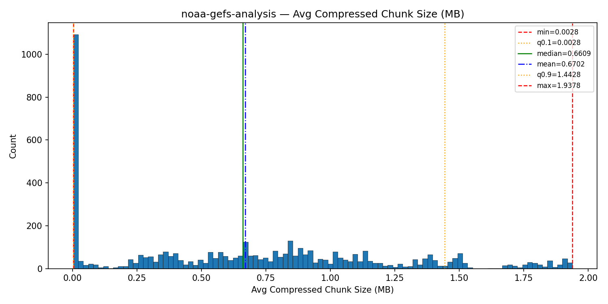

### noaa-gefs-forecast-35-day

**Compression Fraction**

| Facet | Min | Q0.1 | Median | Mean | Q0.9 | Max | Count |
| --- | ---: | ---: | ---: | ---: | ---: | ---: | ---: |
| noaa-gefs-forecast-35-day | 0.0005 | 0.0045 | 0.1445 | 0.1359 | 0.2785 | 0.3355 | 349184 |

**Compressed Shard Size (MB)**

| Facet | Min | Q0.1 | Median | Mean | Q0.9 | Max | Count |
| --- | ---: | ---: | ---: | ---: | ---: | ---: | ---: |
| noaa-gefs-forecast-35-day | 1.5625 | 14.0623 | 451.5546 | 424.6549 | 870.2973 | 1048.4192 | 349184 |

**Avg Compressed Chunk Size (MB)**

| Facet | Min | Q0.1 | Median | Mean | Q0.9 | Max | Count |
| --- | ---: | ---: | ---: | ---: | ---: | ---: | ---: |
| noaa-gefs-forecast-35-day | 0.0010 | 0.0093 | 0.2975 | 0.2797 | 0.5733 | 0.6907 | 349184 |

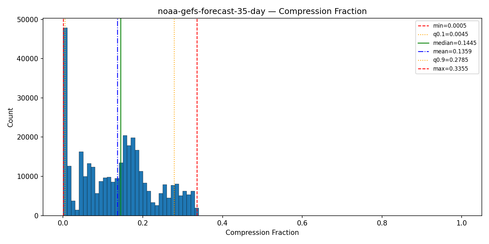

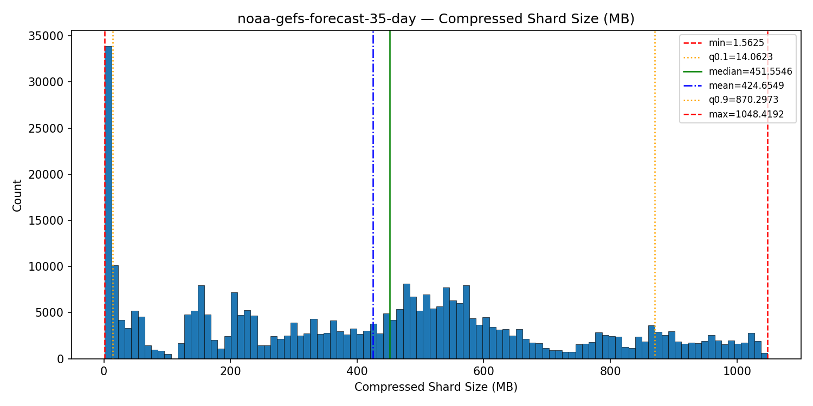

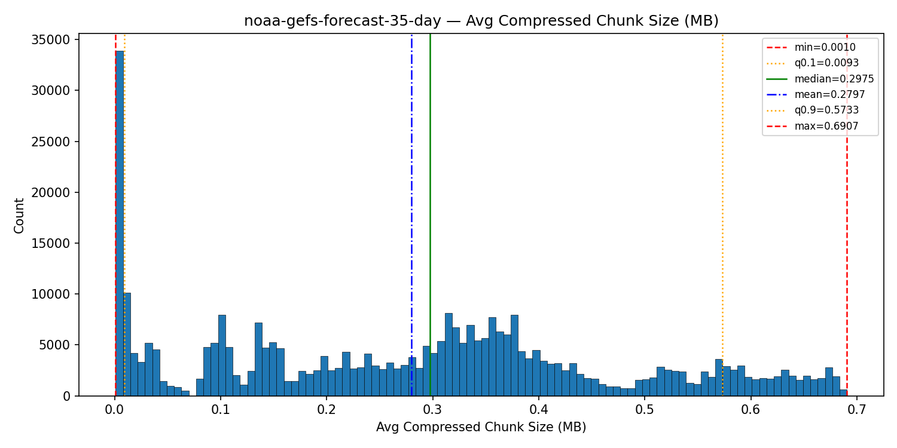

### noaa-gfs-analysis

**Compression Fraction**

| Facet | Min | Q0.1 | Median | Mean | Q0.9 | Max | Count |
| --- | ---: | ---: | ---: | ---: | ---: | ---: | ---: |
| noaa-gfs-analysis | 0.0005 | 0.0035 | 0.0975 | 0.1016 | 0.1925 | 0.2625 | 5040 |

**Compressed Shard Size (MB)**

| Facet | Min | Q0.1 | Median | Mean | Q0.9 | Max | Count |
| --- | ---: | ---: | ---: | ---: | ---: | ---: | ---: |
| noaa-gfs-analysis | 0.4395 | 3.0762 | 85.6934 | 89.2686 | 169.1895 | 230.7129 | 5040 |

**Avg Compressed Chunk Size (MB)**

| Facet | Min | Q0.1 | Median | Mean | Q0.9 | Max | Count |
| --- | ---: | ---: | ---: | ---: | ---: | ---: | ---: |
| noaa-gfs-analysis | 0.0069 | 0.0481 | 1.3390 | 1.3948 | 2.6436 | 3.6049 | 5040 |

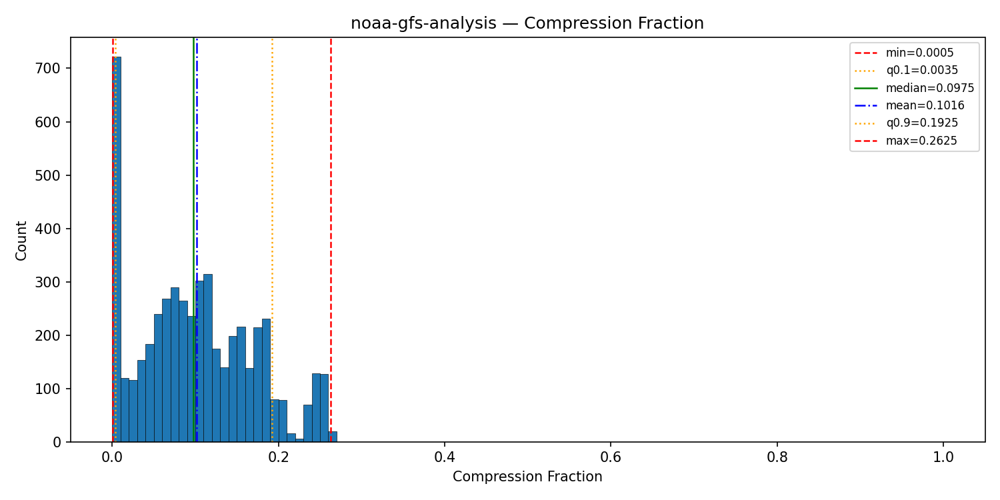

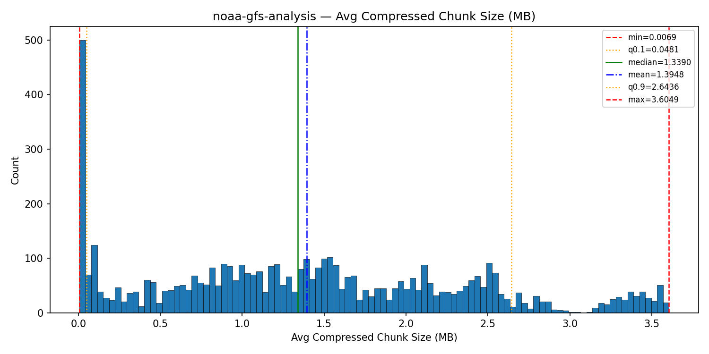

### noaa-gfs-forecast

**Compression Fraction**

| Facet | Min | Q0.1 | Median | Mean | Q0.9 | Max | Count |
| --- | ---: | ---: | ---: | ---: | ---: | ---: | ---: |
| noaa-gfs-forecast | 0.0005 | 0.0035 | 0.1905 | 0.1692 | 0.3235 | 0.3415 | 297696 |

**Compressed Shard Size (MB)**

| Facet | Min | Q0.1 | Median | Mean | Q0.9 | Max | Count |
| --- | ---: | ---: | ---: | ---: | ---: | ---: | ---: |
| noaa-gfs-forecast | 0.2111 | 1.4778 | 80.4355 | 71.4292 | 136.5925 | 144.1927 | 297696 |

**Avg Compressed Chunk Size (MB)**

| Facet | Min | Q0.1 | Median | Mean | Q0.9 | Max | Count |
| --- | ---: | ---: | ---: | ---: | ---: | ---: | ---: |
| noaa-gfs-forecast | 0.0029 | 0.0205 | 1.1172 | 0.9921 | 1.8971 | 2.0027 | 297696 |

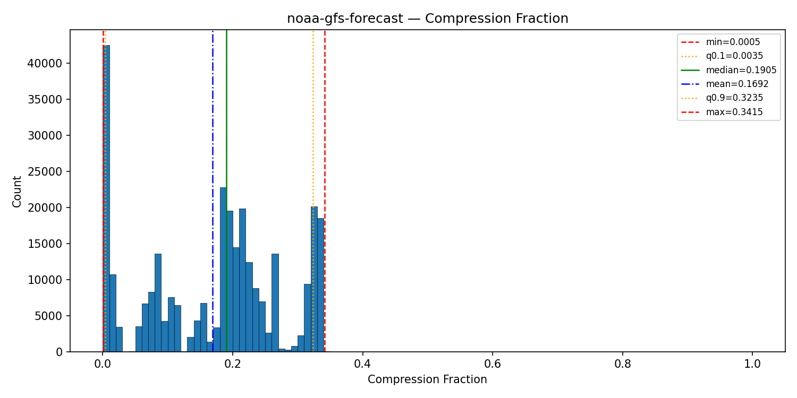

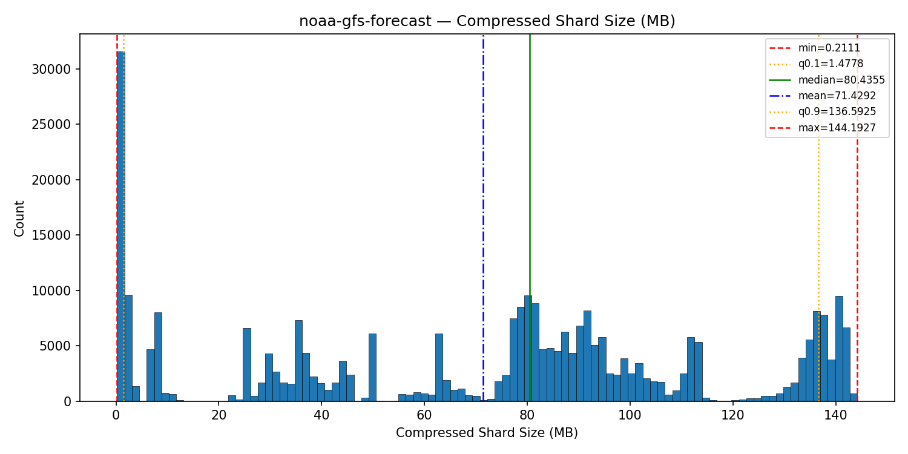

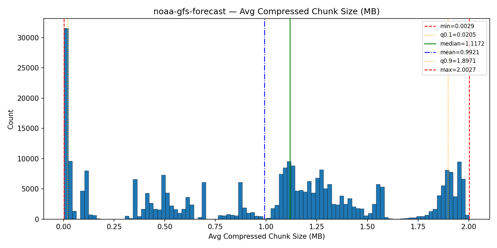

### noaa-hrrr-analysis

**Compression Fraction**

| Facet | Min | Q0.1 | Median | Mean | Q0.9 | Max | Count |
| --- | ---: | ---: | ---: | ---: | ---: | ---: | ---: |
| noaa-hrrr-analysis | 0.0005 | 0.0005 | 0.0655 | 0.0840 | 0.2105 | 0.2685 | 9776 |

**Compressed Shard Size (MB)**

| Facet | Min | Q0.1 | Median | Mean | Q0.9 | Max | Count |
| --- | ---: | ---: | ---: | ---: | ---: | ---: | ---: |
| noaa-hrrr-analysis | 1.0011 | 1.0011 | 131.1479 | 168.1381 | 421.4754 | 537.6064 | 9776 |

**Avg Compressed Chunk Size (MB)**

| Facet | Min | Q0.1 | Median | Mean | Q0.9 | Max | Count |
| --- | ---: | ---: | ---: | ---: | ---: | ---: | ---: |
| noaa-hrrr-analysis | 0.0083 | 0.0083 | 1.0929 | 1.4012 | 3.5123 | 4.4801 | 9776 |

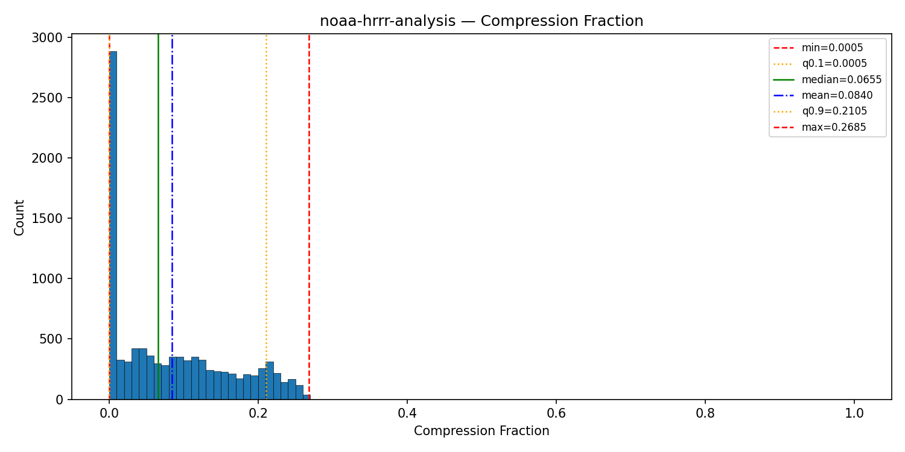

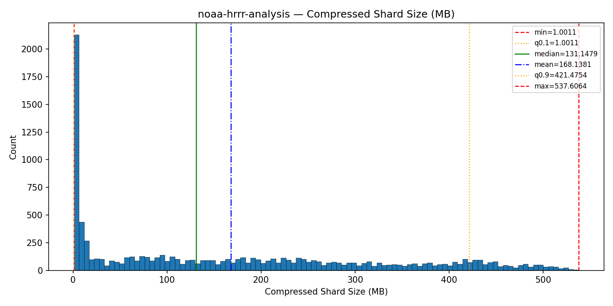

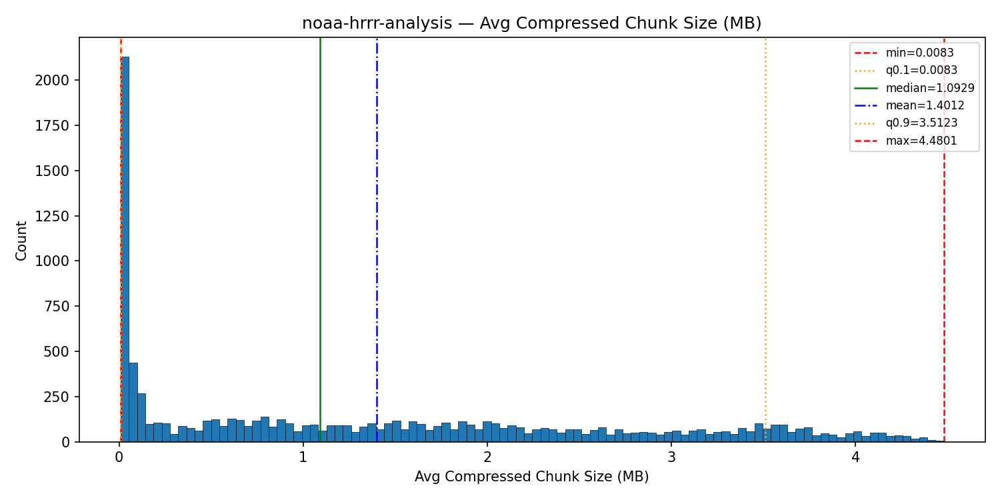

### noaa-hrrr-forecast-48-hour

**Compression Fraction**

| Facet | Min | Q0.1 | Median | Mean | Q0.9 | Max | Count |
| --- | ---: | ---: | ---: | ---: | ---: | ---: | ---: |
| noaa-hrrr-forecast-48-hour | 0.0005 | 0.0005 | 0.1115 | 0.1103 | 0.2405 | 0.2885 | 290654 |

**Compressed Shard Size (MB)**

| Facet | Min | Q0.1 | Median | Mean | Q0.9 | Max | Count |
| --- | ---: | ---: | ---: | ---: | ---: | ---: | ---: |
| noaa-hrrr-forecast-48-hour | 0.1783 | 0.1783 | 39.7658 | 39.3554 | 85.7728 | 102.8917 | 290654 |

**Avg Compressed Chunk Size (MB)**

| Facet | Min | Q0.1 | Median | Mean | Q0.9 | Max | Count |
| --- | ---: | ---: | ---: | ---: | ---: | ---: | ---: |
| noaa-hrrr-forecast-48-hour | 0.0074 | 0.0074 | 1.6569 | 1.6398 | 3.5739 | 4.2872 | 290654 |

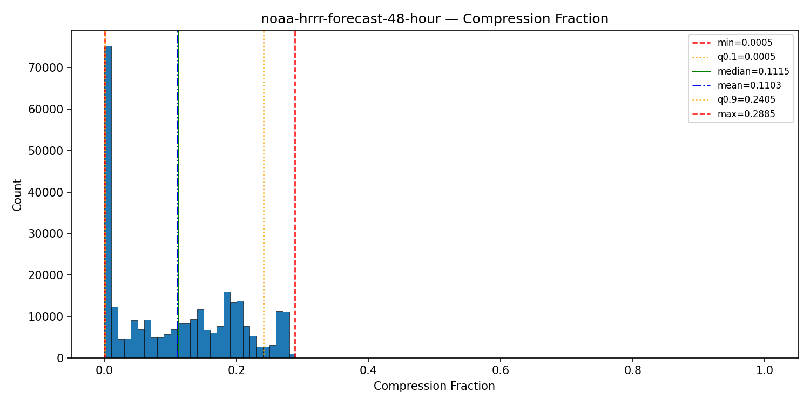

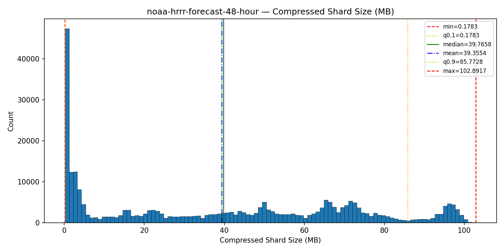

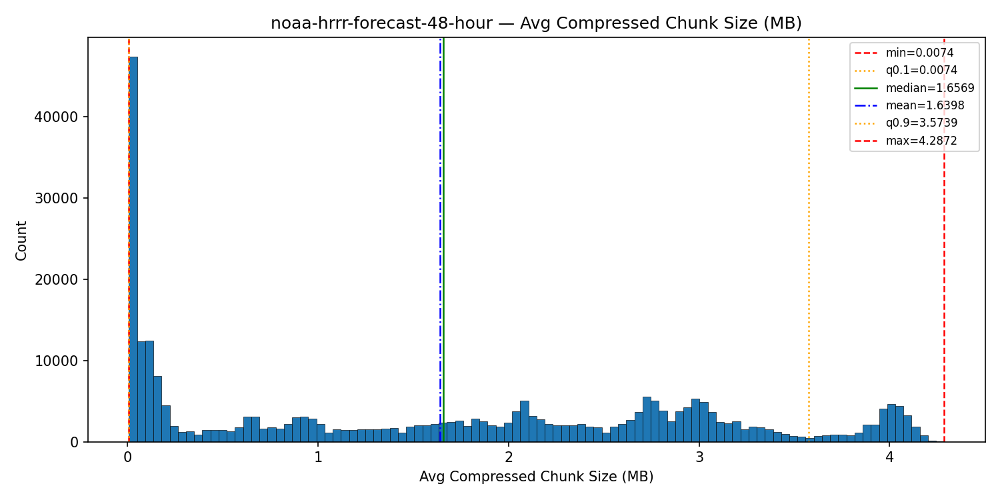

### noaa-mrms-conus-analysis-hourly

**Compression Fraction**

| Facet | Min | Q0.1 | Median | Mean | Q0.9 | Max | Count |
| --- | ---: | ---: | ---: | ---: | ---: | ---: | ---: |
| noaa-mrms-conus-analysis-hourly | 0.0005 | 0.0005 | 0.0025 | 0.0046 | 0.0115 | 0.0315 | 19250 |

**Compressed Shard Size (MB)**

| Facet | Min | Q0.1 | Median | Mean | Q0.9 | Max | Count |
| --- | ---: | ---: | ---: | ---: | ---: | ---: | ---: |
| noaa-mrms-conus-analysis-hourly | 1.2112 | 1.2112 | 6.0562 | 11.1672 | 27.8586 | 76.3083 | 19250 |

**Avg Compressed Chunk Size (MB)**

| Facet | Min | Q0.1 | Median | Mean | Q0.9 | Max | Count |
| --- | ---: | ---: | ---: | ---: | ---: | ---: | ---: |
| noaa-mrms-conus-analysis-hourly | 0.0124 | 0.0124 | 0.0618 | 0.1140 | 0.2843 | 0.7787 | 19250 |

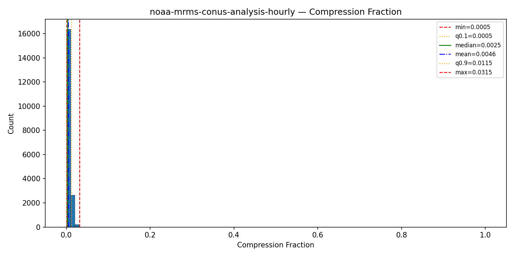

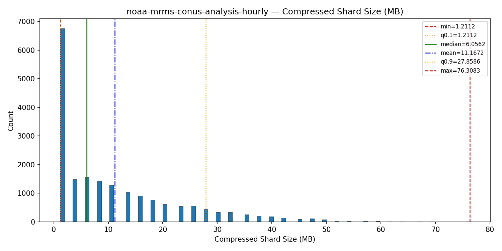

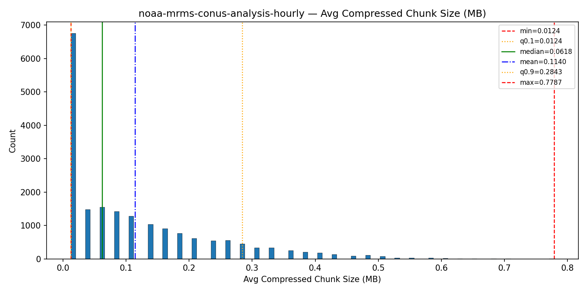

## By Data Variable

### categorical_freezing_rain_surface

**Compression Fraction**

| Facet | Min | Q0.1 | Median | Mean | Q0.9 | Max | Count |
| --- | ---: | ---: | ---: | ---: | ---: | ---: | ---: |
| categorical_freezing_rain_surface | 0.0005 | 0.0005 | 0.0005 | 0.0006 | 0.0005 | 0.0035 | 42059 |

**Compressed Shard Size (MB)**

| Facet | Min | Q0.1 | Median | Mean | Q0.9 | Max | Count |
| --- | ---: | ---: | ---: | ---: | ---: | ---: | ---: |
| categorical_freezing_rain_surface | 0.1783 | 0.1783 | 0.2111 | 0.7485 | 1.5625 | 7.0079 | 42059 |

**Avg Compressed Chunk Size (MB)**

| Facet | Min | Q0.1 | Median | Mean | Q0.9 | Max | Count |
| --- | ---: | ---: | ---: | ---: | ---: | ---: | ---: |
| categorical_freezing_rain_surface | 0.0010 | 0.0010 | 0.0029 | 0.0042 | 0.0074 | 0.0584 | 42059 |

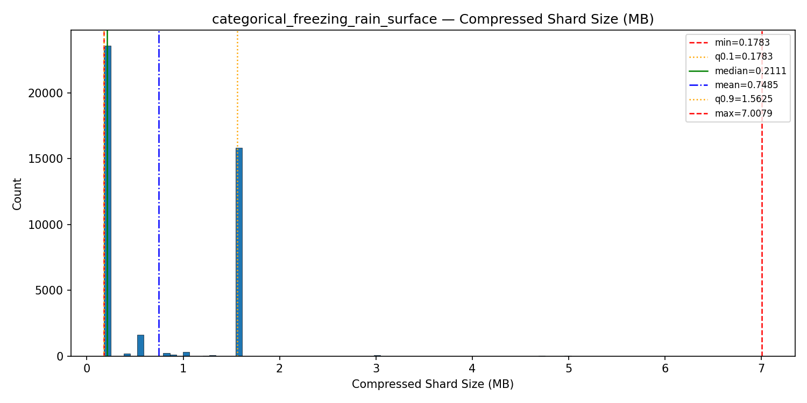

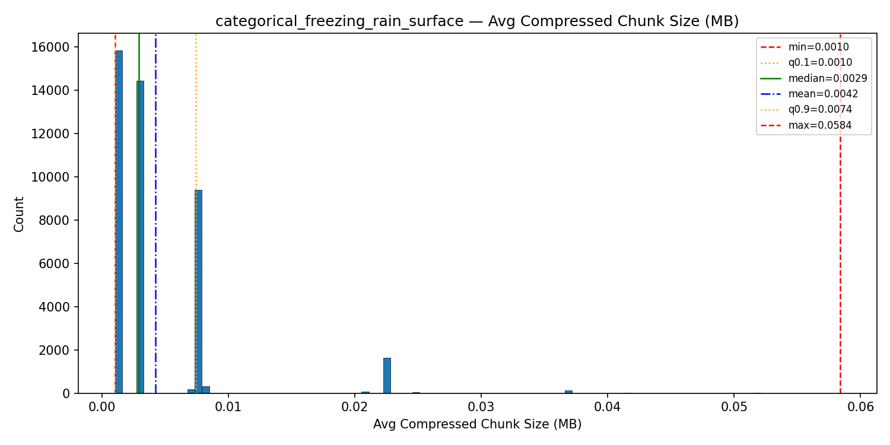

### categorical_ice_pellets_surface

**Compression Fraction**

| Facet | Min | Q0.1 | Median | Mean | Q0.9 | Max | Count |
| --- | ---: | ---: | ---: | ---: | ---: | ---: | ---: |
| categorical_ice_pellets_surface | 0.0005 | 0.0005 | 0.0005 | 0.0005 | 0.0005 | 0.0015 | 42059 |

**Compressed Shard Size (MB)**

| Facet | Min | Q0.1 | Median | Mean | Q0.9 | Max | Count |
| --- | ---: | ---: | ---: | ---: | ---: | ---: | ---: |
| categorical_ice_pellets_surface | 0.1783 | 0.1783 | 0.2111 | 0.7255 | 1.5625 | 3.0034 | 42059 |

**Avg Compressed Chunk Size (MB)**

| Facet | Min | Q0.1 | Median | Mean | Q0.9 | Max | Count |
| --- | ---: | ---: | ---: | ---: | ---: | ---: | ---: |
| categorical_ice_pellets_surface | 0.0010 | 0.0010 | 0.0029 | 0.0035 | 0.0074 | 0.0250 | 42059 |

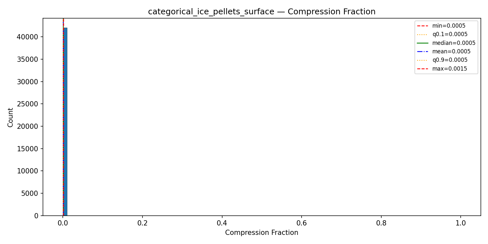

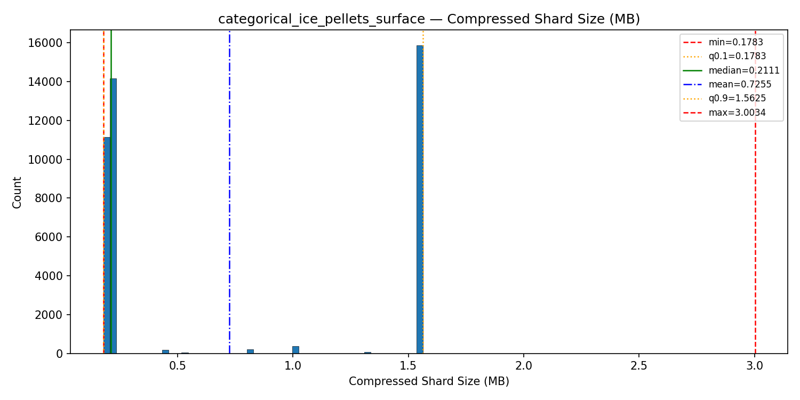

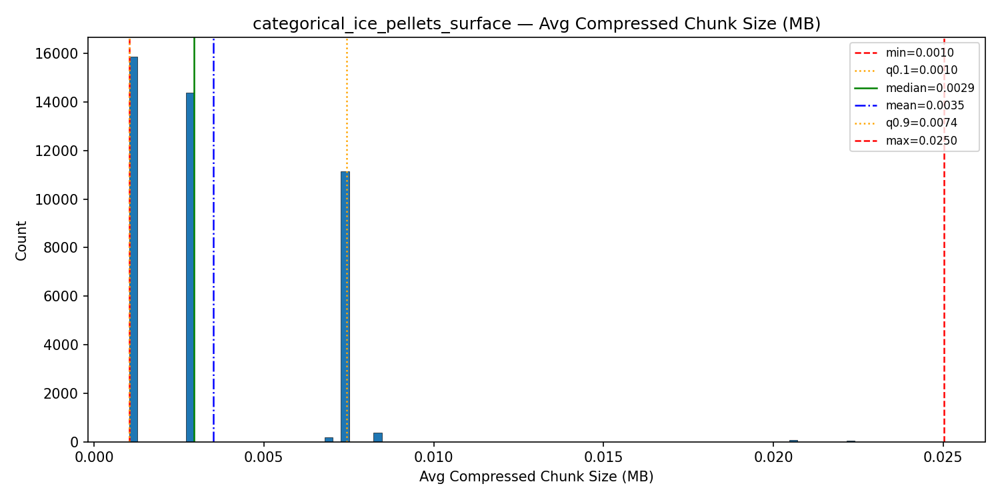

### categorical_precipitation_type_surface

**Compression Fraction**

| Facet | Min | Q0.1 | Median | Mean | Q0.9 | Max | Count |
| --- | ---: | ---: | ---: | ---: | ---: | ---: | ---: |
| categorical_precipitation_type_surface | 0.0005 | 0.0005 | 0.0035 | 0.0152 | 0.0505 | 0.0585 | 14440 |

**Compressed Shard Size (MB)**

| Facet | Min | Q0.1 | Median | Mean | Q0.9 | Max | Count |
| --- | ---: | ---: | ---: | ---: | ---: | ---: | ---: |
| categorical_precipitation_type_surface | 0.8467 | 0.8467 | 7.6201 | 26.2766 | 85.5146 | 99.0615 | 14440 |

**Avg Compressed Chunk Size (MB)**

| Facet | Min | Q0.1 | Median | Mean | Q0.9 | Max | Count |
| --- | ---: | ---: | ---: | ---: | ---: | ---: | ---: |
| categorical_precipitation_type_surface | 0.0085 | 0.0085 | 0.0762 | 0.2631 | 0.8551 | 0.9906 | 14440 |

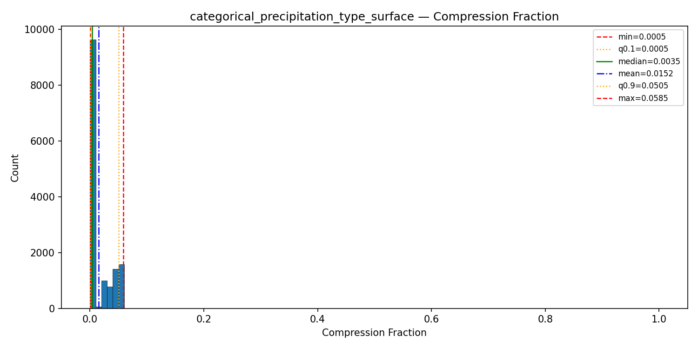

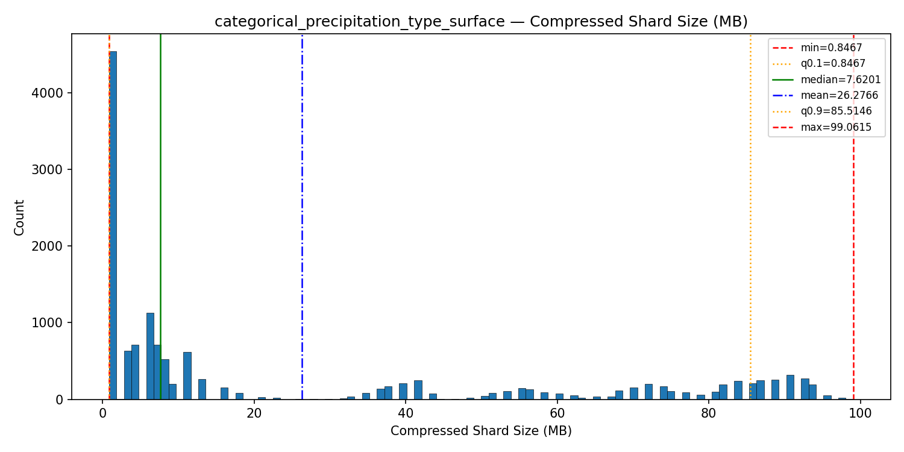

### categorical_rain_surface

**Compression Fraction**

| Facet | Min | Q0.1 | Median | Mean | Q0.9 | Max | Count |
| --- | ---: | ---: | ---: | ---: | ---: | ---: | ---: |
| categorical_rain_surface | 0.0005 | 0.0075 | 0.0155 | 0.0152 | 0.0205 | 0.0365 | 42059 |

**Compressed Shard Size (MB)**

| Facet | Min | Q0.1 | Median | Mean | Q0.9 | Max | Count |
| --- | ---: | ---: | ---: | ---: | ---: | ---: | ---: |
| categorical_rain_surface | 0.1783 | 2.6748 | 8.2336 | 23.4619 | 57.8115 | 92.1859 | 42059 |

**Avg Compressed Chunk Size (MB)**

| Facet | Min | Q0.1 | Median | Mean | Q0.9 | Max | Count |
| --- | ---: | ---: | ---: | ---: | ---: | ---: | ---: |
| categorical_rain_surface | 0.0028 | 0.0298 | 0.0966 | 0.0881 | 0.1560 | 0.5013 | 42059 |

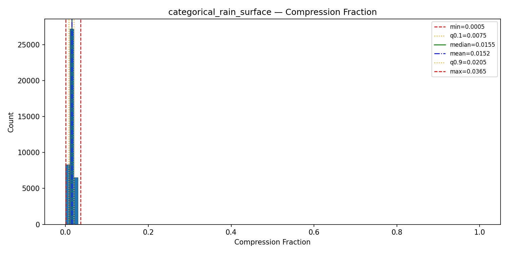

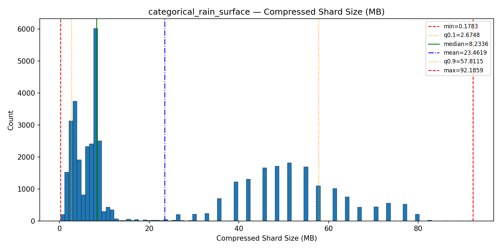

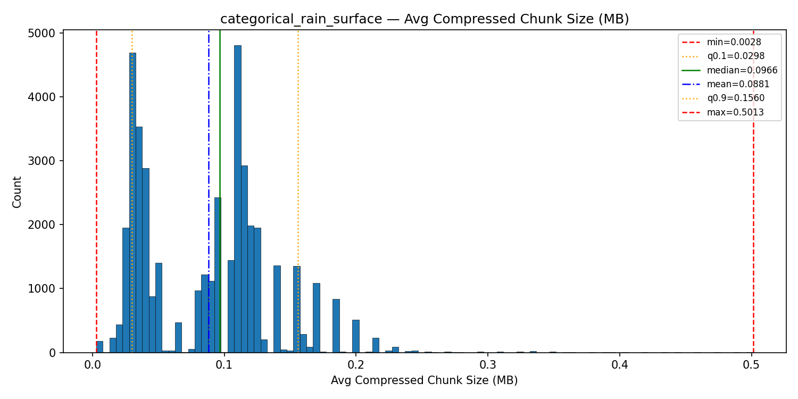

### categorical_snow_surface

**Compression Fraction**

| Facet | Min | Q0.1 | Median | Mean | Q0.9 | Max | Count |
| --- | ---: | ---: | ---: | ---: | ---: | ---: | ---: |
| categorical_snow_surface | 0.0005 | 0.0005 | 0.0045 | 0.0046 | 0.0075 | 0.0115 | 42059 |

**Compressed Shard Size (MB)**

| Facet | Min | Q0.1 | Median | Mean | Q0.9 | Max | Count |
| --- | ---: | ---: | ---: | ---: | ---: | ---: | ---: |
| categorical_snow_surface | 0.1783 | 0.1783 | 2.3223 | 7.7484 | 20.3121 | 35.9369 | 42059 |

**Avg Compressed Chunk Size (MB)**

| Facet | Min | Q0.1 | Median | Mean | Q0.9 | Max | Count |
| --- | ---: | ---: | ---: | ---: | ---: | ---: | ---: |
| categorical_snow_surface | 0.0028 | 0.0074 | 0.0205 | 0.0246 | 0.0520 | 0.1752 | 42059 |

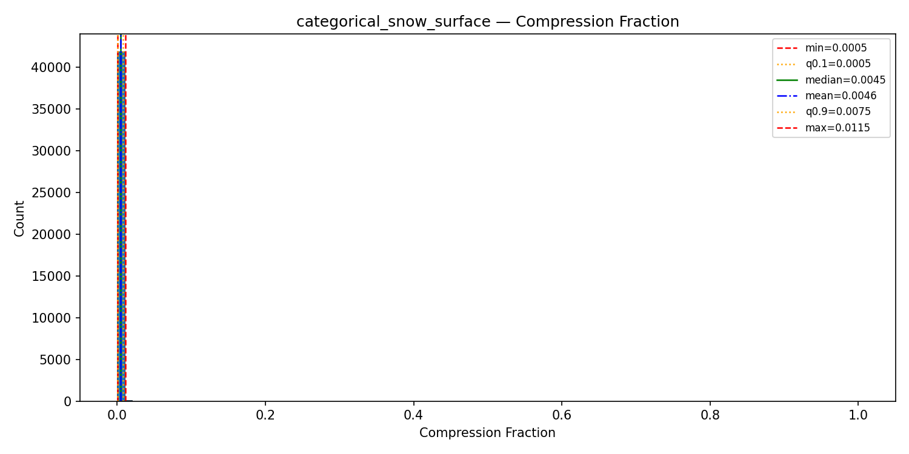

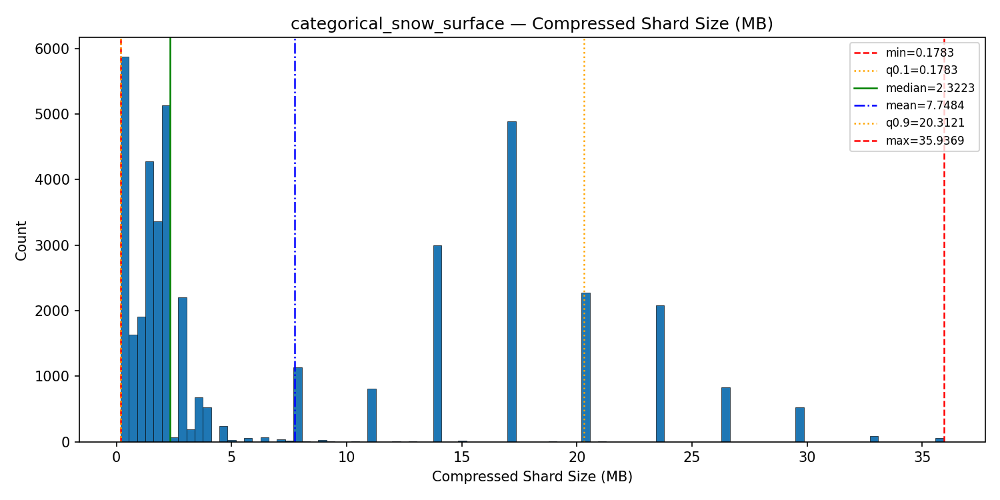

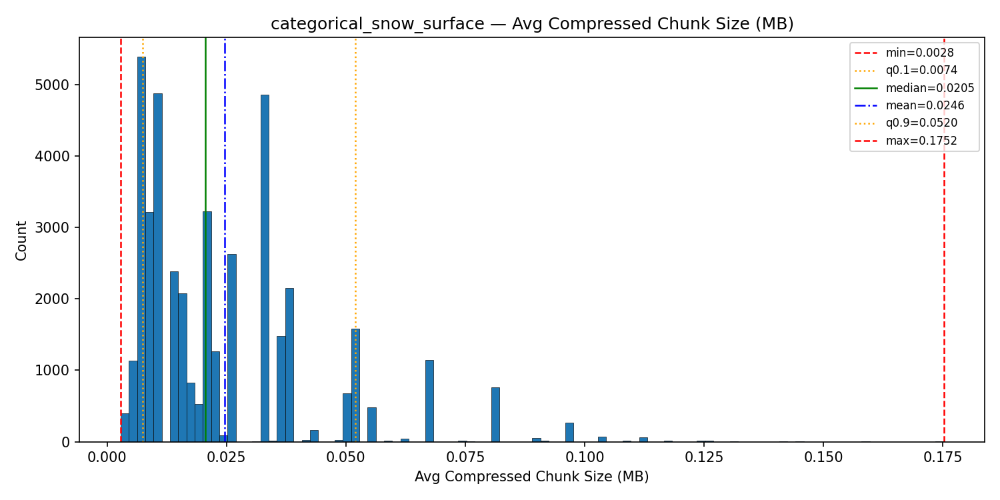

### composite_reflectivity

**Compression Fraction**

| Facet | Min | Q0.1 | Median | Mean | Q0.9 | Max | Count |
| --- | ---: | ---: | ---: | ---: | ---: | ---: | ---: |
| composite_reflectivity | 0.0005 | 0.0615 | 0.0885 | 0.0902 | 0.1215 | 0.1835 | 11555 |

**Compressed Shard Size (MB)**

| Facet | Min | Q0.1 | Median | Mean | Q0.9 | Max | Count |
| --- | ---: | ---: | ---: | ---: | ---: | ---: | ---: |
| composite_reflectivity | 0.1783 | 23.0035 | 32.2763 | 34.7994 | 45.1154 | 231.2608 | 11555 |

**Avg Compressed Chunk Size (MB)**

| Facet | Min | Q0.1 | Median | Mean | Q0.9 | Max | Count |
| --- | ---: | ---: | ---: | ---: | ---: | ---: | ---: |
| composite_reflectivity | 0.0074 | 0.9288 | 1.3151 | 1.3440 | 1.8055 | 2.7268 | 11555 |

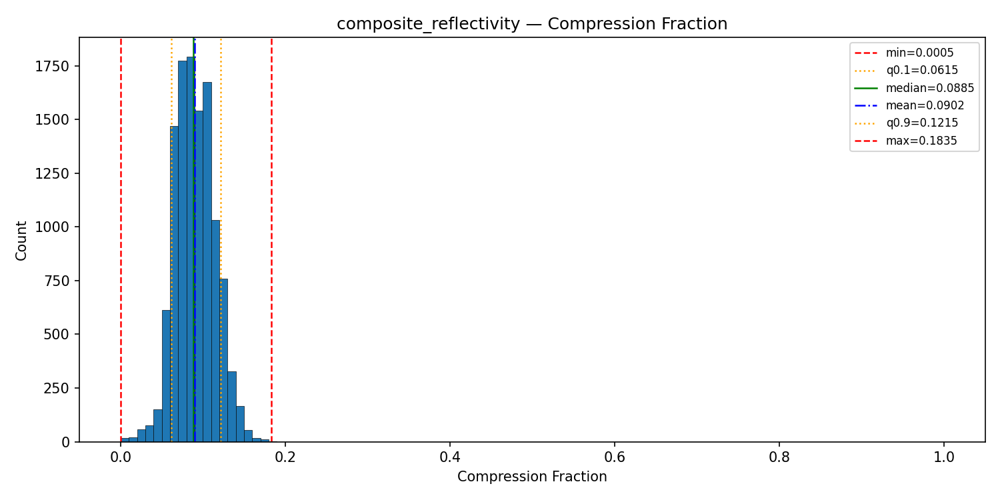

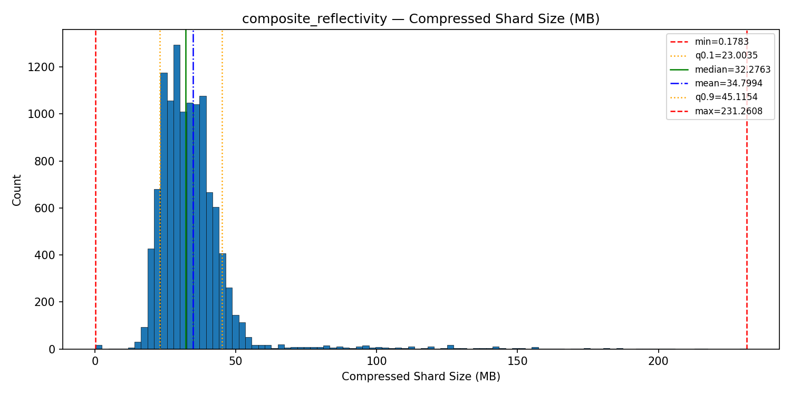

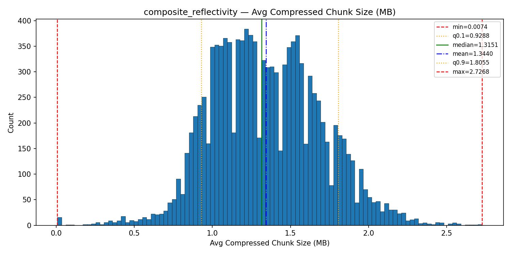

### dew_point_temperature_2m

**Compression Fraction**

| Facet | Min | Q0.1 | Median | Mean | Q0.9 | Max | Count |
| --- | ---: | ---: | ---: | ---: | ---: | ---: | ---: |
| dew_point_temperature_2m | 0.0005 | 0.0325 | 0.1805 | 0.1533 | 0.2125 | 0.2615 | 22145 |

**Compressed Shard Size (MB)**

| Facet | Min | Q0.1 | Median | Mean | Q0.9 | Max | Count |
| --- | ---: | ---: | ---: | ---: | ---: | ---: | ---: |
| dew_point_temperature_2m | 0.1783 | 42.6189 | 68.5811 | 144.8466 | 359.8389 | 503.5680 | 22145 |

**Avg Compressed Chunk Size (MB)**

| Facet | Min | Q0.1 | Median | Mean | Q0.9 | Max | Count |
| --- | ---: | ---: | ---: | ---: | ---: | ---: | ---: |
| dew_point_temperature_2m | 0.0074 | 0.5503 | 2.7120 | 2.4163 | 3.5815 | 4.4281 | 22145 |

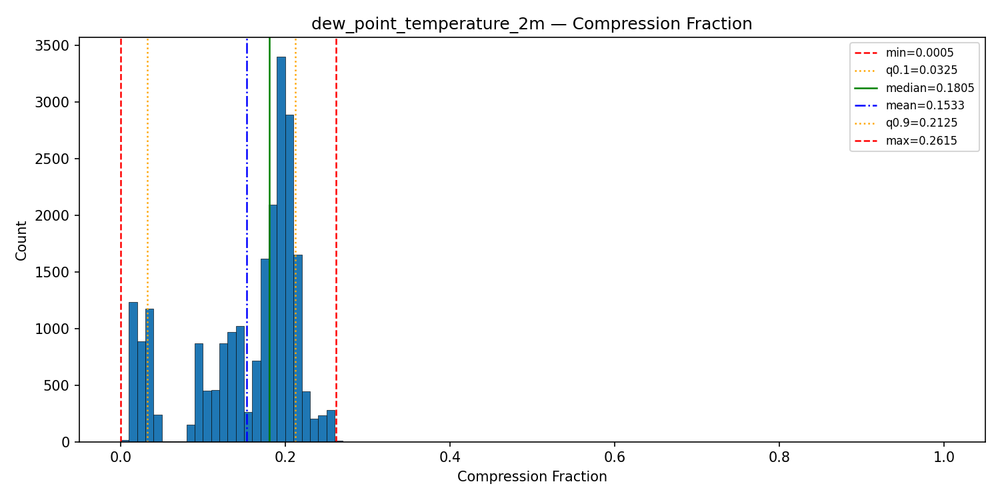

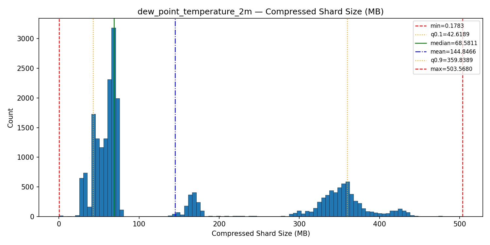

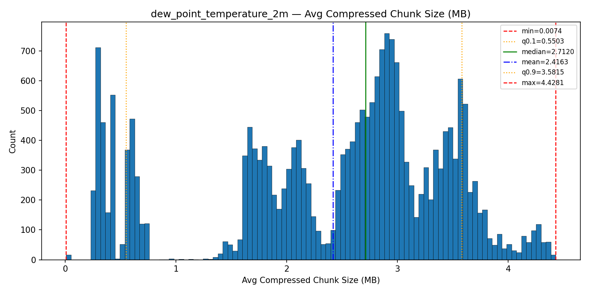

### downward_long_wave_radiation_flux_surface

**Compression Fraction**

| Facet | Min | Q0.1 | Median | Mean | Q0.9 | Max | Count |
| --- | ---: | ---: | ---: | ---: | ---: | ---: | ---: |
| downward_long_wave_radiation_flux_surface | 0.0005 | 0.0935 | 0.1545 | 0.1497 | 0.1915 | 0.2265 | 52649 |

**Compressed Shard Size (MB)**

| Facet | Min | Q0.1 | Median | Mean | Q0.9 | Max | Count |
| --- | ---: | ---: | ---: | ---: | ---: | ---: | ---: |
| downward_long_wave_radiation_flux_surface | 0.1783 | 52.6049 | 80.0132 | 205.1998 | 489.0539 | 560.9277 | 52649 |

**Avg Compressed Chunk Size (MB)**

| Facet | Min | Q0.1 | Median | Mean | Q0.9 | Max | Count |
| --- | ---: | ---: | ---: | ---: | ---: | ---: | ---: |
| downward_long_wave_radiation_flux_surface | 0.0074 | 0.2954 | 1.0878 | 1.2445 | 2.8011 | 3.3658 | 52649 |

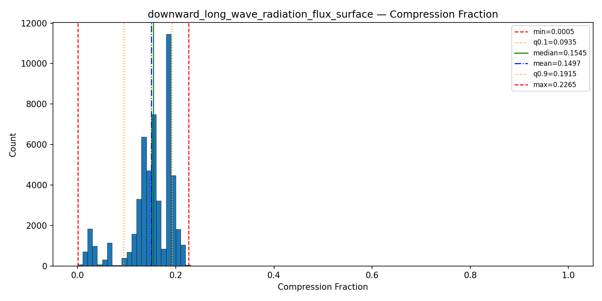

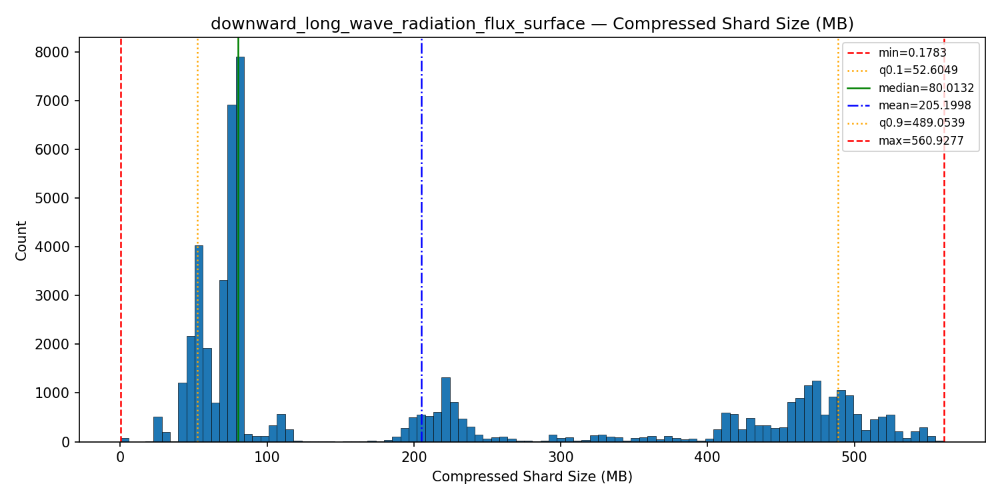

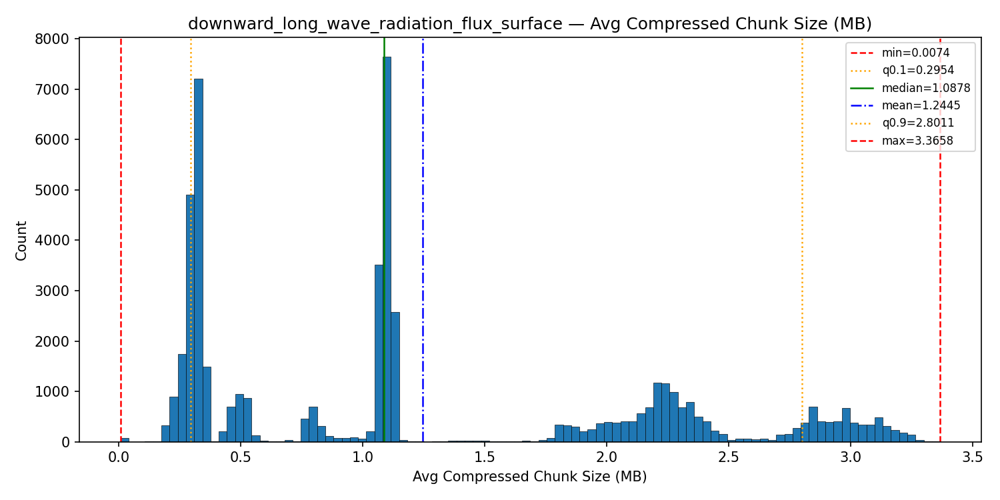

### downward_short_wave_radiation_flux_surface

**Compression Fraction**

| Facet | Min | Q0.1 | Median | Mean | Q0.9 | Max | Count |
| --- | ---: | ---: | ---: | ---: | ---: | ---: | ---: |
| downward_short_wave_radiation_flux_surface | 0.0005 | 0.0665 | 0.1375 | 0.1344 | 0.1945 | 0.2125 | 52649 |

**Compressed Shard Size (MB)**

| Facet | Min | Q0.1 | Median | Mean | Q0.9 | Max | Count |
| --- | ---: | ---: | ---: | ---: | ---: | ---: | ---: |
| downward_short_wave_radiation_flux_surface | 0.1783 | 38.3392 | 82.9689 | 182.9737 | 439.0548 | 664.0509 | 52649 |

**Avg Compressed Chunk Size (MB)**

| Facet | Min | Q0.1 | Median | Mean | Q0.9 | Max | Count |
| --- | ---: | ---: | ---: | ---: | ---: | ---: | ---: |
| downward_short_wave_radiation_flux_surface | 0.0074 | 0.1966 | 1.1054 | 1.0935 | 2.3114 | 3.1581 | 52649 |

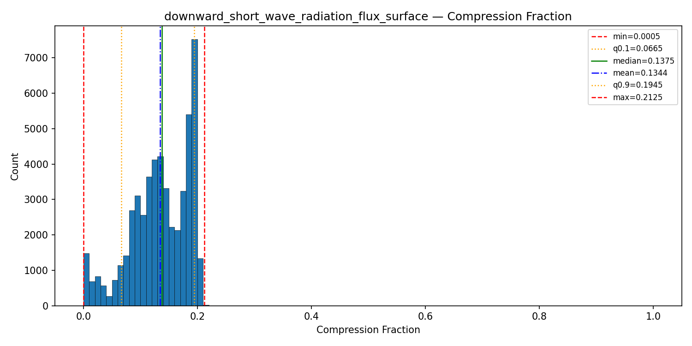

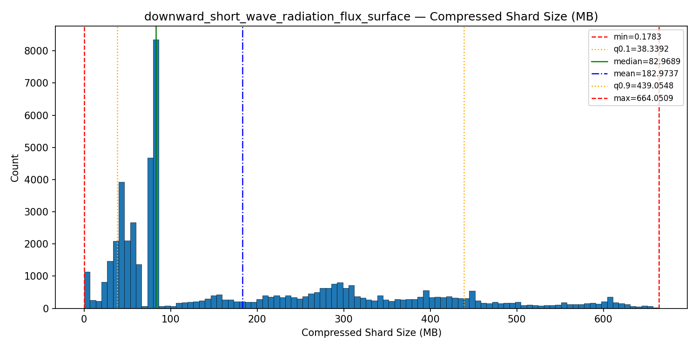

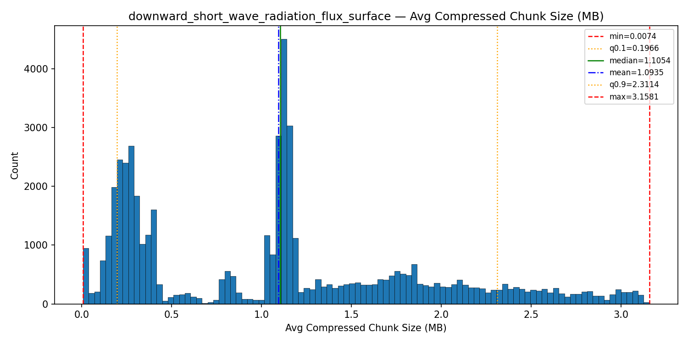

### geopotential_height_500hpa

**Compression Fraction**

| Facet | Min | Q0.1 | Median | Mean | Q0.9 | Max | Count |
| --- | ---: | ---: | ---: | ---: | ---: | ---: | ---: |
| geopotential_height_500hpa | 0.0055 | 0.0145 | 0.0685 | 0.0610 | 0.0755 | 0.0845 | 26678 |

**Compressed Shard Size (MB)**

| Facet | Min | Q0.1 | Median | Mean | Q0.9 | Max | Count |
| --- | ---: | ---: | ---: | ---: | ---: | ---: | ---: |
| geopotential_height_500hpa | 9.3135 | 24.5537 | 201.5590 | 161.8248 | 229.6835 | 245.3082 | 26678 |

**Avg Compressed Chunk Size (MB)**

| Facet | Min | Q0.1 | Median | Mean | Q0.9 | Max | Count |
| --- | ---: | ---: | ---: | ---: | ---: | ---: | ---: |
| geopotential_height_500hpa | 0.0793 | 0.1328 | 0.1492 | 0.4175 | 1.2616 | 1.4309 | 26678 |


### geopotential_height_850hpa

**Compression Fraction**

| Facet | Min | Q0.1 | Median | Mean | Q0.9 | Max | Count |
| --- | ---: | ---: | ---: | ---: | ---: | ---: | ---: |
| geopotential_height_850hpa | 0.0125 | 0.0235 | 0.1165 | 0.0846 | 0.1325 | 0.1415 | 9645 |

**Compressed Shard Size (MB)**

| Facet | Min | Q0.1 | Median | Mean | Q0.9 | Max | Count |
| --- | ---: | ---: | ---: | ---: | ---: | ---: | ---: |
| geopotential_height_850hpa | 21.1670 | 39.7939 | 197.2764 | 143.2248 | 224.3701 | 239.6104 | 9645 |

**Avg Compressed Chunk Size (MB)**

| Facet | Min | Q0.1 | Median | Mean | Q0.9 | Max | Count |
| --- | ---: | ---: | ---: | ---: | ---: | ---: | ---: |
| geopotential_height_850hpa | 0.2117 | 0.3979 | 1.9728 | 1.4322 | 2.2437 | 2.3961 | 9645 |


### geopotential_height_925hpa

**Compression Fraction**

| Facet | Min | Q0.1 | Median | Mean | Q0.9 | Max | Count |
| --- | ---: | ---: | ---: | ---: | ---: | ---: | ---: |
| geopotential_height_925hpa | 0.0175 | 0.0335 | 0.1555 | 0.1139 | 0.1785 | 0.1845 | 9645 |

**Compressed Shard Size (MB)**

| Facet | Min | Q0.1 | Median | Mean | Q0.9 | Max | Count |
| --- | ---: | ---: | ---: | ---: | ---: | ---: | ---: |
| geopotential_height_925hpa | 29.6338 | 56.7275 | 263.3174 | 192.8647 | 302.2646 | 312.4248 | 9645 |

**Avg Compressed Chunk Size (MB)**

| Facet | Min | Q0.1 | Median | Mean | Q0.9 | Max | Count |
| --- | ---: | ---: | ---: | ---: | ---: | ---: | ---: |
| geopotential_height_925hpa | 0.2963 | 0.5673 | 2.6332 | 1.9286 | 3.0226 | 3.1242 | 9645 |


### geopotential_height_cloud_ceiling

**Compression Fraction**

| Facet | Min | Q0.1 | Median | Mean | Q0.9 | Max | Count |
| --- | ---: | ---: | ---: | ---: | ---: | ---: | ---: |
| geopotential_height_cloud_ceiling | 0.0005 | 0.0965 | 0.1695 | 0.1720 | 0.2485 | 0.2795 | 42059 |

**Compressed Shard Size (MB)**

| Facet | Min | Q0.1 | Median | Mean | Q0.9 | Max | Count |
| --- | ---: | ---: | ---: | ---: | ---: | ---: | ---: |
| geopotential_height_cloud_ceiling | 0.1783 | 39.0525 | 104.9250 | 228.6609 | 582.8023 | 732.7997 | 42059 |

**Avg Compressed Chunk Size (MB)**

| Facet | Min | Q0.1 | Median | Mean | Q0.9 | Max | Count |
| --- | ---: | ---: | ---: | ---: | ---: | ---: | ---: |
| geopotential_height_cloud_ceiling | 0.0074 | 0.2398 | 1.3107 | 1.0918 | 1.9392 | 3.4401 | 42059 |


### maximum_temperature_2m

**Compression Fraction**

| Facet | Min | Q0.1 | Median | Mean | Q0.9 | Max | Count |
| --- | ---: | ---: | ---: | ---: | ---: | ---: | ---: |
| maximum_temperature_2m | 0.0315 | 0.1435 | 0.1805 | 0.1792 | 0.2185 | 0.2495 | 30504 |

**Compressed Shard Size (MB)**

| Facet | Min | Q0.1 | Median | Mean | Q0.9 | Max | Count |
| --- | ---: | ---: | ---: | ---: | ---: | ---: | ---: |
| maximum_temperature_2m | 27.6855 | 76.2131 | 398.4305 | 313.7477 | 579.6774 | 779.6739 | 30504 |

**Avg Compressed Chunk Size (MB)**

| Facet | Min | Q0.1 | Median | Mean | Q0.9 | Max | Count |
| --- | ---: | ---: | ---: | ---: | ---: | ---: | ---: |
| maximum_temperature_2m | 0.1328 | 0.2975 | 0.4869 | 0.7233 | 1.2462 | 1.9707 | 30504 |


### minimum_temperature_2m

**Compression Fraction**

| Facet | Min | Q0.1 | Median | Mean | Q0.9 | Max | Count |
| --- | ---: | ---: | ---: | ---: | ---: | ---: | ---: |
| minimum_temperature_2m | 0.0315 | 0.1495 | 0.1855 | 0.1855 | 0.2275 | 0.2575 | 30504 |

**Compressed Shard Size (MB)**

| Facet | Min | Q0.1 | Median | Mean | Q0.9 | Max | Count |
| --- | ---: | ---: | ---: | ---: | ---: | ---: | ---: |
| minimum_temperature_2m | 27.6855 | 77.9021 | 404.6804 | 324.7298 | 598.4270 | 804.6734 | 30504 |

**Avg Compressed Chunk Size (MB)**

| Facet | Min | Q0.1 | Median | Mean | Q0.9 | Max | Count |
| --- | ---: | ---: | ---: | ---: | ---: | ---: | ---: |
| minimum_temperature_2m | 0.1369 | 0.3098 | 0.5033 | 0.7490 | 1.2931 | 2.1767 | 30504 |


### percent_frozen_precipitation_surface

**Compression Fraction**

| Facet | Min | Q0.1 | Median | Mean | Q0.9 | Max | Count |
| --- | ---: | ---: | ---: | ---: | ---: | ---: | ---: |
| percent_frozen_precipitation_surface | 0.0005 | 0.0055 | 0.0895 | 0.0725 | 0.1185 | 0.1625 | 42059 |

**Compressed Shard Size (MB)**

| Facet | Min | Q0.1 | Median | Mean | Q0.9 | Max | Count |
| --- | ---: | ---: | ---: | ---: | ---: | ---: | ---: |
| percent_frozen_precipitation_surface | 0.1783 | 1.9615 | 43.7012 | 130.7992 | 370.3060 | 467.1793 | 42059 |

**Avg Compressed Chunk Size (MB)**

| Facet | Min | Q0.1 | Median | Mean | Q0.9 | Max | Count |
| --- | ---: | ---: | ---: | ---: | ---: | ---: | ---: |
| percent_frozen_precipitation_surface | 0.0028 | 0.0817 | 0.2192 | 0.3060 | 0.6128 | 1.5312 | 42059 |


### precipitable_water_atmosphere

**Compression Fraction**

| Facet | Min | Q0.1 | Median | Mean | Q0.9 | Max | Count |
| --- | ---: | ---: | ---: | ---: | ---: | ---: | ---: |
| precipitable_water_atmosphere | 0.0005 | 0.1485 | 0.1985 | 0.2038 | 0.2665 | 0.2715 | 42059 |

**Compressed Shard Size (MB)**

| Facet | Min | Q0.1 | Median | Mean | Q0.9 | Max | Count |
| --- | ---: | ---: | ---: | ---: | ---: | ---: | ---: |
| precipitable_water_atmosphere | 0.1783 | 56.1714 | 112.5252 | 272.8978 | 626.5515 | 710.9251 | 42059 |

**Avg Compressed Chunk Size (MB)**

| Facet | Min | Q0.1 | Median | Mean | Q0.9 | Max | Count |
| --- | ---: | ---: | ---: | ---: | ---: | ---: | ---: |
| precipitable_water_atmosphere | 0.0074 | 0.3448 | 1.5453 | 1.3504 | 2.5634 | 3.4847 | 42059 |


### precipitation_pass_1_surface

**Compression Fraction**

| Facet | Min | Q0.1 | Median | Mean | Q0.9 | Max | Count |
| --- | ---: | ---: | ---: | ---: | ---: | ---: | ---: |
| precipitation_pass_1_surface | 0.0005 | 0.0005 | 0.0005 | 0.0033 | 0.0095 | 0.0245 | 3850 |

**Compressed Shard Size (MB)**

| Facet | Min | Q0.1 | Median | Mean | Q0.9 | Max | Count |
| --- | ---: | ---: | ---: | ---: | ---: | ---: | ---: |
| precipitation_pass_1_surface | 1.2112 | 1.2112 | 1.2112 | 7.9187 | 23.0136 | 59.3509 | 3850 |

**Avg Compressed Chunk Size (MB)**

| Facet | Min | Q0.1 | Median | Mean | Q0.9 | Max | Count |
| --- | ---: | ---: | ---: | ---: | ---: | ---: | ---: |
| precipitation_pass_1_surface | 0.0124 | 0.0124 | 0.0124 | 0.0808 | 0.2348 | 0.6056 | 3850 |


### precipitation_pass_2_surface

**Compression Fraction**

| Facet | Min | Q0.1 | Median | Mean | Q0.9 | Max | Count |
| --- | ---: | ---: | ---: | ---: | ---: | ---: | ---: |
| precipitation_pass_2_surface | 0.0005 | 0.0005 | 0.0005 | 0.0031 | 0.0095 | 0.0255 | 3850 |

**Compressed Shard Size (MB)**

| Facet | Min | Q0.1 | Median | Mean | Q0.9 | Max | Count |
| --- | ---: | ---: | ---: | ---: | ---: | ---: | ---: |
| precipitation_pass_2_surface | 1.2112 | 1.2112 | 1.2112 | 7.4480 | 23.0136 | 61.7734 | 3850 |

**Avg Compressed Chunk Size (MB)**

| Facet | Min | Q0.1 | Median | Mean | Q0.9 | Max | Count |
| --- | ---: | ---: | ---: | ---: | ---: | ---: | ---: |
| precipitation_pass_2_surface | 0.0124 | 0.0124 | 0.0124 | 0.0760 | 0.2348 | 0.6303 | 3850 |


### precipitation_radar_only_surface

**Compression Fraction**

| Facet | Min | Q0.1 | Median | Mean | Q0.9 | Max | Count |
| --- | ---: | ---: | ---: | ---: | ---: | ---: | ---: |
| precipitation_radar_only_surface | 0.0005 | 0.0005 | 0.0055 | 0.0073 | 0.0165 | 0.0315 | 3850 |

**Compressed Shard Size (MB)**

| Facet | Min | Q0.1 | Median | Mean | Q0.9 | Max | Count |
| --- | ---: | ---: | ---: | ---: | ---: | ---: | ---: |
| precipitation_radar_only_surface | 1.2112 | 1.2112 | 13.3237 | 17.6571 | 39.9710 | 76.3083 | 3850 |

**Avg Compressed Chunk Size (MB)**

| Facet | Min | Q0.1 | Median | Mean | Q0.9 | Max | Count |
| --- | ---: | ---: | ---: | ---: | ---: | ---: | ---: |
| precipitation_radar_only_surface | 0.0124 | 0.0124 | 0.1360 | 0.1802 | 0.4079 | 0.7787 | 3850 |


### precipitation_surface

**Compression Fraction**

| Facet | Min | Q0.1 | Median | Mean | Q0.9 | Max | Count |
| --- | ---: | ---: | ---: | ---: | ---: | ---: | ---: |
| precipitation_surface | 0.0005 | 0.0165 | 0.0835 | 0.0805 | 0.1295 | 0.2305 | 56499 |

**Compressed Shard Size (MB)**

| Facet | Min | Q0.1 | Median | Mean | Q0.9 | Max | Count |
| --- | ---: | ---: | ---: | ---: | ---: | ---: | ---: |
| precipitation_surface | 0.1783 | 13.7308 | 36.1010 | 139.3589 | 348.4314 | 467.1793 | 56499 |

**Avg Compressed Chunk Size (MB)**

| Facet | Min | Q0.1 | Median | Mean | Q0.9 | Max | Count |
| --- | ---: | ---: | ---: | ---: | ---: | ---: | ---: |
| precipitation_surface | 0.0074 | 0.1801 | 0.4604 | 0.6821 | 1.7865 | 3.9032 | 56499 |


### pressure_reduced_to_mean_sea_level

**Compression Fraction**

| Facet | Min | Q0.1 | Median | Mean | Q0.9 | Max | Count |
| --- | ---: | ---: | ---: | ---: | ---: | ---: | ---: |
| pressure_reduced_to_mean_sea_level | 0.0005 | 0.0395 | 0.0545 | 0.0551 | 0.0725 | 0.1055 | 52649 |

**Compressed Shard Size (MB)**

| Facet | Min | Q0.1 | Median | Mean | Q0.9 | Max | Count |
| --- | ---: | ---: | ---: | ---: | ---: | ---: | ---: |
| pressure_reduced_to_mean_sea_level | 0.1783 | 18.7238 | 30.1897 | 76.4163 | 157.8097 | 182.8093 | 52649 |

**Avg Compressed Chunk Size (MB)**

| Facet | Min | Q0.1 | Median | Mean | Q0.9 | Max | Count |
| --- | ---: | ---: | ---: | ---: | ---: | ---: | ---: |
| pressure_reduced_to_mean_sea_level | 0.0028 | 0.0937 | 0.3665 | 0.4970 | 1.1092 | 1.7865 | 52649 |


### pressure_surface

**Compression Fraction**

| Facet | Min | Q0.1 | Median | Mean | Q0.9 | Max | Count |
| --- | ---: | ---: | ---: | ---: | ---: | ---: | ---: |
| pressure_surface | 0.0005 | 0.0385 | 0.1155 | 0.1027 | 0.1815 | 0.1895 | 52649 |

**Compressed Shard Size (MB)**

| Facet | Min | Q0.1 | Median | Mean | Q0.9 | Max | Count |
| --- | ---: | ---: | ---: | ---: | ---: | ---: | ---: |
| pressure_surface | 0.1783 | 49.1902 | 65.8008 | 106.2797 | 214.2100 | 473.4292 | 52649 |

**Avg Compressed Chunk Size (MB)**

| Facet | Min | Q0.1 | Median | Mean | Q0.9 | Max | Count |
| --- | ---: | ---: | ---: | ---: | ---: | ---: | ---: |
| pressure_surface | 0.0074 | 0.0916 | 0.6949 | 1.0286 | 2.6971 | 2.8160 | 52649 |


### relative_humidity_2m

**Compression Fraction**

| Facet | Min | Q0.1 | Median | Mean | Q0.9 | Max | Count |
| --- | ---: | ---: | ---: | ---: | ---: | ---: | ---: |
| relative_humidity_2m | 0.0005 | 0.1485 | 0.1915 | 0.1928 | 0.2435 | 0.2785 | 42059 |

**Compressed Shard Size (MB)**

| Facet | Min | Q0.1 | Median | Mean | Q0.9 | Max | Count |
| --- | ---: | ---: | ---: | ---: | ---: | ---: | ---: |
| relative_humidity_2m | 0.1783 | 64.3742 | 92.1924 | 250.1772 | 551.5528 | 745.2995 | 42059 |

**Avg Compressed Chunk Size (MB)**

| Facet | Min | Q0.1 | Median | Mean | Q0.9 | Max | Count |
| --- | ---: | ---: | ---: | ---: | ---: | ---: | ---: |
| relative_humidity_2m | 0.0028 | 0.3119 | 1.2403 | 1.4244 | 3.6333 | 4.1386 | 42059 |


### snow_area_fraction_surface

**Compression Fraction**

| Facet | Min | Q0.1 | Median | Mean | Q0.9 | Max | Count |
| --- | ---: | ---: | ---: | ---: | ---: | ---: | ---: |
| snow_area_fraction_surface | 0.0005 | 0.0005 | 0.0055 | 0.0063 | 0.0145 | 0.0375 | 11555 |

**Compressed Shard Size (MB)**

| Facet | Min | Q0.1 | Median | Mean | Q0.9 | Max | Count |
| --- | ---: | ---: | ---: | ---: | ---: | ---: | ---: |
| snow_area_fraction_surface | 0.1783 | 0.1783 | 1.9615 | 2.4424 | 5.1713 | 75.0847 | 11555 |

**Avg Compressed Chunk Size (MB)**

| Facet | Min | Q0.1 | Median | Mean | Q0.9 | Max | Count |
| --- | ---: | ---: | ---: | ---: | ---: | ---: | ---: |
| snow_area_fraction_surface | 0.0074 | 0.0074 | 0.0817 | 0.0932 | 0.2155 | 0.6257 | 11555 |


### snow_thickness_surface

**Compression Fraction**

| Facet | Min | Q0.1 | Median | Mean | Q0.9 | Max | Count |
| --- | ---: | ---: | ---: | ---: | ---: | ---: | ---: |
| snow_thickness_surface | 0.0005 | 0.0005 | 0.0125 | 0.0267 | 0.0705 | 0.1175 | 11555 |

**Compressed Shard Size (MB)**

| Facet | Min | Q0.1 | Median | Mean | Q0.9 | Max | Count |
| --- | ---: | ---: | ---: | ---: | ---: | ---: | ---: |
| snow_thickness_surface | 0.1783 | 0.1783 | 4.4580 | 10.2775 | 25.5000 | 199.2247 | 11555 |

**Avg Compressed Chunk Size (MB)**

| Facet | Min | Q0.1 | Median | Mean | Q0.9 | Max | Count |
| --- | ---: | ---: | ---: | ---: | ---: | ---: | ---: |
| snow_thickness_surface | 0.0074 | 0.0074 | 0.1858 | 0.3977 | 1.0476 | 1.7461 | 11555 |


### snow_water_equivalent_surface

**Compression Fraction**

| Facet | Min | Q0.1 | Median | Mean | Q0.9 | Max | Count |
| --- | ---: | ---: | ---: | ---: | ---: | ---: | ---: |
| snow_water_equivalent_surface | 0.0005 | 0.0005 | 0.0135 | 0.0287 | 0.0745 | 0.1275 | 11555 |

**Compressed Shard Size (MB)**

| Facet | Min | Q0.1 | Median | Mean | Q0.9 | Max | Count |
| --- | ---: | ---: | ---: | ---: | ---: | ---: | ---: |
| snow_water_equivalent_surface | 0.1783 | 0.1783 | 4.8147 | 11.1134 | 27.2832 | 199.2247 | 11555 |

**Avg Compressed Chunk Size (MB)**

| Facet | Min | Q0.1 | Median | Mean | Q0.9 | Max | Count |
| --- | ---: | ---: | ---: | ---: | ---: | ---: | ---: |
| snow_water_equivalent_surface | 0.0074 | 0.0074 | 0.2006 | 0.4276 | 1.1071 | 1.8947 | 11555 |


### snowfall_surface

**Compression Fraction**

| Facet | Min | Q0.1 | Median | Mean | Q0.9 | Max | Count |
| --- | ---: | ---: | ---: | ---: | ---: | ---: | ---: |
| snowfall_surface | 0.0005 | 0.0005 | 0.0075 | 0.0118 | 0.0295 | 0.0625 | 11555 |

**Compressed Shard Size (MB)**

| Facet | Min | Q0.1 | Median | Mean | Q0.9 | Max | Count |
| --- | ---: | ---: | ---: | ---: | ---: | ---: | ---: |
| snowfall_surface | 0.1783 | 0.1783 | 2.6748 | 4.6468 | 10.8776 | 125.1411 | 11555 |

**Avg Compressed Chunk Size (MB)**

| Facet | Min | Q0.1 | Median | Mean | Q0.9 | Max | Count |
| --- | ---: | ---: | ---: | ---: | ---: | ---: | ---: |
| snowfall_surface | 0.0074 | 0.0074 | 0.1115 | 0.1764 | 0.4384 | 1.0428 | 11555 |


### temperature_2m

**Compression Fraction**

| Facet | Min | Q0.1 | Median | Mean | Q0.9 | Max | Count |
| --- | ---: | ---: | ---: | ---: | ---: | ---: | ---: |
| temperature_2m | 0.0005 | 0.1185 | 0.1905 | 0.1800 | 0.2325 | 0.2715 | 52649 |

**Compressed Shard Size (MB)**

| Facet | Min | Q0.1 | Median | Mean | Q0.9 | Max | Count |
| --- | ---: | ---: | ---: | ---: | ---: | ---: | ---: |
| temperature_2m | 0.1783 | 60.1143 | 98.1693 | 256.3816 | 598.4270 | 848.4227 | 52649 |

**Avg Compressed Chunk Size (MB)**

| Facet | Min | Q0.1 | Median | Mean | Q0.9 | Max | Count |
| --- | ---: | ---: | ---: | ---: | ---: | ---: | ---: |
| temperature_2m | 0.0074 | 0.3386 | 1.1875 | 1.5096 | 3.2936 | 4.4801 | 52649 |


### temperature_850hpa

**Compression Fraction**

| Facet | Min | Q0.1 | Median | Mean | Q0.9 | Max | Count |
| --- | ---: | ---: | ---: | ---: | ---: | ---: | ---: |
| temperature_850hpa | 0.0125 | 0.0235 | 0.1775 | 0.1233 | 0.2005 | 0.2165 | 9645 |

**Compressed Shard Size (MB)**

| Facet | Min | Q0.1 | Median | Mean | Q0.9 | Max | Count |
| --- | ---: | ---: | ---: | ---: | ---: | ---: | ---: |
| temperature_850hpa | 21.1670 | 39.7939 | 300.5713 | 208.8337 | 339.5186 | 366.6123 | 9645 |

**Avg Compressed Chunk Size (MB)**

| Facet | Min | Q0.1 | Median | Mean | Q0.9 | Max | Count |
| --- | ---: | ---: | ---: | ---: | ---: | ---: | ---: |
| temperature_850hpa | 0.2117 | 0.3979 | 3.0057 | 2.0883 | 3.3952 | 3.6661 | 9645 |


### temperature_925hpa

**Compression Fraction**

| Facet | Min | Q0.1 | Median | Mean | Q0.9 | Max | Count |
| --- | ---: | ---: | ---: | ---: | ---: | ---: | ---: |
| temperature_925hpa | 0.0155 | 0.0265 | 0.1735 | 0.1220 | 0.1955 | 0.2205 | 9645 |

**Compressed Shard Size (MB)**

| Facet | Min | Q0.1 | Median | Mean | Q0.9 | Max | Count |
| --- | ---: | ---: | ---: | ---: | ---: | ---: | ---: |
| temperature_925hpa | 26.2471 | 44.8740 | 293.7979 | 206.5664 | 331.0518 | 373.3857 | 9645 |

**Avg Compressed Chunk Size (MB)**

| Facet | Min | Q0.1 | Median | Mean | Q0.9 | Max | Count |
| --- | ---: | ---: | ---: | ---: | ---: | ---: | ---: |
| temperature_925hpa | 0.2625 | 0.4487 | 2.9380 | 2.0657 | 3.3105 | 3.7339 | 9645 |


### total_cloud_cover_atmosphere

**Compression Fraction**

| Facet | Min | Q0.1 | Median | Mean | Q0.9 | Max | Count |
| --- | ---: | ---: | ---: | ---: | ---: | ---: | ---: |
| total_cloud_cover_atmosphere | 0.0005 | 0.0005 | 0.1625 | 0.1396 | 0.2175 | 0.2705 | 51704 |

**Compressed Shard Size (MB)**

| Facet | Min | Q0.1 | Median | Mean | Q0.9 | Max | Count |
| --- | ---: | ---: | ---: | ---: | ---: | ---: | ---: |
| total_cloud_cover_atmosphere | 0.1783 | 0.8467 | 89.7246 | 208.8908 | 576.5524 | 692.1754 | 51704 |

**Avg Compressed Chunk Size (MB)**

| Facet | Min | Q0.1 | Median | Mean | Q0.9 | Max | Count |
| --- | ---: | ---: | ---: | ---: | ---: | ---: | ---: |
| total_cloud_cover_atmosphere | 0.0074 | 0.0085 | 0.9295 | 0.8564 | 1.7163 | 2.9888 | 51704 |


### wind_gust_10m

**Compression Fraction**

| Facet | Min | Q0.1 | Median | Mean | Q0.9 | Max | Count |
| --- | ---: | ---: | ---: | ---: | ---: | ---: | ---: |
| wind_gust_10m | 0.0005 | 0.0005 | 0.0335 | 0.0692 | 0.1665 | 0.1735 | 9645 |

**Compressed Shard Size (MB)**

| Facet | Min | Q0.1 | Median | Mean | Q0.9 | Max | Count |
| --- | ---: | ---: | ---: | ---: | ---: | ---: | ---: |
| wind_gust_10m | 0.8467 | 0.8467 | 56.7275 | 117.1934 | 281.9443 | 293.7979 | 9645 |

**Avg Compressed Chunk Size (MB)**

| Facet | Min | Q0.1 | Median | Mean | Q0.9 | Max | Count |
| --- | ---: | ---: | ---: | ---: | ---: | ---: | ---: |
| wind_gust_10m | 0.0085 | 0.0085 | 0.5673 | 1.1719 | 2.8194 | 2.9380 | 9645 |


### wind_gust_surface

**Compression Fraction**

| Facet | Min | Q0.1 | Median | Mean | Q0.9 | Max | Count |
| --- | ---: | ---: | ---: | ---: | ---: | ---: | ---: |
| wind_gust_surface | 0.0005 | 0.1385 | 0.1865 | 0.1734 | 0.1935 | 0.2265 | 11555 |

**Compressed Shard Size (MB)**

| Facet | Min | Q0.1 | Median | Mean | Q0.9 | Max | Count |
| --- | ---: | ---: | ---: | ---: | ---: | ---: | ---: |
| wind_gust_surface | 0.1783 | 49.7518 | 66.5140 | 70.8922 | 69.3672 | 453.5115 | 11555 |

**Avg Compressed Chunk Size (MB)**

| Facet | Min | Q0.1 | Median | Mean | Q0.9 | Max | Count |
| --- | ---: | ---: | ---: | ---: | ---: | ---: | ---: |
| wind_gust_surface | 0.0074 | 2.0730 | 2.7714 | 2.5875 | 2.8903 | 3.7793 | 11555 |


### wind_u_100m

**Compression Fraction**

| Facet | Min | Q0.1 | Median | Mean | Q0.9 | Max | Count |
| --- | ---: | ---: | ---: | ---: | ---: | ---: | ---: |
| wind_u_100m | 0.0275 | 0.1185 | 0.2715 | 0.2549 | 0.3225 | 0.3395 | 41094 |

**Compressed Shard Size (MB)**

| Facet | Min | Q0.1 | Median | Mean | Q0.9 | Max | Count |
| --- | ---: | ---: | ---: | ---: | ---: | ---: | ---: |
| wind_u_100m | 46.5674 | 97.7470 | 401.3262 | 444.7085 | 923.4213 | 1032.7944 | 41094 |

**Avg Compressed Chunk Size (MB)**

| Facet | Min | Q0.1 | Median | Mean | Q0.9 | Max | Count |
| --- | ---: | ---: | ---: | ---: | ---: | ---: | ---: |
| wind_u_100m | 0.2213 | 0.5054 | 1.3693 | 1.5697 | 4.0895 | 4.5128 | 41094 |


### wind_u_10m

**Compression Fraction**

| Facet | Min | Q0.1 | Median | Mean | Q0.9 | Max | Count |
| --- | ---: | ---: | ---: | ---: | ---: | ---: | ---: |
| wind_u_10m | 0.0005 | 0.1765 | 0.2695 | 0.2557 | 0.3245 | 0.3445 | 52649 |

**Compressed Shard Size (MB)**

| Facet | Min | Q0.1 | Median | Mean | Q0.9 | Max | Count |
| --- | ---: | ---: | ---: | ---: | ---: | ---: | ---: |
| wind_u_10m | 0.1783 | 78.7412 | 137.4370 | 374.5810 | 917.1714 | 1048.4192 | 52649 |

**Avg Compressed Chunk Size (MB)**

| Facet | Min | Q0.1 | Median | Mean | Q0.9 | Max | Count |
| --- | ---: | ---: | ---: | ---: | ---: | ---: | ---: |
| wind_u_10m | 0.0074 | 0.5260 | 1.8913 | 2.0406 | 4.1233 | 4.5975 | 52649 |


### wind_u_80m

**Compression Fraction**

| Facet | Min | Q0.1 | Median | Mean | Q0.9 | Max | Count |
| --- | ---: | ---: | ---: | ---: | ---: | ---: | ---: |
| wind_u_80m | 0.0005 | 0.2035 | 0.2655 | 0.2429 | 0.2795 | 0.2885 | 11555 |

**Compressed Shard Size (MB)**

| Facet | Min | Q0.1 | Median | Mean | Q0.9 | Max | Count |
| --- | ---: | ---: | ---: | ---: | ---: | ---: | ---: |
| wind_u_80m | 0.1783 | 72.9336 | 95.4022 | 97.1977 | 100.0386 | 511.5770 | 11555 |

**Avg Compressed Chunk Size (MB)**

| Facet | Min | Q0.1 | Median | Mean | Q0.9 | Max | Count |
| --- | ---: | ---: | ---: | ---: | ---: | ---: | ---: |
| wind_u_80m | 0.0074 | 3.0240 | 3.9454 | 3.6210 | 4.1534 | 4.2872 | 11555 |


### wind_v_100m

**Compression Fraction**

| Facet | Min | Q0.1 | Median | Mean | Q0.9 | Max | Count |
| --- | ---: | ---: | ---: | ---: | ---: | ---: | ---: |
| wind_v_100m | 0.0235 | 0.1245 | 0.2865 | 0.2655 | 0.3335 | 0.3415 | 41094 |

**Compressed Shard Size (MB)**

| Facet | Min | Q0.1 | Median | Mean | Q0.9 | Max | Count |
| --- | ---: | ---: | ---: | ---: | ---: | ---: | ---: |
| wind_v_100m | 39.7939 | 100.7027 | 422.4932 | 465.0949 | 964.0456 | 1039.0443 | 41094 |

**Avg Compressed Chunk Size (MB)**

| Facet | Min | Q0.1 | Median | Mean | Q0.9 | Max | Count |
| --- | ---: | ---: | ---: | ---: | ---: | ---: | ---: |
| wind_v_100m | 0.2316 | 0.5486 | 1.4104 | 1.6260 | 4.2588 | 4.5467 | 41094 |


### wind_v_10m

**Compression Fraction**

| Facet | Min | Q0.1 | Median | Mean | Q0.9 | Max | Count |
| --- | ---: | ---: | ---: | ---: | ---: | ---: | ---: |
| wind_v_10m | 0.0005 | 0.1825 | 0.2695 | 0.2614 | 0.3345 | 0.3425 | 52649 |

**Compressed Shard Size (MB)**

| Facet | Min | Q0.1 | Median | Mean | Q0.9 | Max | Count |
| --- | ---: | ---: | ---: | ---: | ---: | ---: | ---: |
| wind_v_10m | 0.1783 | 75.3545 | 142.0815 | 387.4491 | 954.6708 | 1048.4192 | 52649 |

**Avg Compressed Chunk Size (MB)**

| Facet | Min | Q0.1 | Median | Mean | Q0.9 | Max | Count |
| --- | ---: | ---: | ---: | ---: | ---: | ---: | ---: |
| wind_v_10m | 0.0074 | 0.5713 | 1.9499 | 2.0561 | 4.1911 | 4.6144 | 52649 |


### wind_v_80m

**Compression Fraction**

| Facet | Min | Q0.1 | Median | Mean | Q0.9 | Max | Count |
| --- | ---: | ---: | ---: | ---: | ---: | ---: | ---: |
| wind_v_80m | 0.0005 | 0.1995 | 0.2595 | 0.2369 | 0.2725 | 0.2815 | 11555 |

**Compressed Shard Size (MB)**

| Facet | Min | Q0.1 | Median | Mean | Q0.9 | Max | Count |
| --- | ---: | ---: | ---: | ---: | ---: | ---: | ---: |
| wind_v_80m | 0.1783 | 71.1504 | 93.2623 | 94.7574 | 97.5420 | 503.5680 | 11555 |

**Avg Compressed Chunk Size (MB)**

| Facet | Min | Q0.1 | Median | Mean | Q0.9 | Max | Count |
| --- | ---: | ---: | ---: | ---: | ---: | ---: | ---: |
| wind_v_80m | 0.0074 | 2.9646 | 3.8562 | 3.5317 | 4.0494 | 4.1964 | 11555 |


## By (Dataset, Data Variable)

**Compression Fraction**

| Facet | Min | Q0.1 | Median | Mean | Q0.9 | Max | Count |
| --- | ---: | ---: | ---: | ---: | ---: | ---: | ---: |
| ecmwf-ifs-ens-forecast-15-day-0-25-degree / categorical_precipitation_type_surface | 0.0005 | 0.0005 | 0.0045 | 0.0198 | 0.0525 | 0.0585 | 10590 |
| ecmwf-ifs-ens-forecast-15-day-0-25-degree / dew_point_temperature_2m | 0.0145 | 0.0195 | 0.1855 | 0.1338 | 0.2205 | 0.2615 | 10590 |
| ecmwf-ifs-ens-forecast-15-day-0-25-degree / downward_long_wave_radiation_flux_surface | 0.0125 | 0.0265 | 0.1155 | 0.0861 | 0.1365 | 0.1595 | 10590 |
| ecmwf-ifs-ens-forecast-15-day-0-25-degree / downward_short_wave_radiation_flux_surface | 0.0005 | 0.0035 | 0.0905 | 0.0914 | 0.1745 | 0.1865 | 10590 |
| ecmwf-ifs-ens-forecast-15-day-0-25-degree / geopotential_height_500hpa | 0.0055 | 0.0125 | 0.0695 | 0.0492 | 0.0775 | 0.0845 | 10590 |
| ecmwf-ifs-ens-forecast-15-day-0-25-degree / geopotential_height_850hpa | 0.0125 | 0.0235 | 0.1165 | 0.0846 | 0.1325 | 0.1415 | 9645 |
| ecmwf-ifs-ens-forecast-15-day-0-25-degree / geopotential_height_925hpa | 0.0175 | 0.0335 | 0.1555 | 0.1139 | 0.1785 | 0.1845 | 9645 |
| ecmwf-ifs-ens-forecast-15-day-0-25-degree / precipitation_surface | 0.0045 | 0.0125 | 0.1115 | 0.1068 | 0.1965 | 0.2305 | 10590 |
| ecmwf-ifs-ens-forecast-15-day-0-25-degree / pressure_reduced_to_mean_sea_level | 0.0085 | 0.0155 | 0.0645 | 0.0542 | 0.0865 | 0.1055 | 10590 |
| ecmwf-ifs-ens-forecast-15-day-0-25-degree / pressure_surface | 0.0145 | 0.0295 | 0.0685 | 0.0754 | 0.1395 | 0.1525 | 10590 |
| ecmwf-ifs-ens-forecast-15-day-0-25-degree / temperature_2m | 0.0165 | 0.0215 | 0.1595 | 0.1227 | 0.2025 | 0.2365 | 10590 |
| ecmwf-ifs-ens-forecast-15-day-0-25-degree / temperature_850hpa | 0.0125 | 0.0235 | 0.1775 | 0.1233 | 0.2005 | 0.2165 | 9645 |
| ecmwf-ifs-ens-forecast-15-day-0-25-degree / temperature_925hpa | 0.0155 | 0.0265 | 0.1735 | 0.1220 | 0.1955 | 0.2205 | 9645 |
| ecmwf-ifs-ens-forecast-15-day-0-25-degree / total_cloud_cover_atmosphere | 0.0005 | 0.0005 | 0.0005 | 0.0070 | 0.0005 | 0.1765 | 9645 |
| ecmwf-ifs-ens-forecast-15-day-0-25-degree / wind_gust_10m | 0.0005 | 0.0005 | 0.0335 | 0.0692 | 0.1665 | 0.1735 | 9645 |
| ecmwf-ifs-ens-forecast-15-day-0-25-degree / wind_u_100m | 0.0275 | 0.0415 | 0.2305 | 0.1626 | 0.2565 | 0.2665 | 10590 |
| ecmwf-ifs-ens-forecast-15-day-0-25-degree / wind_u_10m | 0.0285 | 0.0435 | 0.2325 | 0.1656 | 0.2615 | 0.2715 | 10590 |
| ecmwf-ifs-ens-forecast-15-day-0-25-degree / wind_v_100m | 0.0235 | 0.0405 | 0.2435 | 0.1674 | 0.2605 | 0.2685 | 10590 |
| ecmwf-ifs-ens-forecast-15-day-0-25-degree / wind_v_10m | 0.0245 | 0.0425 | 0.2465 | 0.1693 | 0.2635 | 0.2725 | 10590 |
| noaa-gefs-analysis / categorical_freezing_rain_surface | 0.0005 | 0.0005 | 0.0005 | 0.0005 | 0.0005 | 0.0015 | 216 |
| noaa-gefs-analysis / categorical_ice_pellets_surface | 0.0005 | 0.0005 | 0.0005 | 0.0005 | 0.0005 | 0.0005 | 216 |
| noaa-gefs-analysis / categorical_rain_surface | 0.0005 | 0.0005 | 0.0005 | 0.0042 | 0.0150 | 0.0245 | 216 |
| noaa-gefs-analysis / categorical_snow_surface | 0.0005 | 0.0005 | 0.0005 | 0.0016 | 0.0045 | 0.0085 | 216 |
| noaa-gefs-analysis / downward_long_wave_radiation_flux_surface | 0.0425 | 0.1055 | 0.1435 | 0.1400 | 0.1795 | 0.1815 | 216 |
| noaa-gefs-analysis / downward_short_wave_radiation_flux_surface | 0.0335 | 0.0735 | 0.0975 | 0.1005 | 0.1265 | 0.1645 | 216 |
| noaa-gefs-analysis / geopotential_height_500hpa | 0.0275 | 0.0475 | 0.0625 | 0.0596 | 0.0675 | 0.0705 | 216 |
| noaa-gefs-analysis / geopotential_height_cloud_ceiling | 0.0295 | 0.1080 | 0.1515 | 0.1489 | 0.1885 | 0.1985 | 216 |
| noaa-gefs-analysis / maximum_temperature_2m | 0.0505 | 0.1125 | 0.1455 | 0.1518 | 0.2145 | 0.2275 | 216 |
| noaa-gefs-analysis / minimum_temperature_2m | 0.0485 | 0.1155 | 0.1485 | 0.1555 | 0.2200 | 0.2405 | 216 |
| noaa-gefs-analysis / percent_frozen_precipitation_surface | 0.0005 | 0.0005 | 0.0005 | 0.0266 | 0.1080 | 0.1625 | 216 |
| noaa-gefs-analysis / precipitable_water_atmosphere | 0.0535 | 0.1175 | 0.1565 | 0.1615 | 0.2095 | 0.2225 | 216 |
| noaa-gefs-analysis / precipitation_surface | 0.0425 | 0.0770 | 0.1090 | 0.1115 | 0.1340 | 0.2145 | 216 |
| noaa-gefs-analysis / pressure_reduced_to_mean_sea_level | 0.0005 | 0.0335 | 0.0465 | 0.0469 | 0.0565 | 0.0695 | 216 |
| noaa-gefs-analysis / pressure_surface | 0.0285 | 0.0605 | 0.0865 | 0.0943 | 0.1725 | 0.1745 | 216 |
| noaa-gefs-analysis / relative_humidity_2m | 0.0005 | 0.0005 | 0.0005 | 0.0366 | 0.1505 | 0.2395 | 216 |
| noaa-gefs-analysis / temperature_2m | 0.0585 | 0.1280 | 0.1650 | 0.1722 | 0.2490 | 0.2565 | 216 |
| noaa-gefs-analysis / total_cloud_cover_atmosphere | 0.0505 | 0.1175 | 0.1585 | 0.1626 | 0.2030 | 0.2705 | 216 |
| noaa-gefs-analysis / wind_u_100m | 0.0785 | 0.1945 | 0.2435 | 0.2543 | 0.3370 | 0.3395 | 216 |
| noaa-gefs-analysis / wind_u_10m | 0.0815 | 0.1975 | 0.2480 | 0.2582 | 0.3410 | 0.3445 | 216 |
| noaa-gefs-analysis / wind_v_100m | 0.0815 | 0.2005 | 0.2655 | 0.2659 | 0.3375 | 0.3405 | 216 |
| noaa-gefs-analysis / wind_v_10m | 0.0835 | 0.2025 | 0.2665 | 0.2675 | 0.3390 | 0.3425 | 216 |
| noaa-gefs-forecast-35-day / categorical_freezing_rain_surface | 0.0005 | 0.0005 | 0.0005 | 0.0005 | 0.0005 | 0.0015 | 15872 |
| noaa-gefs-forecast-35-day / categorical_ice_pellets_surface | 0.0005 | 0.0005 | 0.0005 | 0.0005 | 0.0005 | 0.0005 | 15872 |
| noaa-gefs-forecast-35-day / categorical_rain_surface | 0.0075 | 0.0125 | 0.0165 | 0.0167 | 0.0225 | 0.0295 | 15872 |
| noaa-gefs-forecast-35-day / categorical_snow_surface | 0.0015 | 0.0035 | 0.0055 | 0.0057 | 0.0075 | 0.0115 | 15872 |
| noaa-gefs-forecast-35-day / downward_long_wave_radiation_flux_surface | 0.0595 | 0.1285 | 0.1515 | 0.1479 | 0.1665 | 0.1795 | 15872 |
| noaa-gefs-forecast-35-day / downward_short_wave_radiation_flux_surface | 0.0415 | 0.0765 | 0.1245 | 0.1263 | 0.1875 | 0.2125 | 15872 |
| noaa-gefs-forecast-35-day / geopotential_height_500hpa | 0.0385 | 0.0635 | 0.0685 | 0.0688 | 0.0745 | 0.0785 | 15872 |
| noaa-gefs-forecast-35-day / geopotential_height_cloud_ceiling | 0.0565 | 0.0975 | 0.1595 | 0.1526 | 0.2095 | 0.2345 | 15872 |
| noaa-gefs-forecast-35-day / maximum_temperature_2m | 0.0645 | 0.1395 | 0.1685 | 0.1682 | 0.1975 | 0.2495 | 15872 |
| noaa-gefs-forecast-35-day / minimum_temperature_2m | 0.0665 | 0.1455 | 0.1735 | 0.1740 | 0.2085 | 0.2575 | 15872 |
| noaa-gefs-forecast-35-day / percent_frozen_precipitation_surface | 0.0395 | 0.0655 | 0.1005 | 0.0978 | 0.1295 | 0.1495 | 15872 |
| noaa-gefs-forecast-35-day / precipitable_water_atmosphere | 0.0755 | 0.1565 | 0.1815 | 0.1830 | 0.2135 | 0.2275 | 15872 |
| noaa-gefs-forecast-35-day / precipitation_surface | 0.0405 | 0.0825 | 0.1035 | 0.1034 | 0.1245 | 0.1495 | 15872 |
| noaa-gefs-forecast-35-day / pressure_reduced_to_mean_sea_level | 0.0255 | 0.0425 | 0.0485 | 0.0482 | 0.0535 | 0.0585 | 15872 |
| noaa-gefs-forecast-35-day / pressure_surface | 0.0255 | 0.0325 | 0.0485 | 0.0545 | 0.0785 | 0.1515 | 15872 |
| noaa-gefs-forecast-35-day / relative_humidity_2m | 0.0625 | 0.1405 | 0.1645 | 0.1668 | 0.2155 | 0.2385 | 15872 |
| noaa-gefs-forecast-35-day / temperature_2m | 0.0735 | 0.1525 | 0.1815 | 0.1827 | 0.2154 | 0.2715 | 15872 |
| noaa-gefs-forecast-35-day / total_cloud_cover_atmosphere | 0.0675 | 0.1545 | 0.1795 | 0.1779 | 0.2065 | 0.2215 | 15872 |
| noaa-gefs-forecast-35-day / wind_u_100m | 0.1075 | 0.2355 | 0.2705 | 0.2699 | 0.3195 | 0.3305 | 15872 |
| noaa-gefs-forecast-35-day / wind_u_10m | 0.1105 | 0.2405 | 0.2745 | 0.2745 | 0.3265 | 0.3355 | 15872 |
| noaa-gefs-forecast-35-day / wind_v_100m | 0.1125 | 0.2475 | 0.2855 | 0.2835 | 0.3225 | 0.3325 | 15872 |
| noaa-gefs-forecast-35-day / wind_v_10m | 0.1145 | 0.2505 | 0.2865 | 0.2861 | 0.3255 | 0.3355 | 15872 |
| noaa-gfs-analysis / categorical_freezing_rain_surface | 0.0005 | 0.0005 | 0.0005 | 0.0008 | 0.0015 | 0.0015 | 240 |
| noaa-gfs-analysis / categorical_ice_pellets_surface | 0.0005 | 0.0005 | 0.0005 | 0.0007 | 0.0015 | 0.0015 | 240 |
| noaa-gfs-analysis / categorical_rain_surface | 0.0075 | 0.0115 | 0.0205 | 0.0209 | 0.0315 | 0.0365 | 240 |
| noaa-gfs-analysis / categorical_snow_surface | 0.0015 | 0.0035 | 0.0065 | 0.0061 | 0.0085 | 0.0105 | 240 |
| noaa-gfs-analysis / downward_long_wave_radiation_flux_surface | 0.0325 | 0.0645 | 0.1035 | 0.1013 | 0.1306 | 0.1415 | 240 |
| noaa-gfs-analysis / downward_short_wave_radiation_flux_surface | 0.0445 | 0.0715 | 0.1115 | 0.1140 | 0.1726 | 0.1855 | 240 |
| noaa-gfs-analysis / geopotential_height_cloud_ceiling | 0.0535 | 0.0905 | 0.1585 | 0.1573 | 0.2065 | 0.2225 | 240 |
| noaa-gfs-analysis / maximum_temperature_2m | 0.0315 | 0.0585 | 0.0935 | 0.0954 | 0.1316 | 0.1435 | 240 |
| noaa-gfs-analysis / minimum_temperature_2m | 0.0315 | 0.0595 | 0.0920 | 0.1000 | 0.1420 | 0.1585 | 240 |
| noaa-gfs-analysis / percent_frozen_precipitation_surface | 0.0255 | 0.0444 | 0.0760 | 0.0761 | 0.0985 | 0.1115 | 240 |
| noaa-gfs-analysis / precipitable_water_atmosphere | 0.0485 | 0.0985 | 0.1555 | 0.1566 | 0.2045 | 0.2095 | 240 |
| noaa-gfs-analysis / precipitation_surface | 0.0215 | 0.0345 | 0.0600 | 0.0604 | 0.0776 | 0.0855 | 240 |
| noaa-gfs-analysis / pressure_reduced_to_mean_sea_level | 0.0165 | 0.0305 | 0.0475 | 0.0466 | 0.0645 | 0.0695 | 240 |
| noaa-gfs-analysis / pressure_surface | 0.0205 | 0.0395 | 0.0605 | 0.0622 | 0.1005 | 0.1065 | 240 |
| noaa-gfs-analysis / relative_humidity_2m | 0.0385 | 0.0755 | 0.1095 | 0.1192 | 0.1707 | 0.1905 | 240 |
| noaa-gfs-analysis / temperature_2m | 0.0445 | 0.0815 | 0.1300 | 0.1328 | 0.1858 | 0.2105 | 240 |
| noaa-gfs-analysis / total_cloud_cover_atmosphere | 0.0385 | 0.0754 | 0.1175 | 0.1246 | 0.1736 | 0.1835 | 240 |
| noaa-gfs-analysis / wind_u_100m | 0.0585 | 0.1105 | 0.1745 | 0.1852 | 0.2526 | 0.2585 | 240 |
| noaa-gfs-analysis / wind_u_10m | 0.0595 | 0.1125 | 0.1780 | 0.1885 | 0.2585 | 0.2625 | 240 |
| noaa-gfs-analysis / wind_v_100m | 0.0615 | 0.1115 | 0.1845 | 0.1911 | 0.2545 | 0.2595 | 240 |
| noaa-gfs-analysis / wind_v_10m | 0.0615 | 0.1135 | 0.1865 | 0.1933 | 0.2575 | 0.2615 | 240 |
| noaa-gfs-forecast / categorical_freezing_rain_surface | 0.0005 | 0.0005 | 0.0005 | 0.0005 | 0.0005 | 0.0005 | 14176 |
| noaa-gfs-forecast / categorical_ice_pellets_surface | 0.0005 | 0.0005 | 0.0005 | 0.0005 | 0.0005 | 0.0005 | 14176 |
| noaa-gfs-forecast / categorical_rain_surface | 0.0105 | 0.0155 | 0.0185 | 0.0188 | 0.0215 | 0.0295 | 14176 |
| noaa-gfs-forecast / categorical_snow_surface | 0.0025 | 0.0035 | 0.0055 | 0.0053 | 0.0065 | 0.0095 | 14176 |
| noaa-gfs-forecast / downward_long_wave_radiation_flux_surface | 0.1265 | 0.1815 | 0.1865 | 0.1822 | 0.1905 | 0.1945 | 14176 |
| noaa-gfs-forecast / downward_short_wave_radiation_flux_surface | 0.1165 | 0.1745 | 0.1905 | 0.1860 | 0.1985 | 0.2045 | 14176 |
| noaa-gfs-forecast / geopotential_height_cloud_ceiling | 0.1515 | 0.2135 | 0.2405 | 0.2375 | 0.2625 | 0.2795 | 14176 |
| noaa-gfs-forecast / maximum_temperature_2m | 0.1345 | 0.1765 | 0.1915 | 0.1933 | 0.2225 | 0.2335 | 14176 |
| noaa-gfs-forecast / minimum_temperature_2m | 0.1415 | 0.1805 | 0.1975 | 0.2002 | 0.2315 | 0.2405 | 14176 |
| noaa-gfs-forecast / percent_frozen_precipitation_surface | 0.0615 | 0.0875 | 0.0995 | 0.0981 | 0.1065 | 0.1115 | 14176 |
| noaa-gfs-forecast / precipitable_water_atmosphere | 0.1815 | 0.2585 | 0.2645 | 0.2594 | 0.2675 | 0.2715 | 14176 |
| noaa-gfs-forecast / precipitation_surface | 0.0415 | 0.0755 | 0.0835 | 0.0820 | 0.0865 | 0.0915 | 14176 |
| noaa-gfs-forecast / pressure_reduced_to_mean_sea_level | 0.0415 | 0.0595 | 0.0615 | 0.0645 | 0.0715 | 0.0735 | 14176 |
| noaa-gfs-forecast / pressure_surface | 0.0815 | 0.1155 | 0.1185 | 0.1303 | 0.1505 | 0.1525 | 14176 |
| noaa-gfs-forecast / relative_humidity_2m | 0.1405 | 0.2035 | 0.2135 | 0.2093 | 0.2235 | 0.2315 | 14176 |
| noaa-gfs-forecast / temperature_2m | 0.1565 | 0.1885 | 0.2025 | 0.2087 | 0.2425 | 0.2525 | 14176 |
| noaa-gfs-forecast / total_cloud_cover_atmosphere | 0.1455 | 0.2015 | 0.2145 | 0.2095 | 0.2215 | 0.2285 | 14176 |
| noaa-gfs-forecast / wind_u_100m | 0.2155 | 0.2835 | 0.3175 | 0.3081 | 0.3235 | 0.3315 | 14176 |
| noaa-gfs-forecast / wind_u_10m | 0.2165 | 0.3045 | 0.3225 | 0.3142 | 0.3265 | 0.3325 | 14176 |
| noaa-gfs-forecast / wind_v_100m | 0.2275 | 0.2905 | 0.3305 | 0.3198 | 0.3365 | 0.3415 | 14176 |
| noaa-gfs-forecast / wind_v_10m | 0.2265 | 0.3130 | 0.3325 | 0.3244 | 0.3365 | 0.3405 | 14176 |
| noaa-hrrr-analysis / categorical_freezing_rain_surface | 0.0005 | 0.0005 | 0.0005 | 0.0007 | 0.0015 | 0.0035 | 376 |
| noaa-hrrr-analysis / categorical_ice_pellets_surface | 0.0005 | 0.0005 | 0.0005 | 0.0005 | 0.0005 | 0.0015 | 376 |
| noaa-hrrr-analysis / categorical_rain_surface | 0.0005 | 0.0035 | 0.0065 | 0.0073 | 0.0125 | 0.0235 | 376 |
| noaa-hrrr-analysis / categorical_snow_surface | 0.0005 | 0.0005 | 0.0005 | 0.0022 | 0.0065 | 0.0105 | 376 |
| noaa-hrrr-analysis / composite_reflectivity | 0.0045 | 0.0235 | 0.0465 | 0.0488 | 0.0785 | 0.1155 | 376 |
| noaa-hrrr-analysis / dew_point_temperature_2m | 0.0515 | 0.0940 | 0.1805 | 0.1657 | 0.2260 | 0.2515 | 376 |
| noaa-hrrr-analysis / downward_long_wave_radiation_flux_surface | 0.0005 | 0.0005 | 0.1035 | 0.0870 | 0.1365 | 0.1535 | 376 |
| noaa-hrrr-analysis / downward_short_wave_radiation_flux_surface | 0.0265 | 0.0550 | 0.0825 | 0.0827 | 0.1105 | 0.1355 | 376 |
| noaa-hrrr-analysis / geopotential_height_cloud_ceiling | 0.0115 | 0.0455 | 0.0765 | 0.0817 | 0.1300 | 0.1575 | 376 |
| noaa-hrrr-analysis / percent_frozen_precipitation_surface | 0.0005 | 0.0025 | 0.0055 | 0.0108 | 0.0295 | 0.0455 | 376 |
| noaa-hrrr-analysis / precipitable_water_atmosphere | 0.0345 | 0.0905 | 0.1210 | 0.1233 | 0.1605 | 0.1755 | 376 |
| noaa-hrrr-analysis / precipitation_surface | 0.0035 | 0.0205 | 0.0400 | 0.0443 | 0.0755 | 0.1105 | 376 |
| noaa-hrrr-analysis / pressure_reduced_to_mean_sea_level | 0.0145 | 0.0325 | 0.0445 | 0.0435 | 0.0545 | 0.0665 | 376 |
| noaa-hrrr-analysis / pressure_surface | 0.0135 | 0.0320 | 0.0860 | 0.0828 | 0.1235 | 0.1385 | 376 |
| noaa-hrrr-analysis / relative_humidity_2m | 0.0005 | 0.0005 | 0.1480 | 0.1299 | 0.2120 | 0.2315 | 376 |
| noaa-hrrr-analysis / snow_area_fraction_surface | 0.0005 | 0.0005 | 0.0015 | 0.0039 | 0.0110 | 0.0375 | 376 |
| noaa-hrrr-analysis / snow_thickness_surface | 0.0005 | 0.0005 | 0.0015 | 0.0141 | 0.0470 | 0.0995 | 376 |
| noaa-hrrr-analysis / snow_water_equivalent_surface | 0.0005 | 0.0005 | 0.0025 | 0.0163 | 0.0550 | 0.0995 | 376 |
| noaa-hrrr-analysis / snowfall_surface | 0.0005 | 0.0005 | 0.0005 | 0.0079 | 0.0285 | 0.0625 | 376 |
| noaa-hrrr-analysis / temperature_2m | 0.0355 | 0.0755 | 0.1720 | 0.1591 | 0.2315 | 0.2685 | 376 |
| noaa-hrrr-analysis / total_cloud_cover_atmosphere | 0.0315 | 0.0740 | 0.1020 | 0.1034 | 0.1355 | 0.1655 | 376 |
| noaa-hrrr-analysis / wind_gust_surface | 0.0485 | 0.1185 | 0.1790 | 0.1687 | 0.2135 | 0.2265 | 376 |
| noaa-hrrr-analysis / wind_u_10m | 0.0645 | 0.1495 | 0.2175 | 0.2075 | 0.2555 | 0.2675 | 376 |
| noaa-hrrr-analysis / wind_u_80m | 0.0615 | 0.1455 | 0.2035 | 0.1975 | 0.2445 | 0.2555 | 376 |
| noaa-hrrr-analysis / wind_v_10m | 0.0595 | 0.1385 | 0.2140 | 0.2018 | 0.2525 | 0.2675 | 376 |
| noaa-hrrr-analysis / wind_v_80m | 0.0585 | 0.1365 | 0.2000 | 0.1918 | 0.2415 | 0.2515 | 376 |
| noaa-hrrr-forecast-48-hour / categorical_freezing_rain_surface | 0.0005 | 0.0005 | 0.0005 | 0.0007 | 0.0015 | 0.0035 | 11179 |
| noaa-hrrr-forecast-48-hour / categorical_ice_pellets_surface | 0.0005 | 0.0005 | 0.0005 | 0.0005 | 0.0005 | 0.0015 | 11179 |
| noaa-hrrr-forecast-48-hour / categorical_rain_surface | 0.0005 | 0.0055 | 0.0085 | 0.0089 | 0.0125 | 0.0175 | 11179 |
| noaa-hrrr-forecast-48-hour / categorical_snow_surface | 0.0005 | 0.0005 | 0.0015 | 0.0022 | 0.0045 | 0.0085 | 11179 |
| noaa-hrrr-forecast-48-hour / composite_reflectivity | 0.0005 | 0.0635 | 0.0895 | 0.0916 | 0.1225 | 0.1835 | 11179 |
| noaa-hrrr-forecast-48-hour / dew_point_temperature_2m | 0.0005 | 0.1265 | 0.1795 | 0.1714 | 0.2025 | 0.2185 | 11179 |
| noaa-hrrr-forecast-48-hour / downward_long_wave_radiation_flux_surface | 0.0005 | 0.1305 | 0.1865 | 0.1749 | 0.2095 | 0.2265 | 11179 |
| noaa-hrrr-forecast-48-hour / downward_short_wave_radiation_flux_surface | 0.0005 | 0.0875 | 0.1225 | 0.1239 | 0.1635 | 0.1955 | 11179 |
| noaa-hrrr-forecast-48-hour / geopotential_height_cloud_ceiling | 0.0005 | 0.0845 | 0.1185 | 0.1203 | 0.1595 | 0.2315 | 11179 |
| noaa-hrrr-forecast-48-hour / percent_frozen_precipitation_surface | 0.0005 | 0.0045 | 0.0065 | 0.0070 | 0.0105 | 0.0185 | 11179 |
| noaa-hrrr-forecast-48-hour / precipitable_water_atmosphere | 0.0005 | 0.1265 | 0.1625 | 0.1671 | 0.2145 | 0.2345 | 11179 |
| noaa-hrrr-forecast-48-hour / precipitation_surface | 0.0005 | 0.0295 | 0.0455 | 0.0477 | 0.0695 | 0.1135 | 11179 |
| noaa-hrrr-forecast-48-hour / pressure_reduced_to_mean_sea_level | 0.0005 | 0.0425 | 0.0565 | 0.0544 | 0.0665 | 0.0815 | 11179 |
| noaa-hrrr-forecast-48-hour / pressure_surface | 0.0005 | 0.1375 | 0.1815 | 0.1637 | 0.1865 | 0.1895 | 11179 |
| noaa-hrrr-forecast-48-hour / relative_humidity_2m | 0.0005 | 0.1745 | 0.2345 | 0.2155 | 0.2555 | 0.2785 | 11179 |
| noaa-hrrr-forecast-48-hour / snow_area_fraction_surface | 0.0005 | 0.0005 | 0.0055 | 0.0063 | 0.0145 | 0.0245 | 11179 |
| noaa-hrrr-forecast-48-hour / snow_thickness_surface | 0.0005 | 0.0005 | 0.0125 | 0.0271 | 0.0705 | 0.1175 | 11179 |
| noaa-hrrr-forecast-48-hour / snow_water_equivalent_surface | 0.0005 | 0.0005 | 0.0135 | 0.0291 | 0.0755 | 0.1275 | 11179 |
| noaa-hrrr-forecast-48-hour / snowfall_surface | 0.0005 | 0.0005 | 0.0075 | 0.0120 | 0.0295 | 0.0625 | 11179 |
| noaa-hrrr-forecast-48-hour / temperature_2m | 0.0005 | 0.1515 | 0.2075 | 0.1957 | 0.2325 | 0.2475 | 11179 |
| noaa-hrrr-forecast-48-hour / total_cloud_cover_atmosphere | 0.0005 | 0.0925 | 0.1115 | 0.1123 | 0.1355 | 0.1635 | 11179 |
| noaa-hrrr-forecast-48-hour / wind_gust_surface | 0.0005 | 0.1395 | 0.1865 | 0.1736 | 0.1935 | 0.2015 | 11179 |
| noaa-hrrr-forecast-48-hour / wind_u_10m | 0.0005 | 0.2015 | 0.2665 | 0.2432 | 0.2765 | 0.2845 | 11179 |
| noaa-hrrr-forecast-48-hour / wind_u_80m | 0.0005 | 0.2045 | 0.2665 | 0.2444 | 0.2795 | 0.2885 | 11179 |
| noaa-hrrr-forecast-48-hour / wind_v_10m | 0.0005 | 0.1965 | 0.2595 | 0.2369 | 0.2695 | 0.2775 | 11179 |
| noaa-hrrr-forecast-48-hour / wind_v_80m | 0.0005 | 0.1995 | 0.2605 | 0.2384 | 0.2725 | 0.2815 | 11179 |
| noaa-mrms-conus-analysis-hourly / categorical_precipitation_type_surface | 0.0005 | 0.0005 | 0.0025 | 0.0027 | 0.0055 | 0.0125 | 3850 |
| noaa-mrms-conus-analysis-hourly / precipitation_pass_1_surface | 0.0005 | 0.0005 | 0.0005 | 0.0033 | 0.0095 | 0.0245 | 3850 |
| noaa-mrms-conus-analysis-hourly / precipitation_pass_2_surface | 0.0005 | 0.0005 | 0.0005 | 0.0031 | 0.0095 | 0.0255 | 3850 |
| noaa-mrms-conus-analysis-hourly / precipitation_radar_only_surface | 0.0005 | 0.0005 | 0.0055 | 0.0073 | 0.0165 | 0.0315 | 3850 |
| noaa-mrms-conus-analysis-hourly / precipitation_surface | 0.0005 | 0.0005 | 0.0055 | 0.0067 | 0.0145 | 0.0275 | 3850 |

**Compressed Shard Size (MB)**

| Facet | Min | Q0.1 | Median | Mean | Q0.9 | Max | Count |
| --- | ---: | ---: | ---: | ---: | ---: | ---: | ---: |
| ecmwf-ifs-ens-forecast-15-day-0-25-degree / categorical_precipitation_type_surface | 0.8467 | 0.8467 | 7.6201 | 33.4729 | 88.9014 | 99.0615 | 10590 |
| ecmwf-ifs-ens-forecast-15-day-0-25-degree / dew_point_temperature_2m | 24.5537 | 33.0205 | 314.1182 | 226.5816 | 373.3857 | 442.8135 | 10590 |
| ecmwf-ifs-ens-forecast-15-day-0-25-degree / downward_long_wave_radiation_flux_surface | 21.1670 | 44.8740 | 195.5830 | 145.8547 | 231.1436 | 270.0908 | 10590 |
| ecmwf-ifs-ens-forecast-15-day-0-25-degree / downward_short_wave_radiation_flux_surface | 0.8467 | 5.9268 | 153.2490 | 154.7916 | 295.4912 | 315.8115 | 10590 |
| ecmwf-ifs-ens-forecast-15-day-0-25-degree / geopotential_height_500hpa | 9.3135 | 21.1670 | 117.6885 | 83.2572 | 131.2354 | 143.0889 | 10590 |
| ecmwf-ifs-ens-forecast-15-day-0-25-degree / geopotential_height_850hpa | 21.1670 | 39.7939 | 197.2764 | 143.2248 | 224.3701 | 239.6104 | 9645 |
| ecmwf-ifs-ens-forecast-15-day-0-25-degree / geopotential_height_925hpa | 29.6338 | 56.7275 | 263.3174 | 192.8647 | 302.2646 | 312.4248 | 9645 |
| ecmwf-ifs-ens-forecast-15-day-0-25-degree / precipitation_surface | 7.6201 | 21.1670 | 188.8096 | 180.9000 | 332.7451 | 390.3193 | 10590 |
| ecmwf-ifs-ens-forecast-15-day-0-25-degree / pressure_reduced_to_mean_sea_level | 14.3936 | 26.2471 | 109.2217 | 91.6966 | 146.4756 | 178.6494 | 10590 |
| ecmwf-ifs-ens-forecast-15-day-0-25-degree / pressure_surface | 24.5537 | 49.9541 | 115.9951 | 127.6232 | 236.2236 | 258.2373 | 10590 |
| ecmwf-ifs-ens-forecast-15-day-0-25-degree / temperature_2m | 27.9404 | 36.4072 | 270.0908 | 207.6997 | 342.9053 | 400.4795 | 10590 |
| ecmwf-ifs-ens-forecast-15-day-0-25-degree / temperature_850hpa | 21.1670 | 39.7939 | 300.5713 | 208.8337 | 339.5186 | 366.6123 | 9645 |
| ecmwf-ifs-ens-forecast-15-day-0-25-degree / temperature_925hpa | 26.2471 | 44.8740 | 293.7979 | 206.5664 | 331.0518 | 373.3857 | 9645 |
| ecmwf-ifs-ens-forecast-15-day-0-25-degree / total_cloud_cover_atmosphere | 0.8467 | 0.8467 | 0.8467 | 11.8213 | 0.8467 | 298.8779 | 9645 |
| ecmwf-ifs-ens-forecast-15-day-0-25-degree / wind_gust_10m | 0.8467 | 0.8467 | 56.7275 | 117.1934 | 281.9443 | 293.7979 | 9645 |
| ecmwf-ifs-ens-forecast-15-day-0-25-degree / wind_u_100m | 46.5674 | 70.2744 | 390.3193 | 275.2664 | 434.3467 | 451.2803 | 10590 |
| ecmwf-ifs-ens-forecast-15-day-0-25-degree / wind_u_10m | 48.2607 | 73.6611 | 393.7061 | 280.4782 | 442.8135 | 459.7471 | 10590 |
| ecmwf-ifs-ens-forecast-15-day-0-25-degree / wind_v_100m | 39.7939 | 68.5811 | 412.3330 | 283.4092 | 441.1201 | 454.6670 | 10590 |
| ecmwf-ifs-ens-forecast-15-day-0-25-degree / wind_v_10m | 41.4873 | 71.9678 | 417.4131 | 286.6131 | 446.2002 | 461.4404 | 10590 |
| noaa-gefs-analysis / categorical_freezing_rain_surface | 0.8100 | 0.8100 | 0.8100 | 0.8175 | 0.8100 | 2.4300 | 216 |
| noaa-gefs-analysis / categorical_ice_pellets_surface | 0.8100 | 0.8100 | 0.8100 | 0.8100 | 0.8100 | 0.8100 | 216 |
| noaa-gefs-analysis / categorical_rain_surface | 0.8100 | 0.8100 | 0.8100 | 6.7875 | 24.3000 | 39.6900 | 216 |
| noaa-gefs-analysis / categorical_snow_surface | 0.8100 | 0.8100 | 0.8100 | 2.6475 | 7.2900 | 13.7700 | 216 |
| noaa-gefs-analysis / downward_long_wave_radiation_flux_surface | 68.8500 | 170.9100 | 232.4700 | 226.8525 | 290.7900 | 294.0300 | 216 |
| noaa-gefs-analysis / downward_short_wave_radiation_flux_surface | 54.2700 | 119.0700 | 157.9500 | 162.8550 | 204.9300 | 266.4900 | 216 |
| noaa-gefs-analysis / geopotential_height_500hpa | 44.5500 | 76.9500 | 101.2500 | 96.5550 | 109.3500 | 114.2100 | 216 |
| noaa-gefs-analysis / geopotential_height_cloud_ceiling | 47.7900 | 174.9600 | 245.4300 | 241.2900 | 305.3700 | 321.5700 | 216 |
| noaa-gefs-analysis / maximum_temperature_2m | 81.8100 | 182.2500 | 235.7100 | 245.9325 | 347.4900 | 368.5500 | 216 |
| noaa-gefs-analysis / minimum_temperature_2m | 78.5700 | 187.1100 | 240.5700 | 251.8350 | 356.4000 | 389.6100 | 216 |
| noaa-gefs-analysis / percent_frozen_precipitation_surface | 0.8100 | 0.8100 | 0.8100 | 43.0275 | 174.9600 | 263.2500 | 216 |
| noaa-gefs-analysis / precipitable_water_atmosphere | 86.6700 | 190.3500 | 253.5300 | 261.5925 | 339.3900 | 360.4500 | 216 |
| noaa-gefs-analysis / precipitation_surface | 68.8500 | 124.7400 | 176.5800 | 180.5550 | 217.0800 | 347.4900 | 216 |
| noaa-gefs-analysis / pressure_reduced_to_mean_sea_level | 0.8100 | 54.2700 | 75.3300 | 76.0425 | 91.5300 | 112.5900 | 216 |
| noaa-gefs-analysis / pressure_surface | 46.1700 | 98.0100 | 140.1300 | 152.7150 | 279.4500 | 282.6900 | 216 |
| noaa-gefs-analysis / relative_humidity_2m | 0.8100 | 0.8100 | 0.8100 | 59.3475 | 243.8100 | 387.9900 | 216 |
| noaa-gefs-analysis / temperature_2m | 94.7700 | 207.3600 | 267.3000 | 278.8875 | 403.3800 | 415.5300 | 216 |
| noaa-gefs-analysis / total_cloud_cover_atmosphere | 81.8100 | 190.3500 | 256.7700 | 263.3475 | 328.8600 | 438.2100 | 216 |
| noaa-gefs-analysis / wind_u_100m | 127.1700 | 315.0900 | 394.4700 | 411.9750 | 545.9400 | 549.9900 | 216 |
| noaa-gefs-analysis / wind_u_10m | 132.0300 | 319.9500 | 401.7600 | 418.2975 | 552.4200 | 558.0900 | 216 |
| noaa-gefs-analysis / wind_v_100m | 132.0300 | 324.8100 | 430.1100 | 430.7400 | 546.7500 | 551.6100 | 216 |
| noaa-gefs-analysis / wind_v_10m | 135.2700 | 328.0500 | 431.7300 | 433.3500 | 549.1800 | 554.8500 | 216 |
| noaa-gefs-forecast-35-day / categorical_freezing_rain_surface | 1.5625 | 1.5625 | 1.5625 | 1.5702 | 1.5625 | 4.6874 | 15872 |
| noaa-gefs-forecast-35-day / categorical_ice_pellets_surface | 1.5625 | 1.5625 | 1.5625 | 1.5625 | 1.5625 | 1.5625 | 15872 |
| noaa-gefs-forecast-35-day / categorical_rain_surface | 23.4371 | 39.0618 | 51.5616 | 52.1355 | 70.3113 | 92.1859 | 15872 |
| noaa-gefs-forecast-35-day / categorical_snow_surface | 4.6874 | 10.9373 | 17.1872 | 17.7479 | 23.4371 | 35.9369 | 15872 |
| noaa-gefs-forecast-35-day / downward_long_wave_radiation_flux_surface | 185.9342 | 401.5555 | 473.4292 | 462.1680 | 520.3034 | 560.9277 | 15872 |
| noaa-gefs-forecast-35-day / downward_short_wave_radiation_flux_surface | 129.6852 | 239.0583 | 389.0557 | 394.7697 | 585.9272 | 664.0509 | 15872 |
| noaa-gefs-forecast-35-day / geopotential_height_500hpa | 120.3104 | 198.4340 | 214.0588 | 215.1343 | 232.8084 | 245.3082 | 15872 |
| noaa-gefs-forecast-35-day / geopotential_height_cloud_ceiling | 176.5594 | 304.6822 | 498.4288 | 476.9139 | 654.6760 | 732.7997 | 15872 |
| noaa-gefs-forecast-35-day / maximum_temperature_2m | 201.5590 | 435.9299 | 526.5533 | 525.4639 | 617.1767 | 779.6739 | 15872 |
| noaa-gefs-forecast-35-day / minimum_temperature_2m | 207.8089 | 454.6795 | 542.1780 | 543.8340 | 651.5511 | 804.6734 | 15872 |
| noaa-gefs-forecast-35-day / percent_frozen_precipitation_surface | 123.4353 | 204.6839 | 314.0570 | 305.7448 | 404.6804 | 467.1793 | 15872 |
| noaa-gefs-forecast-35-day / precipitable_water_atmosphere | 235.9334 | 489.0539 | 567.1776 | 571.8335 | 667.1758 | 710.9251 | 15872 |
| noaa-gefs-forecast-35-day / precipitation_surface | 126.5603 | 257.8080 | 323.4318 | 323.1349 | 389.0557 | 467.1793 | 15872 |
| noaa-gefs-forecast-35-day / pressure_reduced_to_mean_sea_level | 79.6861 | 132.8102 | 151.5598 | 150.5888 | 167.1846 | 182.8093 | 15872 |
| noaa-gefs-forecast-35-day / pressure_surface | 79.6861 | 101.5607 | 151.5598 | 170.3150 | 245.3082 | 473.4292 | 15872 |
| noaa-gefs-forecast-35-day / relative_humidity_2m | 195.3091 | 439.0548 | 514.0535 | 521.3138 | 673.4257 | 745.2995 | 15872 |
| noaa-gefs-forecast-35-day / temperature_2m | 229.6835 | 476.5542 | 567.1776 | 570.8703 | 673.1132 | 848.4227 | 15872 |
| noaa-gefs-forecast-35-day / total_cloud_cover_atmosphere | 210.9338 | 482.8041 | 560.9277 | 555.9426 | 645.3012 | 692.1754 | 15872 |
| noaa-gefs-forecast-35-day / wind_u_100m | 335.9316 | 735.9246 | 845.2977 | 843.4541 | 998.4200 | 1032.7944 | 15872 |
| noaa-gefs-forecast-35-day / wind_u_10m | 345.3065 | 751.5493 | 857.7975 | 857.7534 | 1020.2946 | 1048.4192 | 15872 |
| noaa-gefs-forecast-35-day / wind_v_100m | 351.5563 | 773.4240 | 892.1719 | 886.0695 | 1007.7949 | 1039.0443 | 15872 |
| noaa-gefs-forecast-35-day / wind_v_10m | 357.8062 | 782.7988 | 895.2968 | 894.0866 | 1017.1697 | 1048.4192 | 15872 |
| noaa-gfs-analysis / categorical_freezing_rain_surface | 0.4395 | 0.4395 | 0.4395 | 0.6592 | 1.3184 | 1.3184 | 240 |
| noaa-gfs-analysis / categorical_ice_pellets_surface | 0.4395 | 0.4395 | 0.4395 | 0.6519 | 1.3184 | 1.3184 | 240 |
| noaa-gfs-analysis / categorical_rain_surface | 6.5918 | 10.1074 | 18.0176 | 18.3325 | 27.6855 | 32.0801 | 240 |
| noaa-gfs-analysis / categorical_snow_surface | 1.3184 | 3.0762 | 5.7129 | 5.3540 | 7.4707 | 9.2285 | 240 |
| noaa-gfs-analysis / downward_long_wave_radiation_flux_surface | 28.5645 | 56.6895 | 90.9668 | 88.9966 | 114.7852 | 124.3652 | 240 |
| noaa-gfs-analysis / downward_short_wave_radiation_flux_surface | 39.1113 | 62.8418 | 97.9980 | 100.2319 | 151.6992 | 163.0371 | 240 |
| noaa-gfs-analysis / geopotential_height_cloud_ceiling | 47.0215 | 79.5410 | 139.3066 | 138.2776 | 181.4941 | 195.5566 | 240 |
| noaa-gfs-analysis / maximum_temperature_2m | 27.6855 | 51.4160 | 82.1777 | 83.8293 | 115.6641 | 126.1230 | 240 |
| noaa-gfs-analysis / minimum_temperature_2m | 27.6855 | 52.2949 | 80.8594 | 87.8503 | 124.8047 | 139.3066 | 240 |
| noaa-gfs-analysis / percent_frozen_precipitation_surface | 22.4121 | 39.0234 | 66.7969 | 66.8701 | 86.5723 | 97.9980 | 240 |
| noaa-gfs-analysis / precipitable_water_atmosphere | 42.6270 | 86.5723 | 136.6699 | 137.6147 | 179.7363 | 184.1309 | 240 |
| noaa-gfs-analysis / precipitation_surface | 18.8965 | 30.3223 | 52.7344 | 53.0566 | 68.2031 | 75.1465 | 240 |
| noaa-gfs-analysis / pressure_reduced_to_mean_sea_level | 14.5020 | 26.8066 | 41.7480 | 40.9351 | 56.6895 | 61.0840 | 240 |
| noaa-gfs-analysis / pressure_surface | 18.0176 | 34.7168 | 53.1738 | 54.6350 | 88.3301 | 93.6035 | 240 |
| noaa-gfs-analysis / relative_humidity_2m | 33.8379 | 66.3574 | 96.2402 | 104.8059 | 150.0293 | 167.4316 | 240 |
| noaa-gfs-analysis / temperature_2m | 39.1113 | 71.6309 | 114.2578 | 116.7224 | 163.3008 | 185.0098 | 240 |
| noaa-gfs-analysis / total_cloud_cover_atmosphere | 33.8379 | 66.2695 | 103.2715 | 109.5337 | 152.5781 | 161.2793 | 240 |
| noaa-gfs-analysis / wind_u_100m | 51.4160 | 97.1191 | 153.3691 | 162.7734 | 222.0117 | 227.1973 | 240 |
| noaa-gfs-analysis / wind_u_10m | 52.2949 | 98.8770 | 156.4453 | 165.6628 | 227.1973 | 230.7129 | 240 |
| noaa-gfs-analysis / wind_v_100m | 54.0527 | 97.9980 | 162.1582 | 167.9407 | 223.6816 | 228.0762 | 240 |
| noaa-gfs-analysis / wind_v_10m | 54.0527 | 99.7559 | 163.9160 | 169.9072 | 226.3184 | 229.8340 | 240 |
| noaa-gfs-forecast / categorical_freezing_rain_surface | 0.2111 | 0.2111 | 0.2111 | 0.2111 | 0.2111 | 0.2111 | 14176 |
| noaa-gfs-forecast / categorical_ice_pellets_surface | 0.2111 | 0.2111 | 0.2111 | 0.2111 | 0.2111 | 0.2111 | 14176 |
| noaa-gfs-forecast / categorical_rain_surface | 4.4335 | 6.5446 | 7.8113 | 7.9334 | 9.0780 | 12.4559 | 14176 |
| noaa-gfs-forecast / categorical_snow_surface | 1.0556 | 1.4778 | 2.3223 | 2.2399 | 2.7445 | 4.0112 | 14176 |
| noaa-gfs-forecast / downward_long_wave_radiation_flux_surface | 53.4125 | 76.6354 | 78.7465 | 76.9151 | 80.4355 | 82.1244 | 14176 |
| noaa-gfs-forecast / downward_short_wave_radiation_flux_surface | 49.1902 | 73.6797 | 80.4355 | 78.5168 | 83.8133 | 86.3467 | 14176 |
| noaa-gfs-forecast / geopotential_height_cloud_ceiling | 63.9684 | 90.1468 | 101.5471 | 100.2613 | 110.8363 | 118.0142 | 14176 |
| noaa-gfs-forecast / maximum_temperature_2m | 56.7904 | 74.5242 | 80.8577 | 81.6278 | 93.9469 | 98.5915 | 14176 |
| noaa-gfs-forecast / minimum_temperature_2m | 59.7460 | 76.2131 | 83.3911 | 84.5333 | 97.7470 | 101.5471 | 14176 |
| noaa-gfs-forecast / percent_frozen_precipitation_surface | 25.9674 | 36.9454 | 42.0122 | 41.4020 | 44.9679 | 47.0790 | 14176 |
| noaa-gfs-forecast / precipitable_water_atmosphere | 76.6354 | 109.1473 | 111.6807 | 109.5465 | 112.9474 | 114.6364 | 14176 |
| noaa-gfs-forecast / precipitation_surface | 17.5227 | 31.8786 | 35.2565 | 34.6250 | 36.5232 | 38.6344 | 14176 |
| noaa-gfs-forecast / pressure_reduced_to_mean_sea_level | 17.5227 | 25.1229 | 25.9674 | 27.2452 | 30.1897 | 31.0342 | 14176 |
| noaa-gfs-forecast / pressure_surface | 34.4120 | 48.7680 | 50.0347 | 54.9990 | 63.5461 | 64.3906 | 14176 |
| noaa-gfs-forecast / relative_humidity_2m | 59.3238 | 85.9245 | 90.1468 | 88.3735 | 94.3692 | 97.7470 | 14176 |
| noaa-gfs-forecast / temperature_2m | 66.0795 | 79.5910 | 85.5023 | 88.1371 | 102.3916 | 106.6139 | 14176 |
| noaa-gfs-forecast / total_cloud_cover_atmosphere | 61.4350 | 85.0800 | 90.5691 | 88.4420 | 93.5247 | 96.4803 | 14176 |
| noaa-gfs-forecast / wind_u_100m | 90.9913 | 119.7032 | 134.0591 | 130.1089 | 136.5925 | 139.9704 | 14176 |
| noaa-gfs-forecast / wind_u_10m | 91.4135 | 128.5701 | 136.1703 | 132.6725 | 137.8592 | 140.3926 | 14176 |
| noaa-gfs-forecast / wind_v_100m | 96.0581 | 122.6588 | 139.5481 | 135.0356 | 142.0815 | 144.1927 | 14176 |
| noaa-gfs-forecast / wind_v_10m | 95.6359 | 132.1591 | 140.3926 | 136.9766 | 142.0815 | 143.7705 | 14176 |
| noaa-hrrr-analysis / categorical_freezing_rain_surface | 1.0011 | 1.0011 | 1.0011 | 1.4538 | 3.0034 | 7.0079 | 376 |
| noaa-hrrr-analysis / categorical_ice_pellets_surface | 1.0011 | 1.0011 | 1.0011 | 1.0118 | 1.0011 | 3.0034 | 376 |
| noaa-hrrr-analysis / categorical_rain_surface | 1.0011 | 7.0079 | 13.0147 | 14.6282 | 25.0282 | 47.0531 | 376 |
| noaa-hrrr-analysis / categorical_snow_surface | 1.0011 | 1.0011 | 1.0011 | 4.3453 | 13.0147 | 21.0237 | 376 |
| noaa-hrrr-analysis / composite_reflectivity | 9.0102 | 47.0531 | 93.1050 | 97.7113 | 157.1773 | 231.2608 | 376 |
| noaa-hrrr-analysis / dew_point_temperature_2m | 103.1163 | 188.2123 | 361.4076 | 331.8211 | 452.5104 | 503.5680 | 376 |
| noaa-hrrr-analysis / downward_long_wave_radiation_flux_surface | 1.0011 | 1.0011 | 207.2337 | 174.2018 | 273.3083 | 307.3466 | 376 |
| noaa-hrrr-analysis / downward_short_wave_radiation_flux_surface | 53.0598 | 110.1242 | 165.1863 | 165.4952 | 221.2495 | 271.3060 | 376 |
| noaa-hrrr-analysis / geopotential_height_cloud_ceiling | 23.0260 | 91.1028 | 153.1728 | 163.6047 | 260.2936 | 315.3557 | 376 |
| noaa-hrrr-analysis / percent_frozen_precipitation_surface | 1.0011 | 5.0056 | 11.0124 | 21.7107 | 59.0666 | 91.1028 | 376 |
| noaa-hrrr-analysis / precipitable_water_atmosphere | 69.0779 | 181.2044 | 242.2733 | 246.9381 | 321.3625 | 351.3963 | 376 |
| noaa-hrrr-analysis / precipitation_surface | 7.0079 | 41.0463 | 80.0903 | 88.7650 | 151.1705 | 221.2495 | 376 |
| noaa-hrrr-analysis / pressure_reduced_to_mean_sea_level | 29.0327 | 65.0734 | 89.1005 | 87.0397 | 109.1231 | 133.1502 | 376 |
| noaa-hrrr-analysis / pressure_surface | 27.0305 | 64.0723 | 172.1942 | 165.7881 | 247.2789 | 277.3128 | 376 |
| noaa-hrrr-analysis / relative_humidity_2m | 1.0011 | 1.0011 | 296.3342 | 260.1445 | 424.4788 | 463.5228 | 376 |
| noaa-hrrr-analysis / snow_area_fraction_surface | 1.0011 | 1.0011 | 3.0034 | 7.8653 | 22.0248 | 75.0847 | 376 |
| noaa-hrrr-analysis / snow_thickness_surface | 1.0011 | 1.0011 | 3.0034 | 28.1594 | 94.1061 | 199.2247 | 376 |
| noaa-hrrr-analysis / snow_water_equivalent_surface | 1.0011 | 1.0011 | 5.0056 | 32.7231 | 110.1242 | 199.2247 | 376 |
| noaa-hrrr-analysis / snowfall_surface | 1.0011 | 1.0011 | 1.0011 | 15.8903 | 57.0644 | 125.1411 | 376 |
| noaa-hrrr-analysis / temperature_2m | 71.0802 | 151.1705 | 344.3884 | 318.5295 | 463.5228 | 537.6064 | 376 |
| noaa-hrrr-analysis / total_cloud_cover_atmosphere | 63.0711 | 148.1671 | 204.2303 | 207.0846 | 271.3060 | 331.3737 | 376 |
| noaa-hrrr-analysis / wind_gust_surface | 97.1095 | 237.2676 | 358.4042 | 337.7586 | 427.4821 | 453.5115 | 376 |
| noaa-hrrr-analysis / wind_u_10m | 129.1457 | 299.3376 | 435.4912 | 415.4473 | 511.5770 | 535.6041 | 376 |
| noaa-hrrr-analysis / wind_u_80m | 123.1389 | 291.3286 | 407.4596 | 395.3821 | 489.5522 | 511.5770 | 376 |
| noaa-hrrr-analysis / wind_v_10m | 119.1344 | 277.3128 | 428.4833 | 404.1154 | 505.5702 | 535.6041 | 376 |
| noaa-hrrr-analysis / wind_v_80m | 117.1321 | 273.3083 | 400.4517 | 383.9756 | 483.5454 | 503.5680 | 376 |
| noaa-hrrr-forecast-48-hour / categorical_freezing_rain_surface | 0.1783 | 0.1783 | 0.1783 | 0.2403 | 0.5350 | 1.2483 | 11179 |
| noaa-hrrr-forecast-48-hour / categorical_ice_pellets_surface | 0.1783 | 0.1783 | 0.1783 | 0.1798 | 0.1783 | 0.5350 | 11179 |
| noaa-hrrr-forecast-48-hour / categorical_rain_surface | 0.1783 | 1.9615 | 3.0315 | 3.1718 | 4.4580 | 6.2413 | 11179 |
| noaa-hrrr-forecast-48-hour / categorical_snow_surface | 0.1783 | 0.1783 | 0.5350 | 0.8007 | 1.6049 | 3.0315 | 11179 |
| noaa-hrrr-forecast-48-hour / composite_reflectivity | 0.1783 | 22.6469 | 31.9196 | 32.6834 | 43.6889 | 65.4441 | 11179 |
| noaa-hrrr-forecast-48-hour / dew_point_temperature_2m | 0.1783 | 45.1154 | 64.0175 | 61.1293 | 72.2203 | 77.9266 | 11179 |
| noaa-hrrr-forecast-48-hour / downward_long_wave_radiation_flux_surface | 0.1783 | 46.5420 | 66.5140 | 62.3689 | 74.7169 | 80.7798 | 11179 |
| noaa-hrrr-forecast-48-hour / downward_short_wave_radiation_flux_surface | 0.1783 | 31.2063 | 43.6889 | 44.1758 | 58.3112 | 69.7238 | 11179 |
| noaa-hrrr-forecast-48-hour / geopotential_height_cloud_ceiling | 0.1783 | 30.1364 | 42.2623 | 42.8969 | 56.8847 | 82.5630 | 11179 |
| noaa-hrrr-forecast-48-hour / percent_frozen_precipitation_surface | 0.1783 | 1.6049 | 2.3182 | 2.5122 | 3.7448 | 6.5979 | 11179 |
| noaa-hrrr-forecast-48-hour / precipitable_water_atmosphere | 0.1783 | 45.1154 | 57.9546 | 59.6079 | 76.5001 | 83.6329 | 11179 |
| noaa-hrrr-forecast-48-hour / precipitation_surface | 0.1783 | 10.5210 | 16.2273 | 17.0216 | 24.7867 | 40.4791 | 11179 |
| noaa-hrrr-forecast-48-hour / pressure_reduced_to_mean_sea_level | 0.1783 | 15.1574 | 20.1504 | 19.3957 | 23.7168 | 29.0665 | 11179 |
| noaa-hrrr-forecast-48-hour / pressure_surface | 0.1783 | 49.0385 | 64.7308 | 58.3816 | 66.5140 | 67.5840 | 11179 |
| noaa-hrrr-forecast-48-hour / relative_humidity_2m | 0.1783 | 62.2343 | 83.6329 | 76.8708 | 91.1225 | 99.3253 | 11179 |
| noaa-hrrr-forecast-48-hour / snow_area_fraction_surface | 0.1783 | 0.1783 | 1.9615 | 2.2600 | 5.1713 | 8.7378 | 11179 |
| noaa-hrrr-forecast-48-hour / snow_thickness_surface | 0.1783 | 0.1783 | 4.4580 | 9.6761 | 25.1434 | 41.9056 | 11179 |
| noaa-hrrr-forecast-48-hour / snow_water_equivalent_surface | 0.1783 | 0.1783 | 4.8147 | 10.3866 | 26.9266 | 45.4721 | 11179 |
| noaa-hrrr-forecast-48-hour / snowfall_surface | 0.1783 | 0.1783 | 2.6748 | 4.2687 | 10.5210 | 22.2902 | 11179 |
| noaa-hrrr-forecast-48-hour / temperature_2m | 0.1783 | 54.0315 | 74.0036 | 69.8084 | 82.9197 | 88.2693 | 11179 |
| noaa-hrrr-forecast-48-hour / total_cloud_cover_atmosphere | 0.1783 | 32.9895 | 39.7658 | 40.0543 | 48.3252 | 58.3112 | 11179 |
| noaa-hrrr-forecast-48-hour / wind_gust_surface | 0.1783 | 49.7518 | 66.5140 | 61.9163 | 69.0106 | 71.8637 | 11179 |
| noaa-hrrr-forecast-48-hour / wind_u_10m | 0.1783 | 71.8637 | 95.0455 | 86.7434 | 98.6120 | 101.4651 | 11179 |
| noaa-hrrr-forecast-48-hour / wind_u_80m | 0.1783 | 72.9336 | 95.0455 | 87.1684 | 99.6819 | 102.8917 | 11179 |
| noaa-hrrr-forecast-48-hour / wind_v_10m | 0.1783 | 70.0805 | 92.5490 | 84.4909 | 96.1155 | 98.9686 | 11179 |
| noaa-hrrr-forecast-48-hour / wind_v_80m | 0.1783 | 71.1504 | 92.9057 | 85.0297 | 97.1854 | 100.3952 | 11179 |
| noaa-mrms-conus-analysis-hourly / categorical_precipitation_type_surface | 1.2112 | 1.2112 | 6.0562 | 6.4822 | 13.3237 | 30.2811 | 3850 |
| noaa-mrms-conus-analysis-hourly / precipitation_pass_1_surface | 1.2112 | 1.2112 | 1.2112 | 7.9187 | 23.0136 | 59.3509 | 3850 |
| noaa-mrms-conus-analysis-hourly / precipitation_pass_2_surface | 1.2112 | 1.2112 | 1.2112 | 7.4480 | 23.0136 | 61.7734 | 3850 |
| noaa-mrms-conus-analysis-hourly / precipitation_radar_only_surface | 1.2112 | 1.2112 | 13.3237 | 17.6571 | 39.9710 | 76.3083 | 3850 |
| noaa-mrms-conus-analysis-hourly / precipitation_surface | 1.2112 | 1.2112 | 13.3237 | 16.3301 | 35.1260 | 66.6183 | 3850 |

**Avg Compressed Chunk Size (MB)**

| Facet | Min | Q0.1 | Median | Mean | Q0.9 | Max | Count |
| --- | ---: | ---: | ---: | ---: | ---: | ---: | ---: |
| ecmwf-ifs-ens-forecast-15-day-0-25-degree / categorical_precipitation_type_surface | 0.0085 | 0.0085 | 0.0762 | 0.3347 | 0.8890 | 0.9906 | 10590 |
| ecmwf-ifs-ens-forecast-15-day-0-25-degree / dew_point_temperature_2m | 0.2455 | 0.3302 | 3.1412 | 2.2658 | 3.7339 | 4.4281 | 10590 |
| ecmwf-ifs-ens-forecast-15-day-0-25-degree / downward_long_wave_radiation_flux_surface | 0.2117 | 0.4487 | 1.9558 | 1.4585 | 2.3114 | 2.7009 | 10590 |
| ecmwf-ifs-ens-forecast-15-day-0-25-degree / downward_short_wave_radiation_flux_surface | 0.0085 | 0.0593 | 1.5325 | 1.5479 | 2.9549 | 3.1581 | 10590 |
| ecmwf-ifs-ens-forecast-15-day-0-25-degree / geopotential_height_500hpa | 0.0931 | 0.2117 | 1.1769 | 0.8326 | 1.3124 | 1.4309 | 10590 |
| ecmwf-ifs-ens-forecast-15-day-0-25-degree / geopotential_height_850hpa | 0.2117 | 0.3979 | 1.9728 | 1.4322 | 2.2437 | 2.3961 | 9645 |
| ecmwf-ifs-ens-forecast-15-day-0-25-degree / geopotential_height_925hpa | 0.2963 | 0.5673 | 2.6332 | 1.9286 | 3.0226 | 3.1242 | 9645 |
| ecmwf-ifs-ens-forecast-15-day-0-25-degree / precipitation_surface | 0.0762 | 0.2117 | 1.8881 | 1.8090 | 3.3275 | 3.9032 | 10590 |
| ecmwf-ifs-ens-forecast-15-day-0-25-degree / pressure_reduced_to_mean_sea_level | 0.1439 | 0.2625 | 1.0922 | 0.9170 | 1.4648 | 1.7865 | 10590 |
| ecmwf-ifs-ens-forecast-15-day-0-25-degree / pressure_surface | 0.2455 | 0.4995 | 1.1600 | 1.2762 | 2.3622 | 2.5824 | 10590 |
| ecmwf-ifs-ens-forecast-15-day-0-25-degree / temperature_2m | 0.2794 | 0.3641 | 2.7009 | 2.0770 | 3.4291 | 4.0048 | 10590 |
| ecmwf-ifs-ens-forecast-15-day-0-25-degree / temperature_850hpa | 0.2117 | 0.3979 | 3.0057 | 2.0883 | 3.3952 | 3.6661 | 9645 |
| ecmwf-ifs-ens-forecast-15-day-0-25-degree / temperature_925hpa | 0.2625 | 0.4487 | 2.9380 | 2.0657 | 3.3105 | 3.7339 | 9645 |
| ecmwf-ifs-ens-forecast-15-day-0-25-degree / total_cloud_cover_atmosphere | 0.0085 | 0.0085 | 0.0085 | 0.1182 | 0.0085 | 2.9888 | 9645 |
| ecmwf-ifs-ens-forecast-15-day-0-25-degree / wind_gust_10m | 0.0085 | 0.0085 | 0.5673 | 1.1719 | 2.8194 | 2.9380 | 9645 |
| ecmwf-ifs-ens-forecast-15-day-0-25-degree / wind_u_100m | 0.4657 | 0.7027 | 3.9032 | 2.7527 | 4.3435 | 4.5128 | 10590 |
| ecmwf-ifs-ens-forecast-15-day-0-25-degree / wind_u_10m | 0.4826 | 0.7366 | 3.9371 | 2.8048 | 4.4281 | 4.5975 | 10590 |
| ecmwf-ifs-ens-forecast-15-day-0-25-degree / wind_v_100m | 0.3979 | 0.6858 | 4.1233 | 2.8341 | 4.4112 | 4.5467 | 10590 |
| ecmwf-ifs-ens-forecast-15-day-0-25-degree / wind_v_10m | 0.4149 | 0.7197 | 4.1741 | 2.8661 | 4.4620 | 4.6144 | 10590 |
| noaa-gefs-analysis / categorical_freezing_rain_surface | 0.0028 | 0.0028 | 0.0028 | 0.0028 | 0.0028 | 0.0084 | 216 |
| noaa-gefs-analysis / categorical_ice_pellets_surface | 0.0028 | 0.0028 | 0.0028 | 0.0028 | 0.0028 | 0.0028 | 216 |
| noaa-gefs-analysis / categorical_rain_surface | 0.0028 | 0.0028 | 0.0028 | 0.0236 | 0.0844 | 0.1378 | 216 |
| noaa-gefs-analysis / categorical_snow_surface | 0.0028 | 0.0028 | 0.0028 | 0.0092 | 0.0253 | 0.0478 | 216 |
| noaa-gefs-analysis / downward_long_wave_radiation_flux_surface | 0.2391 | 0.5934 | 0.8072 | 0.7877 | 1.0097 | 1.0209 | 216 |
| noaa-gefs-analysis / downward_short_wave_radiation_flux_surface | 0.1884 | 0.4134 | 0.5484 | 0.5655 | 0.7116 | 0.9253 | 216 |
| noaa-gefs-analysis / geopotential_height_500hpa | 0.1547 | 0.2672 | 0.3516 | 0.3353 | 0.3797 | 0.3966 | 216 |
| noaa-gefs-analysis / geopotential_height_cloud_ceiling | 0.1659 | 0.6075 | 0.8522 | 0.8378 | 1.0603 | 1.1166 | 216 |
| noaa-gefs-analysis / maximum_temperature_2m | 0.2841 | 0.6328 | 0.8184 | 0.8539 | 1.2066 | 1.2797 | 216 |
| noaa-gefs-analysis / minimum_temperature_2m | 0.2728 | 0.6497 | 0.8353 | 0.8744 | 1.2375 | 1.3528 | 216 |
| noaa-gefs-analysis / percent_frozen_precipitation_surface | 0.0028 | 0.0028 | 0.0028 | 0.1494 | 0.6075 | 0.9141 | 216 |
| noaa-gefs-analysis / precipitable_water_atmosphere | 0.3009 | 0.6609 | 0.8803 | 0.9083 | 1.1784 | 1.2516 | 216 |
| noaa-gefs-analysis / precipitation_surface | 0.2391 | 0.4331 | 0.6131 | 0.6269 | 0.7538 | 1.2066 | 216 |
| noaa-gefs-analysis / pressure_reduced_to_mean_sea_level | 0.0028 | 0.1884 | 0.2616 | 0.2640 | 0.3178 | 0.3909 | 216 |
| noaa-gefs-analysis / pressure_surface | 0.1603 | 0.3403 | 0.4866 | 0.5303 | 0.9703 | 0.9816 | 216 |
| noaa-gefs-analysis / relative_humidity_2m | 0.0028 | 0.0028 | 0.0028 | 0.2061 | 0.8466 | 1.3472 | 216 |
| noaa-gefs-analysis / temperature_2m | 0.3291 | 0.7200 | 0.9281 | 0.9684 | 1.4006 | 1.4428 | 216 |
| noaa-gefs-analysis / total_cloud_cover_atmosphere | 0.2841 | 0.6609 | 0.8916 | 0.9144 | 1.1419 | 1.5216 | 216 |
| noaa-gefs-analysis / wind_u_100m | 0.4416 | 1.0941 | 1.3697 | 1.4305 | 1.8956 | 1.9097 | 216 |
| noaa-gefs-analysis / wind_u_10m | 0.4584 | 1.1109 | 1.3950 | 1.4524 | 1.9181 | 1.9378 | 216 |
| noaa-gefs-analysis / wind_v_100m | 0.4584 | 1.1278 | 1.4934 | 1.4956 | 1.8984 | 1.9153 | 216 |
| noaa-gefs-analysis / wind_v_10m | 0.4697 | 1.1391 | 1.4991 | 1.5047 | 1.9069 | 1.9266 | 216 |
| noaa-gefs-forecast-35-day / categorical_freezing_rain_surface | 0.0010 | 0.0010 | 0.0010 | 0.0010 | 0.0010 | 0.0031 | 15872 |
| noaa-gefs-forecast-35-day / categorical_ice_pellets_surface | 0.0010 | 0.0010 | 0.0010 | 0.0010 | 0.0010 | 0.0010 | 15872 |
| noaa-gefs-forecast-35-day / categorical_rain_surface | 0.0154 | 0.0257 | 0.0340 | 0.0343 | 0.0463 | 0.0607 | 15872 |
| noaa-gefs-forecast-35-day / categorical_snow_surface | 0.0031 | 0.0072 | 0.0113 | 0.0117 | 0.0154 | 0.0237 | 15872 |
| noaa-gefs-forecast-35-day / downward_long_wave_radiation_flux_surface | 0.1225 | 0.2645 | 0.3119 | 0.3045 | 0.3428 | 0.3695 | 15872 |
| noaa-gefs-forecast-35-day / downward_short_wave_radiation_flux_surface | 0.0854 | 0.1575 | 0.2563 | 0.2601 | 0.3860 | 0.4375 | 15872 |
| noaa-gefs-forecast-35-day / geopotential_height_500hpa | 0.0793 | 0.1307 | 0.1410 | 0.1417 | 0.1534 | 0.1616 | 15872 |
| noaa-gefs-forecast-35-day / geopotential_height_cloud_ceiling | 0.1163 | 0.2007 | 0.3283 | 0.3142 | 0.4313 | 0.4827 | 15872 |
| noaa-gefs-forecast-35-day / maximum_temperature_2m | 0.1328 | 0.2872 | 0.3469 | 0.3462 | 0.4066 | 0.5136 | 15872 |
| noaa-gefs-forecast-35-day / minimum_temperature_2m | 0.1369 | 0.2995 | 0.3572 | 0.3583 | 0.4292 | 0.5301 | 15872 |
| noaa-gefs-forecast-35-day / percent_frozen_precipitation_surface | 0.0813 | 0.1348 | 0.2069 | 0.2014 | 0.2666 | 0.3078 | 15872 |
| noaa-gefs-forecast-35-day / precipitable_water_atmosphere | 0.1554 | 0.3222 | 0.3736 | 0.3767 | 0.4395 | 0.4683 | 15872 |
| noaa-gefs-forecast-35-day / precipitation_surface | 0.0834 | 0.1698 | 0.2131 | 0.2129 | 0.2563 | 0.3078 | 15872 |
| noaa-gefs-forecast-35-day / pressure_reduced_to_mean_sea_level | 0.0525 | 0.0875 | 0.0998 | 0.0992 | 0.1101 | 0.1204 | 15872 |
| noaa-gefs-forecast-35-day / pressure_surface | 0.0525 | 0.0669 | 0.0998 | 0.1122 | 0.1616 | 0.3119 | 15872 |
| noaa-gefs-forecast-35-day / relative_humidity_2m | 0.1287 | 0.2892 | 0.3386 | 0.3434 | 0.4436 | 0.4910 | 15872 |
| noaa-gefs-forecast-35-day / temperature_2m | 0.1513 | 0.3139 | 0.3736 | 0.3761 | 0.4434 | 0.5589 | 15872 |
| noaa-gefs-forecast-35-day / total_cloud_cover_atmosphere | 0.1390 | 0.3181 | 0.3695 | 0.3662 | 0.4251 | 0.4560 | 15872 |
| noaa-gefs-forecast-35-day / wind_u_100m | 0.2213 | 0.4848 | 0.5568 | 0.5556 | 0.6577 | 0.6804 | 15872 |
| noaa-gefs-forecast-35-day / wind_u_10m | 0.2275 | 0.4951 | 0.5651 | 0.5651 | 0.6721 | 0.6907 | 15872 |
| noaa-gefs-forecast-35-day / wind_v_100m | 0.2316 | 0.5095 | 0.5877 | 0.5837 | 0.6639 | 0.6845 | 15872 |
| noaa-gefs-forecast-35-day / wind_v_10m | 0.2357 | 0.5157 | 0.5898 | 0.5890 | 0.6701 | 0.6907 | 15872 |
| noaa-gfs-analysis / categorical_freezing_rain_surface | 0.0069 | 0.0069 | 0.0069 | 0.0103 | 0.0206 | 0.0206 | 240 |
| noaa-gfs-analysis / categorical_ice_pellets_surface | 0.0069 | 0.0069 | 0.0069 | 0.0102 | 0.0206 | 0.0206 | 240 |
| noaa-gfs-analysis / categorical_rain_surface | 0.1030 | 0.1579 | 0.2815 | 0.2864 | 0.4326 | 0.5013 | 240 |
| noaa-gfs-analysis / categorical_snow_surface | 0.0206 | 0.0481 | 0.0893 | 0.0837 | 0.1167 | 0.1442 | 240 |
| noaa-gfs-analysis / downward_long_wave_radiation_flux_surface | 0.4463 | 0.8858 | 1.4214 | 1.3906 | 1.7935 | 1.9432 | 240 |
| noaa-gfs-analysis / downward_short_wave_radiation_flux_surface | 0.6111 | 0.9819 | 1.5312 | 1.5661 | 2.3703 | 2.5475 | 240 |
| noaa-gfs-analysis / geopotential_height_cloud_ceiling | 0.7347 | 1.2428 | 2.1767 | 2.1606 | 2.8358 | 3.0556 | 240 |
| noaa-gfs-analysis / maximum_temperature_2m | 0.4326 | 0.8034 | 1.2840 | 1.3098 | 1.8073 | 1.9707 | 240 |
| noaa-gfs-analysis / minimum_temperature_2m | 0.4326 | 0.8171 | 1.2634 | 1.3727 | 1.9501 | 2.1767 | 240 |
| noaa-gfs-analysis / percent_frozen_precipitation_surface | 0.3502 | 0.6097 | 1.0437 | 1.0448 | 1.3527 | 1.5312 | 240 |
| noaa-gfs-analysis / precipitable_water_atmosphere | 0.6660 | 1.3527 | 2.1355 | 2.1502 | 2.8084 | 2.8770 | 240 |
| noaa-gfs-analysis / precipitation_surface | 0.2953 | 0.4738 | 0.8240 | 0.8290 | 1.0657 | 1.1742 | 240 |
| noaa-gfs-analysis / pressure_reduced_to_mean_sea_level | 0.2266 | 0.4189 | 0.6523 | 0.6396 | 0.8858 | 0.9544 | 240 |
| noaa-gfs-analysis / pressure_surface | 0.2815 | 0.5424 | 0.8308 | 0.8537 | 1.3802 | 1.4626 | 240 |
| noaa-gfs-analysis / relative_humidity_2m | 0.5287 | 1.0368 | 1.5038 | 1.6376 | 2.3442 | 2.6161 | 240 |
| noaa-gfs-analysis / temperature_2m | 0.6111 | 1.1192 | 1.7853 | 1.8238 | 2.5516 | 2.8908 | 240 |
| noaa-gfs-analysis / total_cloud_cover_atmosphere | 0.5287 | 1.0355 | 1.6136 | 1.7115 | 2.3840 | 2.5200 | 240 |
| noaa-gfs-analysis / wind_u_100m | 0.8034 | 1.5175 | 2.3964 | 2.5433 | 3.4689 | 3.5500 | 240 |
| noaa-gfs-analysis / wind_u_10m | 0.8171 | 1.5450 | 2.4445 | 2.5885 | 3.5500 | 3.6049 | 240 |
| noaa-gfs-analysis / wind_v_100m | 0.8446 | 1.5312 | 2.5337 | 2.6241 | 3.4950 | 3.5637 | 240 |
| noaa-gfs-analysis / wind_v_10m | 0.8446 | 1.5587 | 2.5612 | 2.6548 | 3.5362 | 3.5912 | 240 |
| noaa-gfs-forecast / categorical_freezing_rain_surface | 0.0029 | 0.0029 | 0.0029 | 0.0029 | 0.0029 | 0.0029 | 14176 |
| noaa-gfs-forecast / categorical_ice_pellets_surface | 0.0029 | 0.0029 | 0.0029 | 0.0029 | 0.0029 | 0.0029 | 14176 |
| noaa-gfs-forecast / categorical_rain_surface | 0.0616 | 0.0909 | 0.1085 | 0.1102 | 0.1261 | 0.1730 | 14176 |
| noaa-gfs-forecast / categorical_snow_surface | 0.0147 | 0.0205 | 0.0323 | 0.0311 | 0.0381 | 0.0557 | 14176 |
| noaa-gfs-forecast / downward_long_wave_radiation_flux_surface | 0.7418 | 1.0644 | 1.0937 | 1.0683 | 1.1172 | 1.1406 | 14176 |
| noaa-gfs-forecast / downward_short_wave_radiation_flux_surface | 0.6832 | 1.0233 | 1.1172 | 1.0905 | 1.1641 | 1.1993 | 14176 |
| noaa-gfs-forecast / geopotential_height_cloud_ceiling | 0.8884 | 1.2520 | 1.4104 | 1.3925 | 1.5394 | 1.6391 | 14176 |
| noaa-gfs-forecast / maximum_temperature_2m | 0.7888 | 1.0351 | 1.1230 | 1.1337 | 1.3048 | 1.3693 | 14176 |
| noaa-gfs-forecast / minimum_temperature_2m | 0.8298 | 1.0585 | 1.1582 | 1.1741 | 1.3576 | 1.4104 | 14176 |
| noaa-gfs-forecast / percent_frozen_precipitation_surface | 0.3607 | 0.5131 | 0.5835 | 0.5750 | 0.6246 | 0.6539 | 14176 |
| noaa-gfs-forecast / precipitable_water_atmosphere | 1.0644 | 1.5159 | 1.5511 | 1.5215 | 1.5687 | 1.5922 | 14176 |
| noaa-gfs-forecast / precipitation_surface | 0.2434 | 0.4428 | 0.4897 | 0.4809 | 0.5073 | 0.5366 | 14176 |
| noaa-gfs-forecast / pressure_reduced_to_mean_sea_level | 0.2434 | 0.3489 | 0.3607 | 0.3784 | 0.4193 | 0.4310 | 14176 |
| noaa-gfs-forecast / pressure_surface | 0.4779 | 0.6773 | 0.6949 | 0.7639 | 0.8826 | 0.8943 | 14176 |
| noaa-gfs-forecast / relative_humidity_2m | 0.8239 | 1.1934 | 1.2520 | 1.2274 | 1.3107 | 1.3576 | 14176 |
| noaa-gfs-forecast / temperature_2m | 0.9178 | 1.1054 | 1.1875 | 1.2241 | 1.4221 | 1.4807 | 14176 |
| noaa-gfs-forecast / total_cloud_cover_atmosphere | 0.8533 | 1.1817 | 1.2579 | 1.2284 | 1.2990 | 1.3400 | 14176 |
| noaa-gfs-forecast / wind_u_100m | 1.2638 | 1.6625 | 1.8619 | 1.8071 | 1.8971 | 1.9440 | 14176 |
| noaa-gfs-forecast / wind_u_10m | 1.2696 | 1.7857 | 1.8913 | 1.8427 | 1.9147 | 1.9499 | 14176 |
| noaa-gfs-forecast / wind_v_100m | 1.3341 | 1.7036 | 1.9382 | 1.8755 | 1.9734 | 2.0027 | 14176 |
| noaa-gfs-forecast / wind_v_10m | 1.3283 | 1.8355 | 1.9499 | 1.9025 | 1.9734 | 1.9968 | 14176 |
| noaa-hrrr-analysis / categorical_freezing_rain_surface | 0.0083 | 0.0083 | 0.0083 | 0.0121 | 0.0250 | 0.0584 | 376 |
| noaa-hrrr-analysis / categorical_ice_pellets_surface | 0.0083 | 0.0083 | 0.0083 | 0.0084 | 0.0083 | 0.0250 | 376 |
| noaa-hrrr-analysis / categorical_rain_surface | 0.0083 | 0.0584 | 0.1085 | 0.1219 | 0.2086 | 0.3921 | 376 |
| noaa-hrrr-analysis / categorical_snow_surface | 0.0083 | 0.0083 | 0.0083 | 0.0362 | 0.1085 | 0.1752 | 376 |
| noaa-hrrr-analysis / composite_reflectivity | 0.0751 | 0.3921 | 0.7759 | 0.8143 | 1.3098 | 1.9272 | 376 |
| noaa-hrrr-analysis / dew_point_temperature_2m | 0.8593 | 1.5684 | 3.0117 | 2.7652 | 3.7709 | 4.1964 | 376 |
| noaa-hrrr-analysis / downward_long_wave_radiation_flux_surface | 0.0083 | 0.0083 | 1.7269 | 1.4517 | 2.2776 | 2.5612 | 376 |
| noaa-hrrr-analysis / downward_short_wave_radiation_flux_surface | 0.4422 | 0.9177 | 1.3766 | 1.3791 | 1.8437 | 2.2609 | 376 |
| noaa-hrrr-analysis / geopotential_height_cloud_ceiling | 0.1919 | 0.7592 | 1.2764 | 1.3634 | 2.1691 | 2.6280 | 376 |
| noaa-hrrr-analysis / percent_frozen_precipitation_surface | 0.0083 | 0.0417 | 0.0918 | 0.1809 | 0.4922 | 0.7592 | 376 |
| noaa-hrrr-analysis / precipitable_water_atmosphere | 0.5756 | 1.5100 | 2.0189 | 2.0578 | 2.6780 | 2.9283 | 376 |
| noaa-hrrr-analysis / precipitation_surface | 0.0584 | 0.3421 | 0.6674 | 0.7397 | 1.2598 | 1.8437 | 376 |
| noaa-hrrr-analysis / pressure_reduced_to_mean_sea_level | 0.2419 | 0.5423 | 0.7425 | 0.7253 | 0.9094 | 1.1096 | 376 |
| noaa-hrrr-analysis / pressure_surface | 0.2253 | 0.5339 | 1.4350 | 1.3816 | 2.0607 | 2.3109 | 376 |
| noaa-hrrr-analysis / relative_humidity_2m | 0.0083 | 0.0083 | 2.4695 | 2.1679 | 3.5373 | 3.8627 | 376 |
| noaa-hrrr-analysis / snow_area_fraction_surface | 0.0083 | 0.0083 | 0.0250 | 0.0655 | 0.1835 | 0.6257 | 376 |
| noaa-hrrr-analysis / snow_thickness_surface | 0.0083 | 0.0083 | 0.0250 | 0.2347 | 0.7842 | 1.6602 | 376 |
| noaa-hrrr-analysis / snow_water_equivalent_surface | 0.0083 | 0.0083 | 0.0417 | 0.2727 | 0.9177 | 1.6602 | 376 |
| noaa-hrrr-analysis / snowfall_surface | 0.0083 | 0.0083 | 0.0083 | 0.1324 | 0.4755 | 1.0428 | 376 |
| noaa-hrrr-analysis / temperature_2m | 0.5923 | 1.2598 | 2.8699 | 2.6544 | 3.8627 | 4.4801 | 376 |
| noaa-hrrr-analysis / total_cloud_cover_atmosphere | 0.5256 | 1.2347 | 1.7019 | 1.7257 | 2.2609 | 2.7614 | 376 |
| noaa-hrrr-analysis / wind_gust_surface | 0.8092 | 1.9772 | 2.9867 | 2.8147 | 3.5624 | 3.7793 | 376 |
| noaa-hrrr-analysis / wind_u_10m | 1.0762 | 2.4945 | 3.6291 | 3.4621 | 4.2631 | 4.4634 | 376 |
| noaa-hrrr-analysis / wind_u_80m | 1.0262 | 2.4277 | 3.3955 | 3.2949 | 4.0796 | 4.2631 | 376 |
| noaa-hrrr-analysis / wind_v_10m | 0.9928 | 2.3109 | 3.5707 | 3.3676 | 4.2131 | 4.4634 | 376 |
| noaa-hrrr-analysis / wind_v_80m | 0.9761 | 2.2776 | 3.3371 | 3.1998 | 4.0295 | 4.1964 | 376 |
| noaa-hrrr-forecast-48-hour / categorical_freezing_rain_surface | 0.0074 | 0.0074 | 0.0074 | 0.0100 | 0.0223 | 0.0520 | 11179 |
| noaa-hrrr-forecast-48-hour / categorical_ice_pellets_surface | 0.0074 | 0.0074 | 0.0074 | 0.0075 | 0.0074 | 0.0223 | 11179 |
| noaa-hrrr-forecast-48-hour / categorical_rain_surface | 0.0074 | 0.0817 | 0.1263 | 0.1322 | 0.1858 | 0.2601 | 11179 |
| noaa-hrrr-forecast-48-hour / categorical_snow_surface | 0.0074 | 0.0074 | 0.0223 | 0.0334 | 0.0669 | 0.1263 | 11179 |
| noaa-hrrr-forecast-48-hour / composite_reflectivity | 0.0074 | 0.9436 | 1.3300 | 1.3618 | 1.8204 | 2.7268 | 11179 |
| noaa-hrrr-forecast-48-hour / dew_point_temperature_2m | 0.0074 | 1.8798 | 2.6674 | 2.5471 | 3.0092 | 3.2469 | 11179 |
| noaa-hrrr-forecast-48-hour / downward_long_wave_radiation_flux_surface | 0.0074 | 1.9392 | 2.7714 | 2.5987 | 3.1132 | 3.3658 | 11179 |
| noaa-hrrr-forecast-48-hour / downward_short_wave_radiation_flux_surface | 0.0074 | 1.3003 | 1.8204 | 1.8407 | 2.4296 | 2.9052 | 11179 |
| noaa-hrrr-forecast-48-hour / geopotential_height_cloud_ceiling | 0.0074 | 1.2557 | 1.7609 | 1.7874 | 2.3702 | 3.4401 | 11179 |
| noaa-hrrr-forecast-48-hour / percent_frozen_precipitation_surface | 0.0074 | 0.0669 | 0.0966 | 0.1047 | 0.1560 | 0.2749 | 11179 |
| noaa-hrrr-forecast-48-hour / precipitable_water_atmosphere | 0.0074 | 1.8798 | 2.4148 | 2.4837 | 3.1875 | 3.4847 | 11179 |
| noaa-hrrr-forecast-48-hour / precipitation_surface | 0.0074 | 0.4384 | 0.6761 | 0.7092 | 1.0328 | 1.6866 | 11179 |
| noaa-hrrr-forecast-48-hour / pressure_reduced_to_mean_sea_level | 0.0074 | 0.6316 | 0.8396 | 0.8082 | 0.9882 | 1.2111 | 11179 |
| noaa-hrrr-forecast-48-hour / pressure_surface | 0.0074 | 2.0433 | 2.6971 | 2.4326 | 2.7714 | 2.8160 | 11179 |
| noaa-hrrr-forecast-48-hour / relative_humidity_2m | 0.0074 | 2.5931 | 3.4847 | 3.2030 | 3.7968 | 4.1386 | 11179 |
| noaa-hrrr-forecast-48-hour / snow_area_fraction_surface | 0.0074 | 0.0074 | 0.0817 | 0.0942 | 0.2155 | 0.3641 | 11179 |
| noaa-hrrr-forecast-48-hour / snow_thickness_surface | 0.0074 | 0.0074 | 0.1858 | 0.4032 | 1.0476 | 1.7461 | 11179 |
| noaa-hrrr-forecast-48-hour / snow_water_equivalent_surface | 0.0074 | 0.0074 | 0.2006 | 0.4328 | 1.1219 | 1.8947 | 11179 |
| noaa-hrrr-forecast-48-hour / snowfall_surface | 0.0074 | 0.0074 | 0.1115 | 0.1779 | 0.4384 | 0.9288 | 11179 |
| noaa-hrrr-forecast-48-hour / temperature_2m | 0.0074 | 2.2513 | 3.0835 | 2.9087 | 3.4550 | 3.6779 | 11179 |
| noaa-hrrr-forecast-48-hour / total_cloud_cover_atmosphere | 0.0074 | 1.3746 | 1.6569 | 1.6689 | 2.0136 | 2.4296 | 11179 |
| noaa-hrrr-forecast-48-hour / wind_gust_surface | 0.0074 | 2.0730 | 2.7714 | 2.5798 | 2.8754 | 2.9943 | 11179 |
| noaa-hrrr-forecast-48-hour / wind_u_10m | 0.0074 | 2.9943 | 3.9602 | 3.6143 | 4.1088 | 4.2277 | 11179 |
| noaa-hrrr-forecast-48-hour / wind_u_80m | 0.0074 | 3.0389 | 3.9602 | 3.6320 | 4.1534 | 4.2872 | 11179 |
| noaa-hrrr-forecast-48-hour / wind_v_10m | 0.0074 | 2.9200 | 3.8562 | 3.5205 | 4.0048 | 4.1237 | 11179 |
| noaa-hrrr-forecast-48-hour / wind_v_80m | 0.0074 | 2.9646 | 3.8711 | 3.5429 | 4.0494 | 4.1831 | 11179 |
| noaa-mrms-conus-analysis-hourly / categorical_precipitation_type_surface | 0.0124 | 0.0124 | 0.0618 | 0.0661 | 0.1360 | 0.3090 | 3850 |
| noaa-mrms-conus-analysis-hourly / precipitation_pass_1_surface | 0.0124 | 0.0124 | 0.0124 | 0.0808 | 0.2348 | 0.6056 | 3850 |
| noaa-mrms-conus-analysis-hourly / precipitation_pass_2_surface | 0.0124 | 0.0124 | 0.0124 | 0.0760 | 0.2348 | 0.6303 | 3850 |
| noaa-mrms-conus-analysis-hourly / precipitation_radar_only_surface | 0.0124 | 0.0124 | 0.1360 | 0.1802 | 0.4079 | 0.7787 | 3850 |
| noaa-mrms-conus-analysis-hourly / precipitation_surface | 0.0124 | 0.0124 | 0.1360 | 0.1666 | 0.3584 | 0.6798 | 3850 |

### Individual Histograms

#### ecmwf-ifs-ens-forecast-15-day-0-25-degree / categorical_precipitation_type_surface


#### ecmwf-ifs-ens-forecast-15-day-0-25-degree / dew_point_temperature_2m


#### ecmwf-ifs-ens-forecast-15-day-0-25-degree / downward_long_wave_radiation_flux_surface


#### ecmwf-ifs-ens-forecast-15-day-0-25-degree / downward_short_wave_radiation_flux_surface


#### ecmwf-ifs-ens-forecast-15-day-0-25-degree / geopotential_height_500hpa


#### ecmwf-ifs-ens-forecast-15-day-0-25-degree / geopotential_height_850hpa


#### ecmwf-ifs-ens-forecast-15-day-0-25-degree / geopotential_height_925hpa


#### ecmwf-ifs-ens-forecast-15-day-0-25-degree / precipitation_surface


#### ecmwf-ifs-ens-forecast-15-day-0-25-degree / pressure_reduced_to_mean_sea_level


#### ecmwf-ifs-ens-forecast-15-day-0-25-degree / pressure_surface


#### ecmwf-ifs-ens-forecast-15-day-0-25-degree / temperature_2m


#### ecmwf-ifs-ens-forecast-15-day-0-25-degree / temperature_850hpa


#### ecmwf-ifs-ens-forecast-15-day-0-25-degree / temperature_925hpa


#### ecmwf-ifs-ens-forecast-15-day-0-25-degree / total_cloud_cover_atmosphere


#### ecmwf-ifs-ens-forecast-15-day-0-25-degree / wind_gust_10m


#### ecmwf-ifs-ens-forecast-15-day-0-25-degree / wind_u_100m


#### ecmwf-ifs-ens-forecast-15-day-0-25-degree / wind_u_10m


#### ecmwf-ifs-ens-forecast-15-day-0-25-degree / wind_v_100m


#### ecmwf-ifs-ens-forecast-15-day-0-25-degree / wind_v_10m


#### noaa-gefs-analysis / categorical_freezing_rain_surface


#### noaa-gefs-analysis / categorical_ice_pellets_surface


#### noaa-gefs-analysis / categorical_rain_surface


#### noaa-gefs-analysis / categorical_snow_surface


#### noaa-gefs-analysis / downward_long_wave_radiation_flux_surface


#### noaa-gefs-analysis / downward_short_wave_radiation_flux_surface


#### noaa-gefs-analysis / geopotential_height_500hpa


#### noaa-gefs-analysis / geopotential_height_cloud_ceiling


#### noaa-gefs-analysis / maximum_temperature_2m


#### noaa-gefs-analysis / minimum_temperature_2m


#### noaa-gefs-analysis / percent_frozen_precipitation_surface


#### noaa-gefs-analysis / precipitable_water_atmosphere


#### noaa-gefs-analysis / precipitation_surface


#### noaa-gefs-analysis / pressure_reduced_to_mean_sea_level


#### noaa-gefs-analysis / pressure_surface


#### noaa-gefs-analysis / relative_humidity_2m


#### noaa-gefs-analysis / temperature_2m


#### noaa-gefs-analysis / total_cloud_cover_atmosphere


#### noaa-gefs-analysis / wind_u_100m


#### noaa-gefs-analysis / wind_u_10m


#### noaa-gefs-analysis / wind_v_100m


#### noaa-gefs-analysis / wind_v_10m


#### noaa-gefs-forecast-35-day / categorical_freezing_rain_surface


#### noaa-gefs-forecast-35-day / categorical_ice_pellets_surface


#### noaa-gefs-forecast-35-day / categorical_rain_surface


#### noaa-gefs-forecast-35-day / categorical_snow_surface


#### noaa-gefs-forecast-35-day / downward_long_wave_radiation_flux_surface


#### noaa-gefs-forecast-35-day / downward_short_wave_radiation_flux_surface


#### noaa-gefs-forecast-35-day / geopotential_height_500hpa


#### noaa-gefs-forecast-35-day / geopotential_height_cloud_ceiling


#### noaa-gefs-forecast-35-day / maximum_temperature_2m


#### noaa-gefs-forecast-35-day / minimum_temperature_2m


#### noaa-gefs-forecast-35-day / percent_frozen_precipitation_surface


#### noaa-gefs-forecast-35-day / precipitable_water_atmosphere


#### noaa-gefs-forecast-35-day / precipitation_surface


#### noaa-gefs-forecast-35-day / pressure_reduced_to_mean_sea_level


#### noaa-gefs-forecast-35-day / pressure_surface


#### noaa-gefs-forecast-35-day / relative_humidity_2m


#### noaa-gefs-forecast-35-day / temperature_2m


#### noaa-gefs-forecast-35-day / total_cloud_cover_atmosphere


#### noaa-gefs-forecast-35-day / wind_u_100m


#### noaa-gefs-forecast-35-day / wind_u_10m


#### noaa-gefs-forecast-35-day / wind_v_100m


#### noaa-gefs-forecast-35-day / wind_v_10m


#### noaa-gfs-analysis / categorical_freezing_rain_surface


#### noaa-gfs-analysis / categorical_ice_pellets_surface

#### noaa-gfs-analysis / categorical_rain_surface


#### noaa-gfs-analysis / categorical_snow_surface


#### noaa-gfs-analysis / downward_long_wave_radiation_flux_surface


#### noaa-gfs-analysis / downward_short_wave_radiation_flux_surface


#### noaa-gfs-analysis / geopotential_height_cloud_ceiling


#### noaa-gfs-analysis / maximum_temperature_2m


#### noaa-gfs-analysis / minimum_temperature_2m


#### noaa-gfs-analysis / percent_frozen_precipitation_surface


#### noaa-gfs-analysis / precipitable_water_atmosphere


#### noaa-gfs-analysis / precipitation_surface


#### noaa-gfs-analysis / pressure_reduced_to_mean_sea_level


#### noaa-gfs-analysis / pressure_surface


#### noaa-gfs-analysis / relative_humidity_2m


#### noaa-gfs-analysis / temperature_2m


#### noaa-gfs-analysis / total_cloud_cover_atmosphere


#### noaa-gfs-analysis / wind_u_100m


#### noaa-gfs-analysis / wind_u_10m


#### noaa-gfs-analysis / wind_v_100m


#### noaa-gfs-analysis / wind_v_10m


#### noaa-gfs-forecast / categorical_freezing_rain_surface


#### noaa-gfs-forecast / categorical_ice_pellets_surface


#### noaa-gfs-forecast / categorical_rain_surface


#### noaa-gfs-forecast / categorical_snow_surface


#### noaa-gfs-forecast / downward_long_wave_radiation_flux_surface


#### noaa-gfs-forecast / downward_short_wave_radiation_flux_surface


#### noaa-gfs-forecast / geopotential_height_cloud_ceiling


#### noaa-gfs-forecast / maximum_temperature_2m


#### noaa-gfs-forecast / minimum_temperature_2m


#### noaa-gfs-forecast / percent_frozen_precipitation_surface


#### noaa-gfs-forecast / precipitable_water_atmosphere


#### noaa-gfs-forecast / precipitation_surface


#### noaa-gfs-forecast / pressure_reduced_to_mean_sea_level


#### noaa-gfs-forecast / pressure_surface


#### noaa-gfs-forecast / relative_humidity_2m


#### noaa-gfs-forecast / temperature_2m


#### noaa-gfs-forecast / total_cloud_cover_atmosphere


#### noaa-gfs-forecast / wind_u_100m


#### noaa-gfs-forecast / wind_u_10m


#### noaa-gfs-forecast / wind_v_100m


#### noaa-gfs-forecast / wind_v_10m


#### noaa-hrrr-analysis / categorical_freezing_rain_surface


#### noaa-hrrr-analysis / categorical_ice_pellets_surface


#### noaa-hrrr-analysis / categorical_rain_surface


#### noaa-hrrr-analysis / categorical_snow_surface


#### noaa-hrrr-analysis / composite_reflectivity


#### noaa-hrrr-analysis / dew_point_temperature_2m


#### noaa-hrrr-analysis / downward_long_wave_radiation_flux_surface


#### noaa-hrrr-analysis / downward_short_wave_radiation_flux_surface


#### noaa-hrrr-analysis / geopotential_height_cloud_ceiling


#### noaa-hrrr-analysis / percent_frozen_precipitation_surface


#### noaa-hrrr-analysis / precipitable_water_atmosphere


#### noaa-hrrr-analysis / precipitation_surface


#### noaa-hrrr-analysis / pressure_reduced_to_mean_sea_level


#### noaa-hrrr-analysis / pressure_surface


#### noaa-hrrr-analysis / relative_humidity_2m


#### noaa-hrrr-analysis / snow_area_fraction_surface


#### noaa-hrrr-analysis / snow_thickness_surface


#### noaa-hrrr-analysis / snow_water_equivalent_surface


#### noaa-hrrr-analysis / snowfall_surface


#### noaa-hrrr-analysis / temperature_2m


#### noaa-hrrr-analysis / total_cloud_cover_atmosphere


#### noaa-hrrr-analysis / wind_gust_surface


#### noaa-hrrr-analysis / wind_u_10m


#### noaa-hrrr-analysis / wind_u_80m


#### noaa-hrrr-analysis / wind_v_10m


#### noaa-hrrr-analysis / wind_v_80m


#### noaa-hrrr-forecast-48-hour / categorical_freezing_rain_surface


#### noaa-hrrr-forecast-48-hour / categorical_ice_pellets_surface


#### noaa-hrrr-forecast-48-hour / categorical_rain_surface


#### noaa-hrrr-forecast-48-hour / categorical_snow_surface


#### noaa-hrrr-forecast-48-hour / composite_reflectivity


#### noaa-hrrr-forecast-48-hour / dew_point_temperature_2m


#### noaa-hrrr-forecast-48-hour / downward_long_wave_radiation_flux_surface


#### noaa-hrrr-forecast-48-hour / downward_short_wave_radiation_flux_surface


#### noaa-hrrr-forecast-48-hour / geopotential_height_cloud_ceiling


#### noaa-hrrr-forecast-48-hour / percent_frozen_precipitation_surface


#### noaa-hrrr-forecast-48-hour / precipitable_water_atmosphere


#### noaa-hrrr-forecast-48-hour / precipitation_surface


#### noaa-hrrr-forecast-48-hour / pressure_reduced_to_mean_sea_level


#### noaa-hrrr-forecast-48-hour / pressure_surface


#### noaa-hrrr-forecast-48-hour / relative_humidity_2m


#### noaa-hrrr-forecast-48-hour / snow_area_fraction_surface


#### noaa-hrrr-forecast-48-hour / snow_thickness_surface


#### noaa-hrrr-forecast-48-hour / snow_water_equivalent_surface


#### noaa-hrrr-forecast-48-hour / snowfall_surface


#### noaa-hrrr-forecast-48-hour / temperature_2m


#### noaa-hrrr-forecast-48-hour / total_cloud_cover_atmosphere


#### noaa-hrrr-forecast-48-hour / wind_gust_surface


#### noaa-hrrr-forecast-48-hour / wind_u_10m


#### noaa-hrrr-forecast-48-hour / wind_u_80m


#### noaa-hrrr-forecast-48-hour / wind_v_10m


#### noaa-hrrr-forecast-48-hour / wind_v_80m


#### noaa-mrms-conus-analysis-hourly / categorical_precipitation_type_surface


#### noaa-mrms-conus-analysis-hourly / precipitation_pass_1_surface


#### noaa-mrms-conus-analysis-hourly / precipitation_pass_2_surface


#### noaa-mrms-conus-analysis-hourly / precipitation_radar_only_surface


#### noaa-mrms-conus-analysis-hourly / precipitation_surface


