# Compression Audit Report

## Overall

| Facet | Min | Q0.1 | Median | Mean | Q0.9 | Max | Count |
| --- | ---: | ---: | ---: | ---: | ---: | ---: | ---: |
| overall | 0.0005 | 0.0005 | 0.1295 | 0.1296 | 0.2665 | 0.3445 | 1168877 |

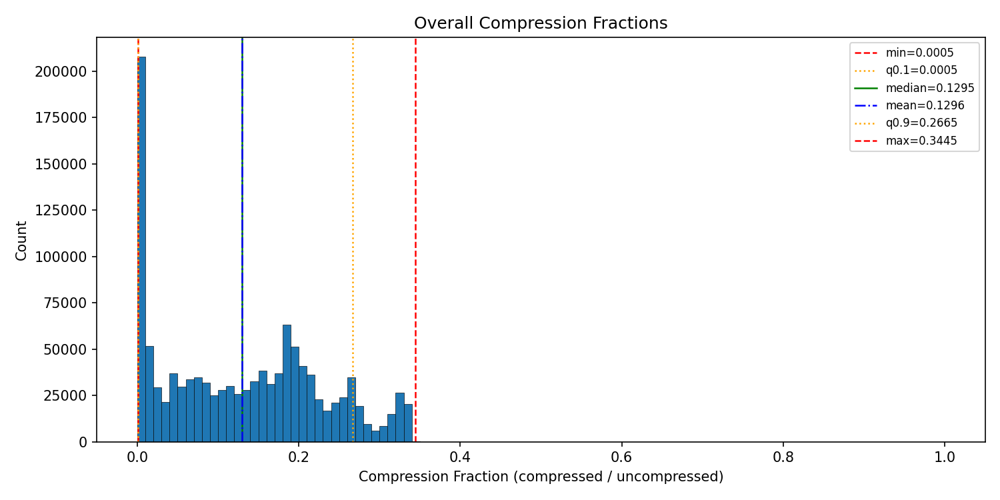

## By Dataset

### ecmwf-ifs-ens-forecast-15-day-0-25-degree

| Facet | Min | Q0.1 | Median | Mean | Q0.9 | Max | Count |
| --- | ---: | ---: | ---: | ---: | ---: | ---: | ---: |
| ecmwf-ifs-ens-forecast-15-day-0-25-degree | 0.0005 | 0.0055 | 0.0795 | 0.1016 | 0.2435 | 0.2725 | 192525 |

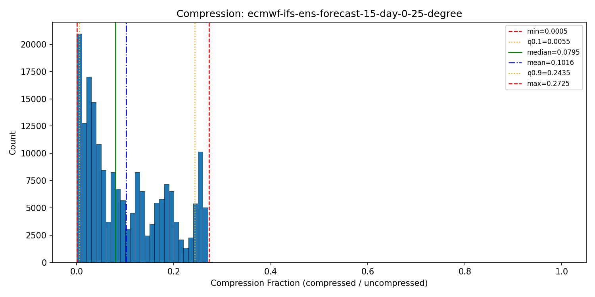

### noaa-gefs-analysis

| Facet | Min | Q0.1 | Median | Mean | Q0.9 | Max | Count |
| --- | ---: | ---: | ---: | ---: | ---: | ---: | ---: |
| noaa-gefs-analysis | 0.0005 | 0.0005 | 0.1175 | 0.1191 | 0.2565 | 0.3445 | 4752 |

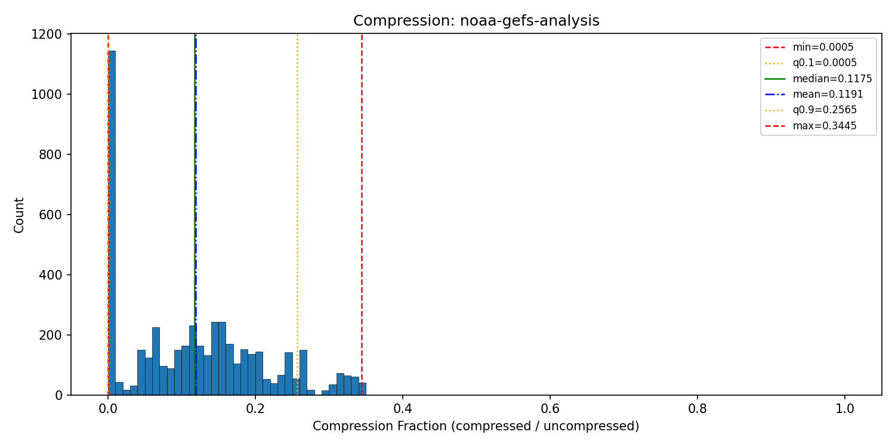

### noaa-gefs-forecast-35-day

| Facet | Min | Q0.1 | Median | Mean | Q0.9 | Max | Count |
| --- | ---: | ---: | ---: | ---: | ---: | ---: | ---: |
| noaa-gefs-forecast-35-day | 0.0005 | 0.0045 | 0.1445 | 0.1359 | 0.2785 | 0.3355 | 349184 |

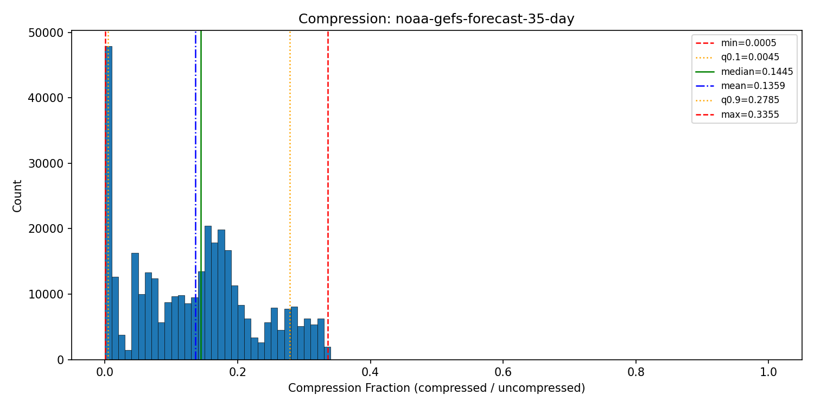

### noaa-gfs-analysis

| Facet | Min | Q0.1 | Median | Mean | Q0.9 | Max | Count |
| --- | ---: | ---: | ---: | ---: | ---: | ---: | ---: |
| noaa-gfs-analysis | 0.0005 | 0.0035 | 0.0975 | 0.1016 | 0.1925 | 0.2625 | 5040 |

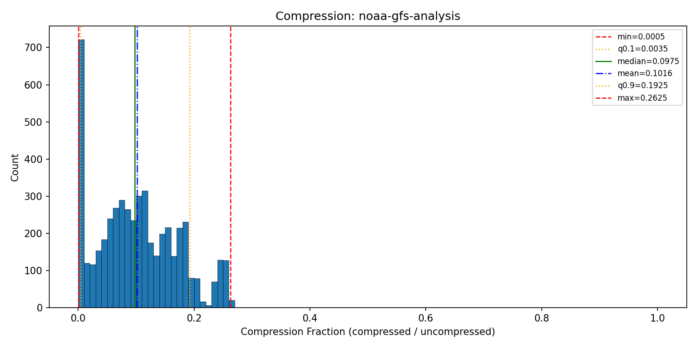

### noaa-gfs-forecast

| Facet | Min | Q0.1 | Median | Mean | Q0.9 | Max | Count |
| --- | ---: | ---: | ---: | ---: | ---: | ---: | ---: |
| noaa-gfs-forecast | 0.0005 | 0.0035 | 0.1905 | 0.1692 | 0.3235 | 0.3415 | 297696 |

### noaa-hrrr-analysis

| Facet | Min | Q0.1 | Median | Mean | Q0.9 | Max | Count |
| --- | ---: | ---: | ---: | ---: | ---: | ---: | ---: |
| noaa-hrrr-analysis | 0.0005 | 0.0005 | 0.0655 | 0.0840 | 0.2105 | 0.2685 | 9776 |

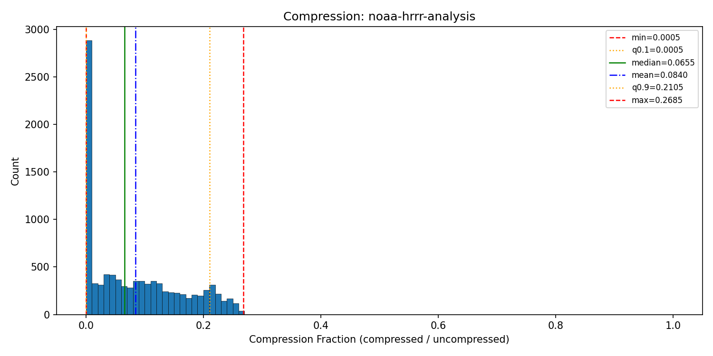

### noaa-hrrr-forecast-48-hour

| Facet | Min | Q0.1 | Median | Mean | Q0.9 | Max | Count |
| --- | ---: | ---: | ---: | ---: | ---: | ---: | ---: |
| noaa-hrrr-forecast-48-hour | 0.0005 | 0.0005 | 0.1115 | 0.1103 | 0.2405 | 0.2885 | 290654 |

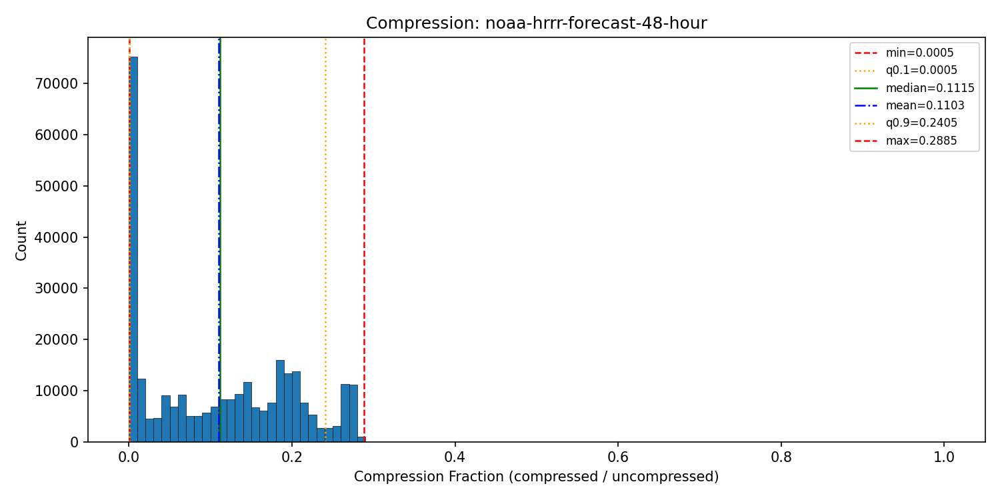

### noaa-mrms-conus-analysis-hourly

| Facet | Min | Q0.1 | Median | Mean | Q0.9 | Max | Count |
| --- | ---: | ---: | ---: | ---: | ---: | ---: | ---: |
| noaa-mrms-conus-analysis-hourly | 0.0005 | 0.0005 | 0.0025 | 0.0046 | 0.0115 | 0.0315 | 19250 |

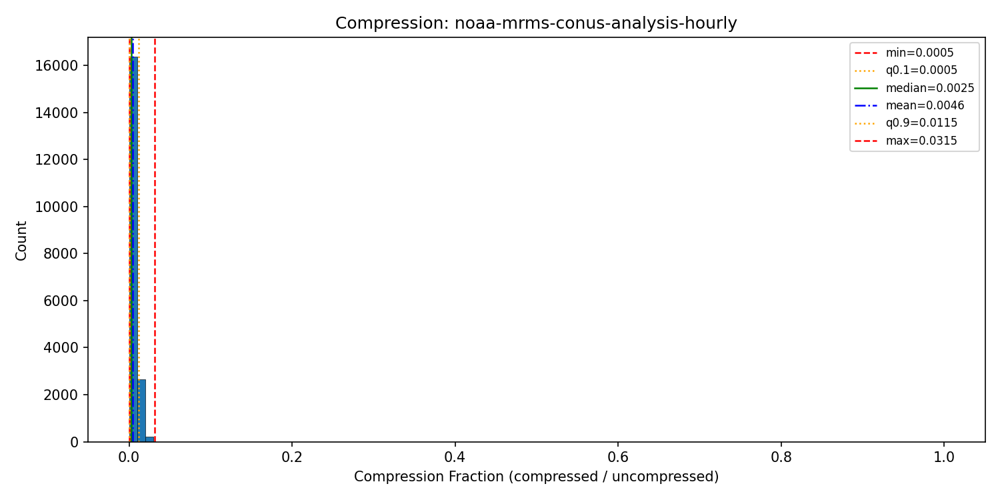

## By Data Variable

### categorical_freezing_rain_surface

| Facet | Min | Q0.1 | Median | Mean | Q0.9 | Max | Count |
| --- | ---: | ---: | ---: | ---: | ---: | ---: | ---: |
| categorical_freezing_rain_surface | 0.0005 | 0.0005 | 0.0005 | 0.0006 | 0.0005 | 0.0035 | 42059 |

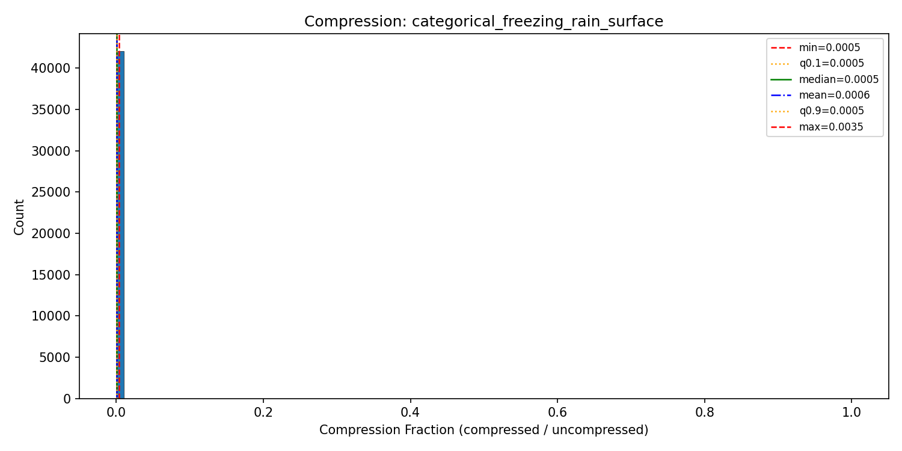

### categorical_ice_pellets_surface

| Facet | Min | Q0.1 | Median | Mean | Q0.9 | Max | Count |
| --- | ---: | ---: | ---: | ---: | ---: | ---: | ---: |
| categorical_ice_pellets_surface | 0.0005 | 0.0005 | 0.0005 | 0.0005 | 0.0005 | 0.0015 | 42059 |

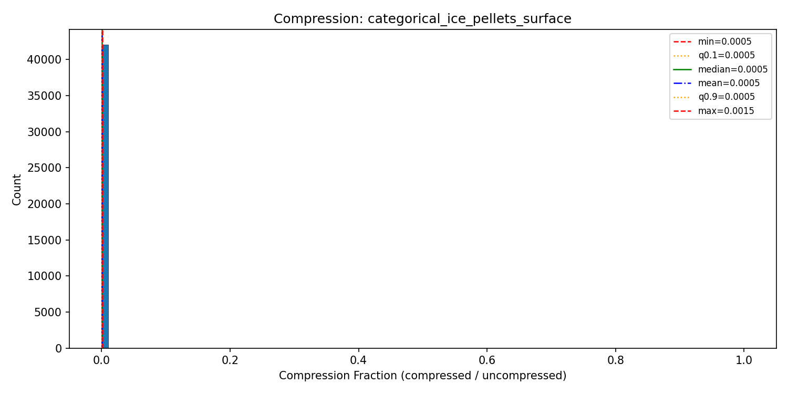

### categorical_precipitation_type_surface

| Facet | Min | Q0.1 | Median | Mean | Q0.9 | Max | Count |
| --- | ---: | ---: | ---: | ---: | ---: | ---: | ---: |
| categorical_precipitation_type_surface | 0.0005 | 0.0005 | 0.0035 | 0.0152 | 0.0505 | 0.0585 | 14440 |

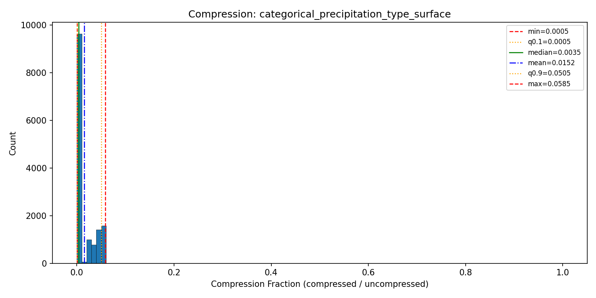

### categorical_rain_surface

| Facet | Min | Q0.1 | Median | Mean | Q0.9 | Max | Count |
| --- | ---: | ---: | ---: | ---: | ---: | ---: | ---: |
| categorical_rain_surface | 0.0005 | 0.0075 | 0.0155 | 0.0152 | 0.0205 | 0.0365 | 42059 |

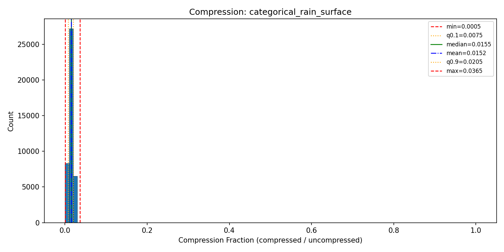

### categorical_snow_surface

| Facet | Min | Q0.1 | Median | Mean | Q0.9 | Max | Count |
| --- | ---: | ---: | ---: | ---: | ---: | ---: | ---: |
| categorical_snow_surface | 0.0005 | 0.0005 | 0.0045 | 0.0046 | 0.0075 | 0.0115 | 42059 |

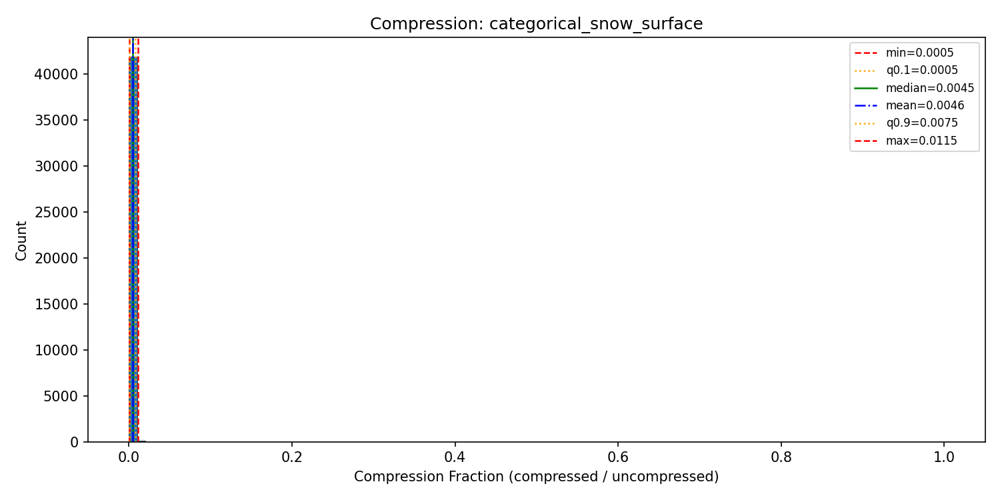

### composite_reflectivity

| Facet | Min | Q0.1 | Median | Mean | Q0.9 | Max | Count |
| --- | ---: | ---: | ---: | ---: | ---: | ---: | ---: |
| composite_reflectivity | 0.0005 | 0.0615 | 0.0885 | 0.0902 | 0.1215 | 0.1835 | 11555 |

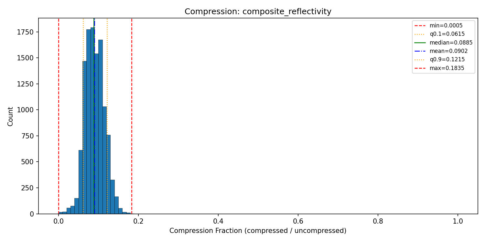

### dew_point_temperature_2m

| Facet | Min | Q0.1 | Median | Mean | Q0.9 | Max | Count |
| --- | ---: | ---: | ---: | ---: | ---: | ---: | ---: |
| dew_point_temperature_2m | 0.0005 | 0.0325 | 0.1805 | 0.1533 | 0.2125 | 0.2615 | 22145 |

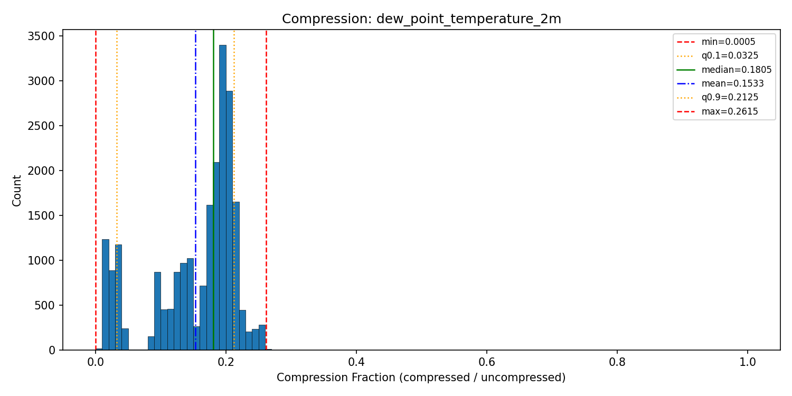

### downward_long_wave_radiation_flux_surface

| Facet | Min | Q0.1 | Median | Mean | Q0.9 | Max | Count |
| --- | ---: | ---: | ---: | ---: | ---: | ---: | ---: |
| downward_long_wave_radiation_flux_surface | 0.0005 | 0.0935 | 0.1545 | 0.1497 | 0.1915 | 0.2265 | 52649 |

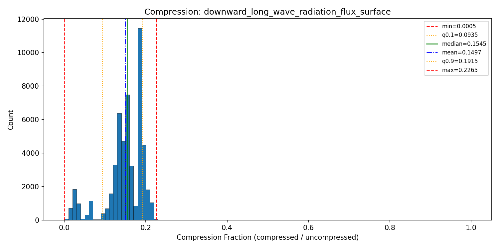

### downward_short_wave_radiation_flux_surface

| Facet | Min | Q0.1 | Median | Mean | Q0.9 | Max | Count |
| --- | ---: | ---: | ---: | ---: | ---: | ---: | ---: |
| downward_short_wave_radiation_flux_surface | 0.0005 | 0.0665 | 0.1375 | 0.1344 | 0.1945 | 0.2125 | 52649 |

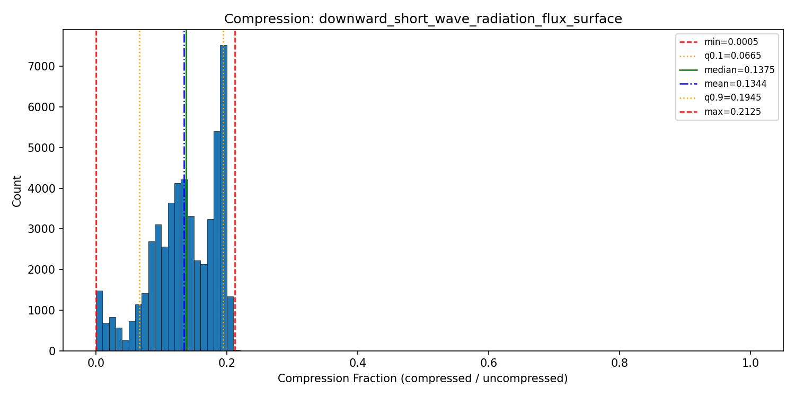

### geopotential_height_500hpa

| Facet | Min | Q0.1 | Median | Mean | Q0.9 | Max | Count |
| --- | ---: | ---: | ---: | ---: | ---: | ---: | ---: |
| geopotential_height_500hpa | 0.0055 | 0.0145 | 0.0685 | 0.0610 | 0.0755 | 0.0845 | 26678 |

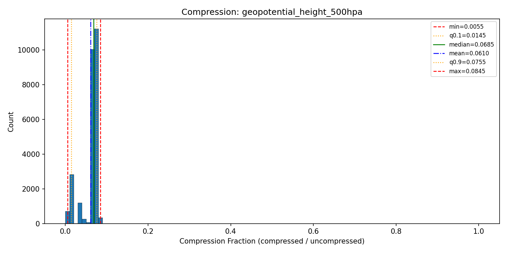

### geopotential_height_850hpa

| Facet | Min | Q0.1 | Median | Mean | Q0.9 | Max | Count |
| --- | ---: | ---: | ---: | ---: | ---: | ---: | ---: |
| geopotential_height_850hpa | 0.0125 | 0.0245 | 0.1165 | 0.0847 | 0.1325 | 0.1415 | 9150 |

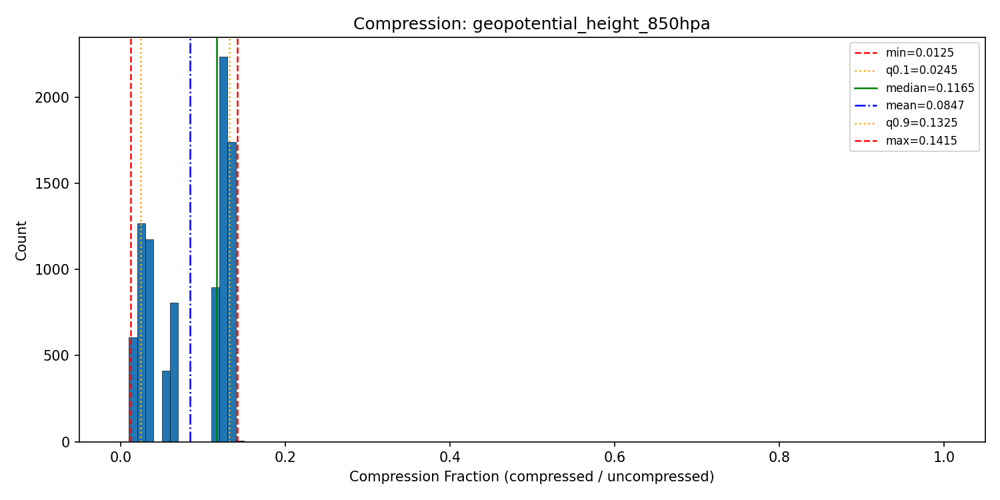

### geopotential_height_925hpa

| Facet | Min | Q0.1 | Median | Mean | Q0.9 | Max | Count |
| --- | ---: | ---: | ---: | ---: | ---: | ---: | ---: |
| geopotential_height_925hpa | 0.0175 | 0.0345 | 0.1555 | 0.1140 | 0.1785 | 0.1845 | 9150 |

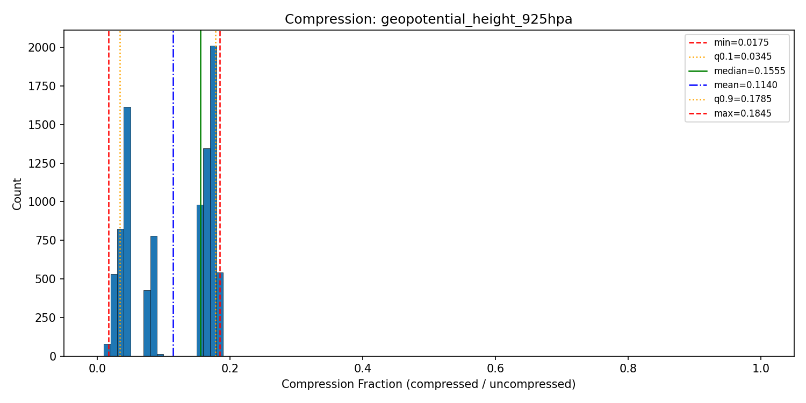

### geopotential_height_cloud_ceiling

| Facet | Min | Q0.1 | Median | Mean | Q0.9 | Max | Count |
| --- | ---: | ---: | ---: | ---: | ---: | ---: | ---: |
| geopotential_height_cloud_ceiling | 0.0005 | 0.0965 | 0.1695 | 0.1720 | 0.2485 | 0.2795 | 42059 |

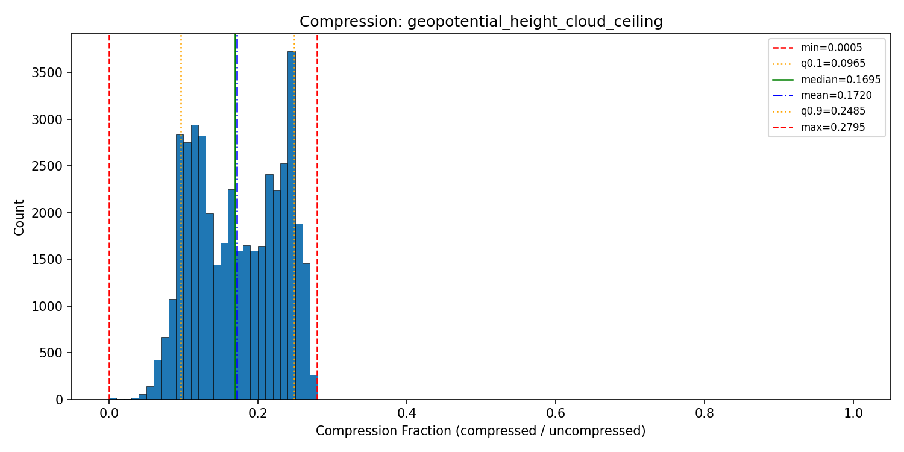

### maximum_temperature_2m

| Facet | Min | Q0.1 | Median | Mean | Q0.9 | Max | Count |
| --- | ---: | ---: | ---: | ---: | ---: | ---: | ---: |
| maximum_temperature_2m | 0.0305 | 0.1435 | 0.1805 | 0.1792 | 0.2185 | 0.2495 | 30504 |

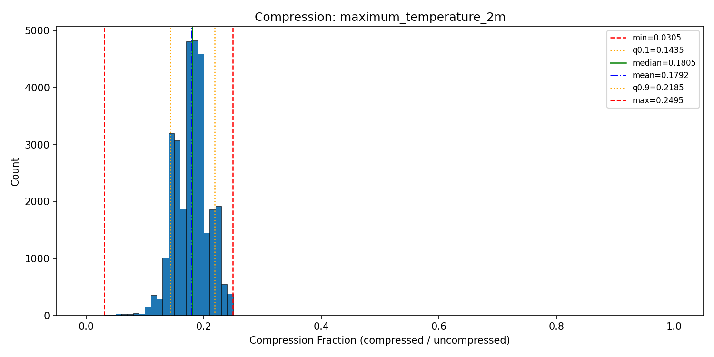

### minimum_temperature_2m

| Facet | Min | Q0.1 | Median | Mean | Q0.9 | Max | Count |
| --- | ---: | ---: | ---: | ---: | ---: | ---: | ---: |
| minimum_temperature_2m | 0.0305 | 0.1495 | 0.1855 | 0.1855 | 0.2275 | 0.2575 | 30504 |

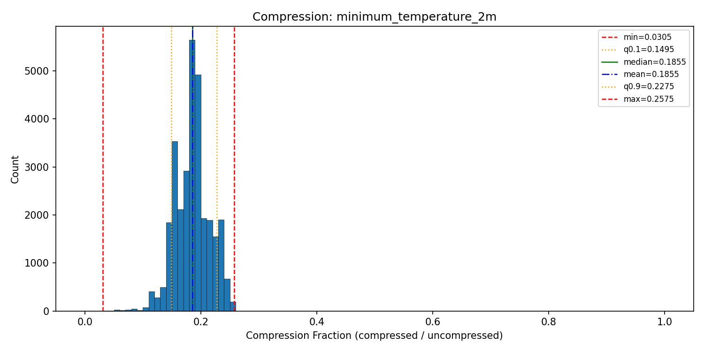

### percent_frozen_precipitation_surface

| Facet | Min | Q0.1 | Median | Mean | Q0.9 | Max | Count |
| --- | ---: | ---: | ---: | ---: | ---: | ---: | ---: |
| percent_frozen_precipitation_surface | 0.0005 | 0.0055 | 0.0895 | 0.0725 | 0.1185 | 0.1625 | 42059 |

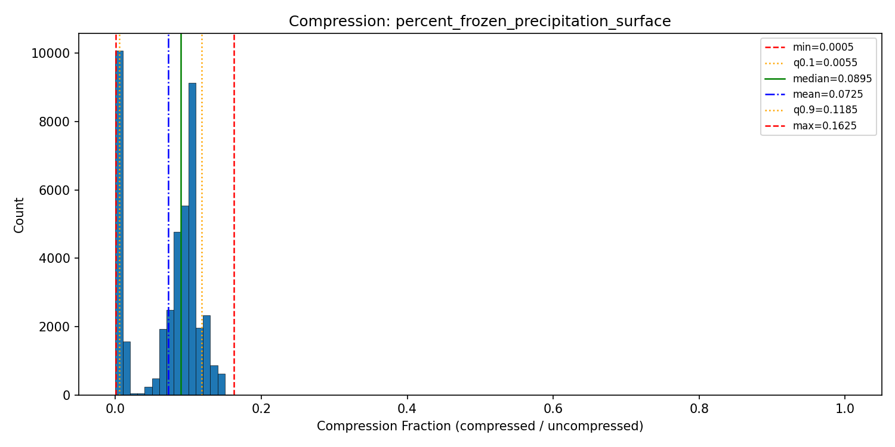

### precipitable_water_atmosphere

| Facet | Min | Q0.1 | Median | Mean | Q0.9 | Max | Count |
| --- | ---: | ---: | ---: | ---: | ---: | ---: | ---: |
| precipitable_water_atmosphere | 0.0005 | 0.1485 | 0.1985 | 0.2038 | 0.2665 | 0.2715 | 42059 |

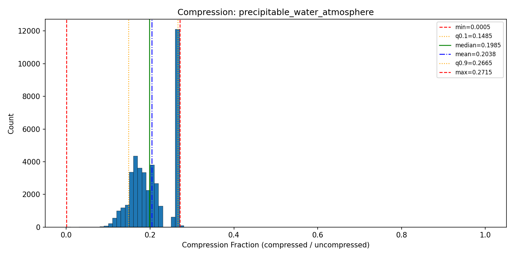

### precipitation_pass_1_surface

| Facet | Min | Q0.1 | Median | Mean | Q0.9 | Max | Count |
| --- | ---: | ---: | ---: | ---: | ---: | ---: | ---: |
| precipitation_pass_1_surface | 0.0005 | 0.0005 | 0.0005 | 0.0033 | 0.0095 | 0.0245 | 3850 |

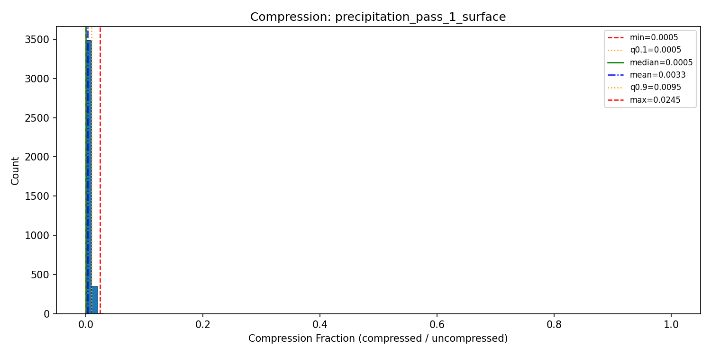

### precipitation_pass_2_surface

| Facet | Min | Q0.1 | Median | Mean | Q0.9 | Max | Count |
| --- | ---: | ---: | ---: | ---: | ---: | ---: | ---: |
| precipitation_pass_2_surface | 0.0005 | 0.0005 | 0.0005 | 0.0031 | 0.0095 | 0.0255 | 3850 |

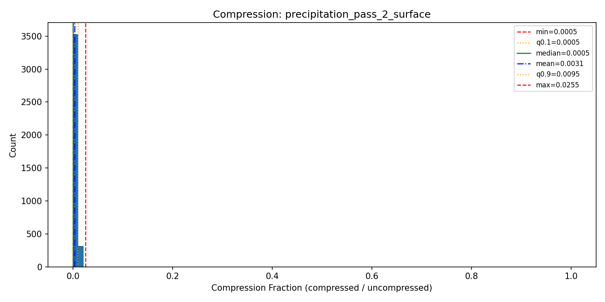

### precipitation_radar_only_surface

| Facet | Min | Q0.1 | Median | Mean | Q0.9 | Max | Count |
| --- | ---: | ---: | ---: | ---: | ---: | ---: | ---: |
| precipitation_radar_only_surface | 0.0005 | 0.0005 | 0.0055 | 0.0073 | 0.0165 | 0.0315 | 3850 |

### precipitation_surface

| Facet | Min | Q0.1 | Median | Mean | Q0.9 | Max | Count |
| --- | ---: | ---: | ---: | ---: | ---: | ---: | ---: |
| precipitation_surface | 0.0005 | 0.0165 | 0.0835 | 0.0805 | 0.1295 | 0.2305 | 56499 |

### pressure_reduced_to_mean_sea_level

| Facet | Min | Q0.1 | Median | Mean | Q0.9 | Max | Count |
| --- | ---: | ---: | ---: | ---: | ---: | ---: | ---: |
| pressure_reduced_to_mean_sea_level | 0.0005 | 0.0395 | 0.0545 | 0.0551 | 0.0725 | 0.1055 | 52649 |

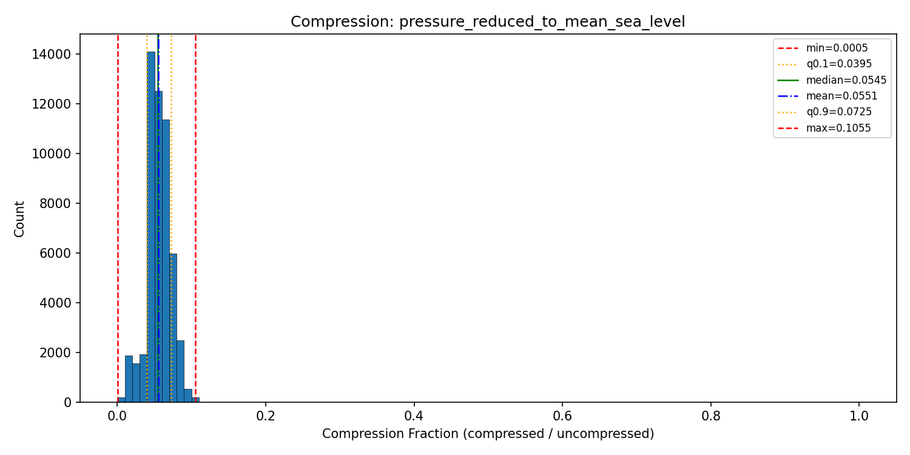

### pressure_surface

| Facet | Min | Q0.1 | Median | Mean | Q0.9 | Max | Count |
| --- | ---: | ---: | ---: | ---: | ---: | ---: | ---: |
| pressure_surface | 0.0005 | 0.0385 | 0.1155 | 0.1027 | 0.1815 | 0.1895 | 52649 |

### relative_humidity_2m

| Facet | Min | Q0.1 | Median | Mean | Q0.9 | Max | Count |
| --- | ---: | ---: | ---: | ---: | ---: | ---: | ---: |
| relative_humidity_2m | 0.0005 | 0.1485 | 0.1915 | 0.1928 | 0.2435 | 0.2785 | 42059 |

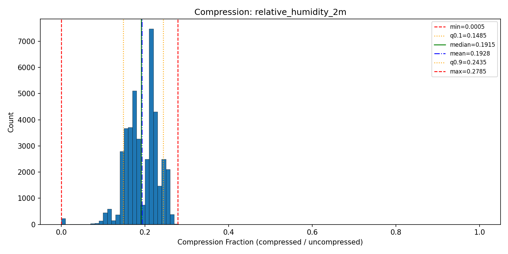

### snow_area_fraction_surface

| Facet | Min | Q0.1 | Median | Mean | Q0.9 | Max | Count |
| --- | ---: | ---: | ---: | ---: | ---: | ---: | ---: |
| snow_area_fraction_surface | 0.0005 | 0.0005 | 0.0055 | 0.0063 | 0.0145 | 0.0375 | 11555 |

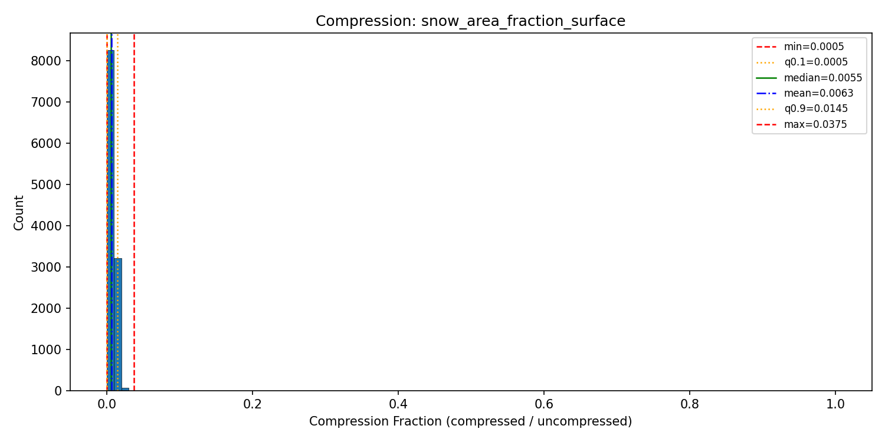

### snow_thickness_surface

| Facet | Min | Q0.1 | Median | Mean | Q0.9 | Max | Count |
| --- | ---: | ---: | ---: | ---: | ---: | ---: | ---: |
| snow_thickness_surface | 0.0005 | 0.0005 | 0.0125 | 0.0267 | 0.0705 | 0.1175 | 11555 |

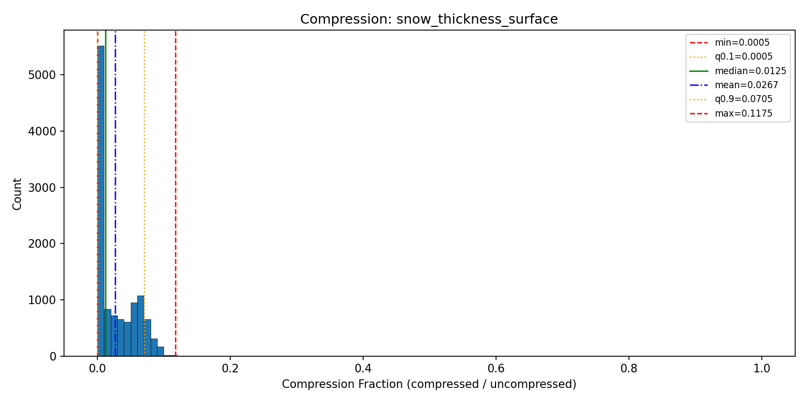

### snow_water_equivalent_surface

| Facet | Min | Q0.1 | Median | Mean | Q0.9 | Max | Count |
| --- | ---: | ---: | ---: | ---: | ---: | ---: | ---: |
| snow_water_equivalent_surface | 0.0005 | 0.0005 | 0.0135 | 0.0287 | 0.0745 | 0.1275 | 11555 |

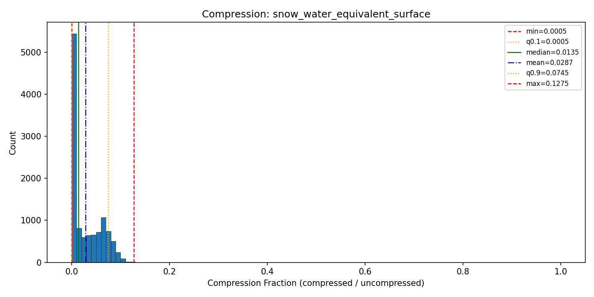

### snowfall_surface

| Facet | Min | Q0.1 | Median | Mean | Q0.9 | Max | Count |
| --- | ---: | ---: | ---: | ---: | ---: | ---: | ---: |
| snowfall_surface | 0.0005 | 0.0005 | 0.0075 | 0.0118 | 0.0295 | 0.0625 | 11555 |

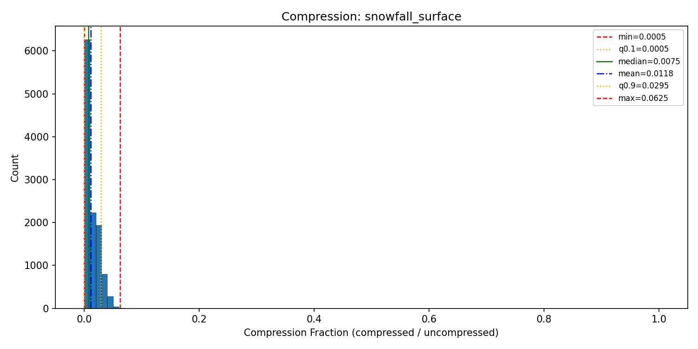

### temperature_2m

| Facet | Min | Q0.1 | Median | Mean | Q0.9 | Max | Count |
| --- | ---: | ---: | ---: | ---: | ---: | ---: | ---: |
| temperature_2m | 0.0005 | 0.1185 | 0.1905 | 0.1800 | 0.2325 | 0.2715 | 52649 |

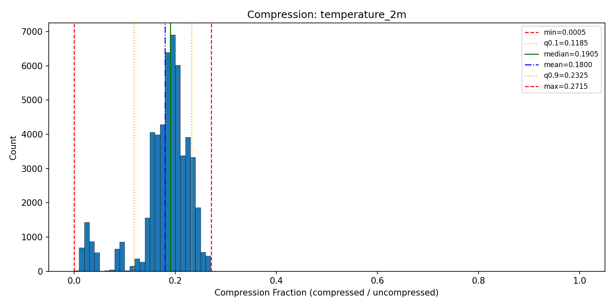

### temperature_850hpa

| Facet | Min | Q0.1 | Median | Mean | Q0.9 | Max | Count |
| --- | ---: | ---: | ---: | ---: | ---: | ---: | ---: |
| temperature_850hpa | 0.0125 | 0.0245 | 0.1775 | 0.1234 | 0.2005 | 0.2145 | 9150 |

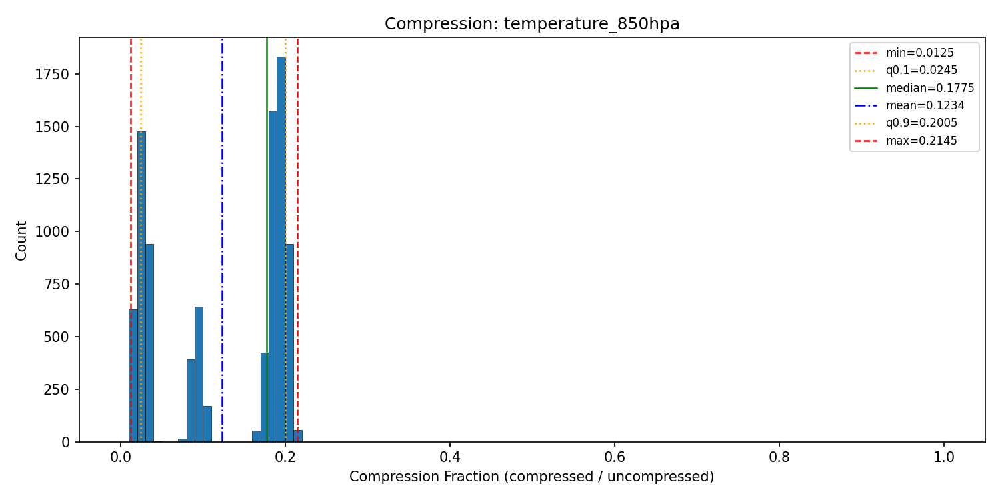

### temperature_925hpa

| Facet | Min | Q0.1 | Median | Mean | Q0.9 | Max | Count |
| --- | ---: | ---: | ---: | ---: | ---: | ---: | ---: |
| temperature_925hpa | 0.0155 | 0.0265 | 0.1745 | 0.1220 | 0.1955 | 0.2205 | 9135 |

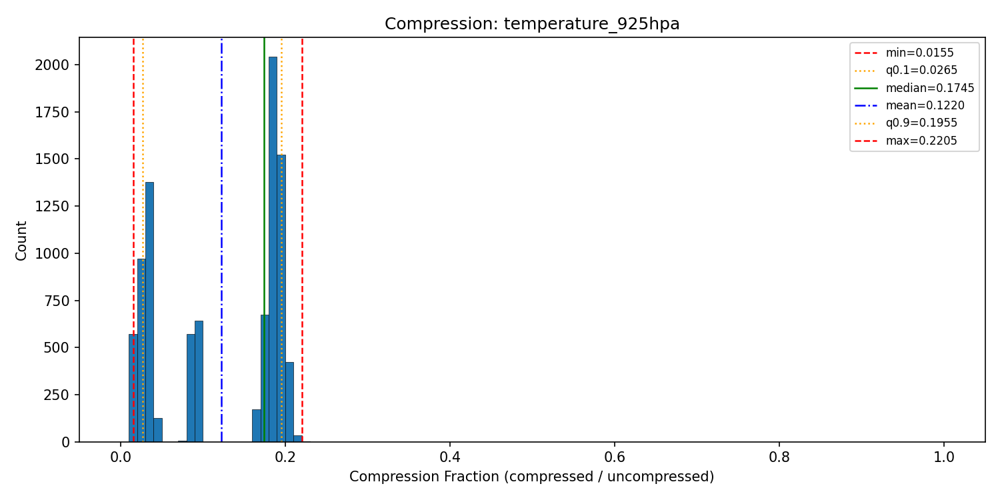

### total_cloud_cover_atmosphere

| Facet | Min | Q0.1 | Median | Mean | Q0.9 | Max | Count |
| --- | ---: | ---: | ---: | ---: | ---: | ---: | ---: |
| total_cloud_cover_atmosphere | 0.0005 | 0.0005 | 0.1635 | 0.1401 | 0.2175 | 0.2705 | 51194 |

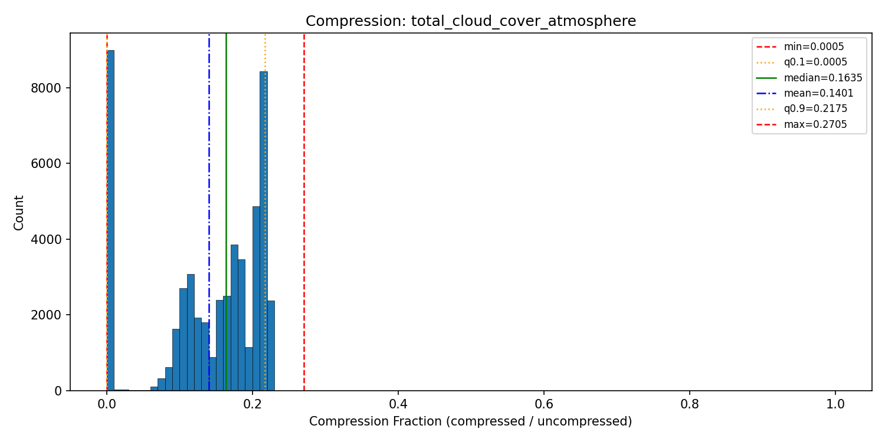

### wind_gust_10m

| Facet | Min | Q0.1 | Median | Mean | Q0.9 | Max | Count |
| --- | ---: | ---: | ---: | ---: | ---: | ---: | ---: |
| wind_gust_10m | 0.0005 | 0.0005 | 0.0325 | 0.0671 | 0.1655 | 0.1735 | 9135 |

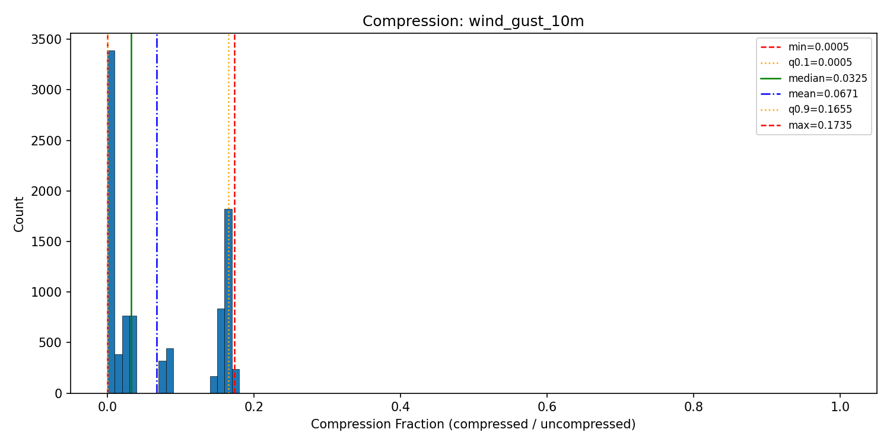

### wind_gust_surface

| Facet | Min | Q0.1 | Median | Mean | Q0.9 | Max | Count |
| --- | ---: | ---: | ---: | ---: | ---: | ---: | ---: |
| wind_gust_surface | 0.0005 | 0.1385 | 0.1865 | 0.1734 | 0.1935 | 0.2265 | 11555 |

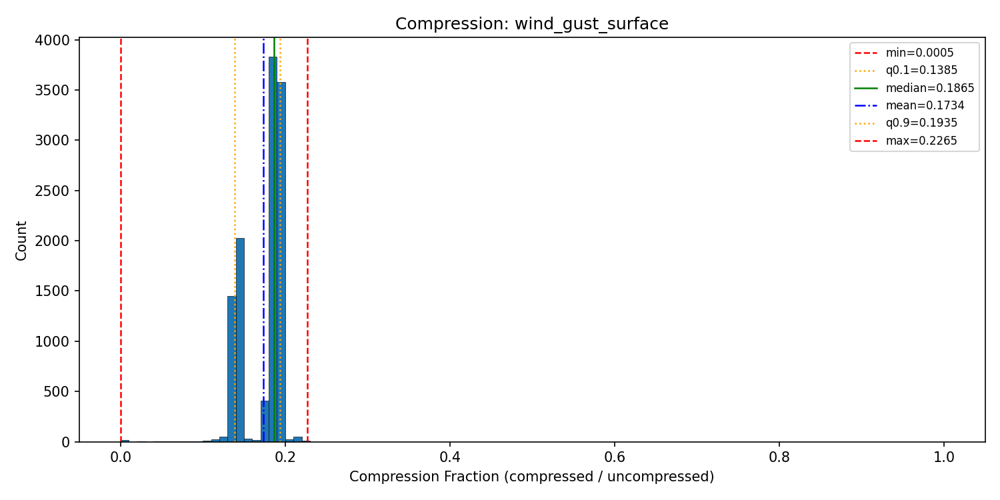

### wind_u_100m

| Facet | Min | Q0.1 | Median | Mean | Q0.9 | Max | Count |
| --- | ---: | ---: | ---: | ---: | ---: | ---: | ---: |
| wind_u_100m | 0.0275 | 0.1185 | 0.2715 | 0.2549 | 0.3225 | 0.3395 | 41094 |

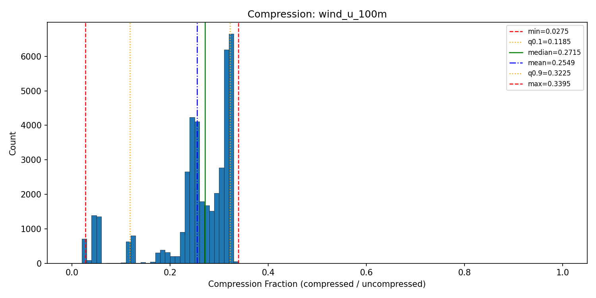

### wind_u_10m

| Facet | Min | Q0.1 | Median | Mean | Q0.9 | Max | Count |
| --- | ---: | ---: | ---: | ---: | ---: | ---: | ---: |
| wind_u_10m | 0.0005 | 0.1765 | 0.2695 | 0.2557 | 0.3245 | 0.3445 | 52649 |

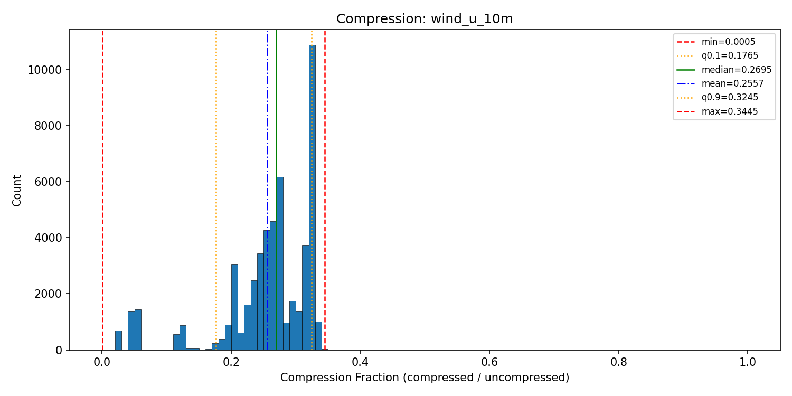

### wind_u_80m

| Facet | Min | Q0.1 | Median | Mean | Q0.9 | Max | Count |
| --- | ---: | ---: | ---: | ---: | ---: | ---: | ---: |
| wind_u_80m | 0.0005 | 0.2035 | 0.2655 | 0.2429 | 0.2795 | 0.2885 | 11555 |

### wind_v_100m

| Facet | Min | Q0.1 | Median | Mean | Q0.9 | Max | Count |
| --- | ---: | ---: | ---: | ---: | ---: | ---: | ---: |
| wind_v_100m | 0.0235 | 0.1245 | 0.2865 | 0.2655 | 0.3335 | 0.3415 | 41094 |

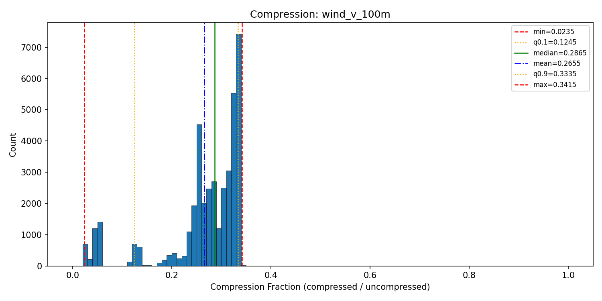

### wind_v_10m

| Facet | Min | Q0.1 | Median | Mean | Q0.9 | Max | Count |
| --- | ---: | ---: | ---: | ---: | ---: | ---: | ---: |
| wind_v_10m | 0.0005 | 0.1825 | 0.2695 | 0.2614 | 0.3345 | 0.3425 | 52649 |

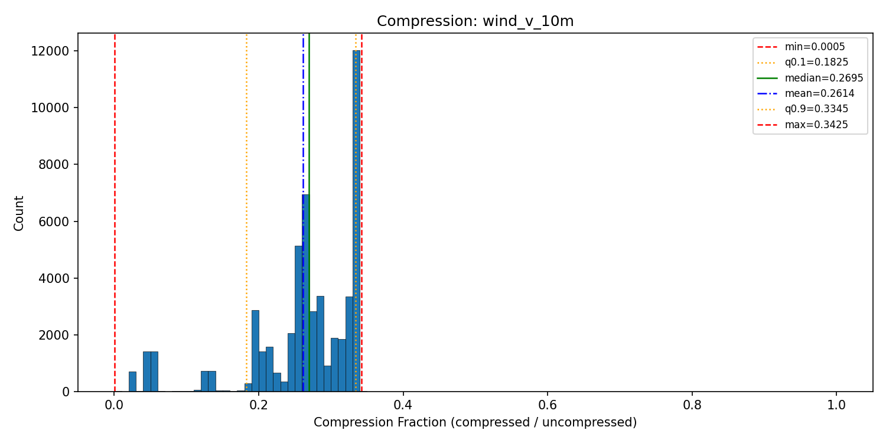

### wind_v_80m

| Facet | Min | Q0.1 | Median | Mean | Q0.9 | Max | Count |
| --- | ---: | ---: | ---: | ---: | ---: | ---: | ---: |
| wind_v_80m | 0.0005 | 0.1995 | 0.2595 | 0.2369 | 0.2725 | 0.2815 | 11555 |

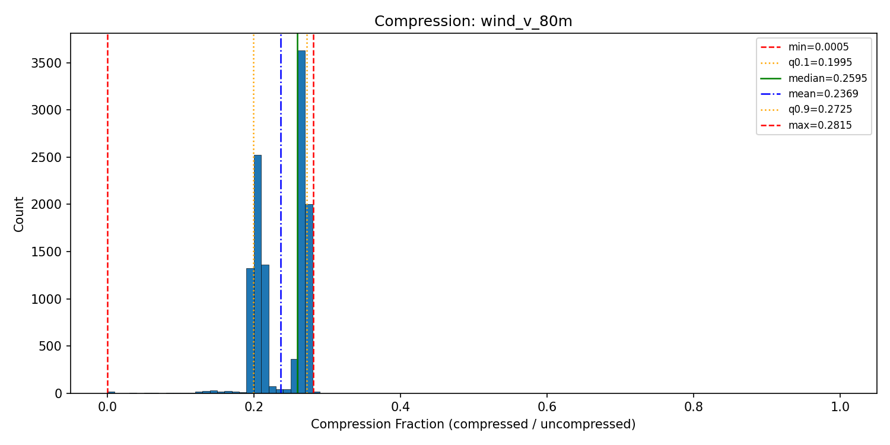

## By (Dataset, Data Variable)

| Facet | Min | Q0.1 | Median | Mean | Q0.9 | Max | Count |
| --- | ---: | ---: | ---: | ---: | ---: | ---: | ---: |
| ecmwf-ifs-ens-forecast-15-day-0-25-degree / categorical_precipitation_type_surface | 0.0005 | 0.0005 | 0.0045 | 0.0198 | 0.0525 | 0.0585 | 10590 |
| ecmwf-ifs-ens-forecast-15-day-0-25-degree / dew_point_temperature_2m | 0.0145 | 0.0195 | 0.1855 | 0.1338 | 0.2205 | 0.2615 | 10590 |
| ecmwf-ifs-ens-forecast-15-day-0-25-degree / downward_long_wave_radiation_flux_surface | 0.0125 | 0.0265 | 0.1155 | 0.0861 | 0.1365 | 0.1595 | 10590 |
| ecmwf-ifs-ens-forecast-15-day-0-25-degree / downward_short_wave_radiation_flux_surface | 0.0005 | 0.0035 | 0.0905 | 0.0914 | 0.1745 | 0.1865 | 10590 |
| ecmwf-ifs-ens-forecast-15-day-0-25-degree / geopotential_height_500hpa | 0.0055 | 0.0125 | 0.0695 | 0.0492 | 0.0775 | 0.0845 | 10590 |
| ecmwf-ifs-ens-forecast-15-day-0-25-degree / geopotential_height_850hpa | 0.0125 | 0.0245 | 0.1165 | 0.0847 | 0.1325 | 0.1415 | 9150 |
| ecmwf-ifs-ens-forecast-15-day-0-25-degree / geopotential_height_925hpa | 0.0175 | 0.0345 | 0.1555 | 0.1140 | 0.1785 | 0.1845 | 9150 |
| ecmwf-ifs-ens-forecast-15-day-0-25-degree / precipitation_surface | 0.0045 | 0.0125 | 0.1115 | 0.1068 | 0.1965 | 0.2305 | 10590 |
| ecmwf-ifs-ens-forecast-15-day-0-25-degree / pressure_reduced_to_mean_sea_level | 0.0085 | 0.0155 | 0.0645 | 0.0542 | 0.0865 | 0.1055 | 10590 |
| ecmwf-ifs-ens-forecast-15-day-0-25-degree / pressure_surface | 0.0145 | 0.0295 | 0.0685 | 0.0754 | 0.1395 | 0.1525 | 10590 |
| ecmwf-ifs-ens-forecast-15-day-0-25-degree / temperature_2m | 0.0165 | 0.0215 | 0.1595 | 0.1227 | 0.2025 | 0.2365 | 10590 |
| ecmwf-ifs-ens-forecast-15-day-0-25-degree / temperature_850hpa | 0.0125 | 0.0245 | 0.1775 | 0.1234 | 0.2005 | 0.2145 | 9150 |
| ecmwf-ifs-ens-forecast-15-day-0-25-degree / temperature_925hpa | 0.0155 | 0.0265 | 0.1745 | 0.1220 | 0.1955 | 0.2205 | 9135 |
| ecmwf-ifs-ens-forecast-15-day-0-25-degree / total_cloud_cover_atmosphere | 0.0005 | 0.0005 | 0.0005 | 0.0021 | 0.0005 | 0.1765 | 9135 |
| ecmwf-ifs-ens-forecast-15-day-0-25-degree / wind_gust_10m | 0.0005 | 0.0005 | 0.0325 | 0.0671 | 0.1655 | 0.1735 | 9135 |
| ecmwf-ifs-ens-forecast-15-day-0-25-degree / wind_u_100m | 0.0275 | 0.0415 | 0.2305 | 0.1626 | 0.2565 | 0.2665 | 10590 |
| ecmwf-ifs-ens-forecast-15-day-0-25-degree / wind_u_10m | 0.0285 | 0.0435 | 0.2325 | 0.1656 | 0.2615 | 0.2715 | 10590 |
| ecmwf-ifs-ens-forecast-15-day-0-25-degree / wind_v_100m | 0.0235 | 0.0405 | 0.2435 | 0.1674 | 0.2605 | 0.2685 | 10590 |
| ecmwf-ifs-ens-forecast-15-day-0-25-degree / wind_v_10m | 0.0245 | 0.0425 | 0.2465 | 0.1693 | 0.2635 | 0.2725 | 10590 |
| noaa-gefs-analysis / categorical_freezing_rain_surface | 0.0005 | 0.0005 | 0.0005 | 0.0005 | 0.0005 | 0.0015 | 216 |
| noaa-gefs-analysis / categorical_ice_pellets_surface | 0.0005 | 0.0005 | 0.0005 | 0.0005 | 0.0005 | 0.0005 | 216 |
| noaa-gefs-analysis / categorical_rain_surface | 0.0005 | 0.0005 | 0.0005 | 0.0042 | 0.0150 | 0.0245 | 216 |
| noaa-gefs-analysis / categorical_snow_surface | 0.0005 | 0.0005 | 0.0005 | 0.0016 | 0.0045 | 0.0085 | 216 |
| noaa-gefs-analysis / downward_long_wave_radiation_flux_surface | 0.0425 | 0.1055 | 0.1435 | 0.1400 | 0.1795 | 0.1815 | 216 |
| noaa-gefs-analysis / downward_short_wave_radiation_flux_surface | 0.0335 | 0.0735 | 0.0975 | 0.1005 | 0.1265 | 0.1645 | 216 |
| noaa-gefs-analysis / geopotential_height_500hpa | 0.0275 | 0.0475 | 0.0625 | 0.0596 | 0.0675 | 0.0705 | 216 |
| noaa-gefs-analysis / geopotential_height_cloud_ceiling | 0.0295 | 0.1080 | 0.1515 | 0.1489 | 0.1885 | 0.1985 | 216 |
| noaa-gefs-analysis / maximum_temperature_2m | 0.0505 | 0.1125 | 0.1455 | 0.1518 | 0.2145 | 0.2275 | 216 |
| noaa-gefs-analysis / minimum_temperature_2m | 0.0485 | 0.1155 | 0.1485 | 0.1554 | 0.2200 | 0.2405 | 216 |
| noaa-gefs-analysis / percent_frozen_precipitation_surface | 0.0005 | 0.0005 | 0.0005 | 0.0266 | 0.1080 | 0.1625 | 216 |
| noaa-gefs-analysis / precipitable_water_atmosphere | 0.0535 | 0.1175 | 0.1565 | 0.1615 | 0.2095 | 0.2225 | 216 |
| noaa-gefs-analysis / precipitation_surface | 0.0425 | 0.0770 | 0.1090 | 0.1114 | 0.1340 | 0.2145 | 216 |
| noaa-gefs-analysis / pressure_reduced_to_mean_sea_level | 0.0005 | 0.0335 | 0.0465 | 0.0469 | 0.0565 | 0.0695 | 216 |
| noaa-gefs-analysis / pressure_surface | 0.0285 | 0.0605 | 0.0865 | 0.0943 | 0.1725 | 0.1745 | 216 |
| noaa-gefs-analysis / relative_humidity_2m | 0.0005 | 0.0005 | 0.0005 | 0.0366 | 0.1505 | 0.2395 | 216 |
| noaa-gefs-analysis / temperature_2m | 0.0585 | 0.1280 | 0.1650 | 0.1721 | 0.2490 | 0.2565 | 216 |
| noaa-gefs-analysis / total_cloud_cover_atmosphere | 0.0505 | 0.1175 | 0.1585 | 0.1626 | 0.2030 | 0.2705 | 216 |
| noaa-gefs-analysis / wind_u_100m | 0.0785 | 0.1945 | 0.2435 | 0.2543 | 0.3370 | 0.3395 | 216 |
| noaa-gefs-analysis / wind_u_10m | 0.0815 | 0.1975 | 0.2480 | 0.2582 | 0.3410 | 0.3445 | 216 |
| noaa-gefs-analysis / wind_v_100m | 0.0805 | 0.2005 | 0.2655 | 0.2659 | 0.3375 | 0.3405 | 216 |
| noaa-gefs-analysis / wind_v_10m | 0.0835 | 0.2025 | 0.2665 | 0.2675 | 0.3390 | 0.3425 | 216 |
| noaa-gefs-forecast-35-day / categorical_freezing_rain_surface | 0.0005 | 0.0005 | 0.0005 | 0.0005 | 0.0005 | 0.0015 | 15872 |
| noaa-gefs-forecast-35-day / categorical_ice_pellets_surface | 0.0005 | 0.0005 | 0.0005 | 0.0005 | 0.0005 | 0.0005 | 15872 |
| noaa-gefs-forecast-35-day / categorical_rain_surface | 0.0075 | 0.0125 | 0.0165 | 0.0167 | 0.0225 | 0.0295 | 15872 |
| noaa-gefs-forecast-35-day / categorical_snow_surface | 0.0015 | 0.0035 | 0.0055 | 0.0057 | 0.0075 | 0.0115 | 15872 |
| noaa-gefs-forecast-35-day / downward_long_wave_radiation_flux_surface | 0.0595 | 0.1285 | 0.1515 | 0.1479 | 0.1665 | 0.1795 | 15872 |
| noaa-gefs-forecast-35-day / downward_short_wave_radiation_flux_surface | 0.0415 | 0.0765 | 0.1245 | 0.1263 | 0.1875 | 0.2125 | 15872 |
| noaa-gefs-forecast-35-day / geopotential_height_500hpa | 0.0385 | 0.0635 | 0.0685 | 0.0688 | 0.0745 | 0.0785 | 15872 |
| noaa-gefs-forecast-35-day / geopotential_height_cloud_ceiling | 0.0565 | 0.0975 | 0.1595 | 0.1526 | 0.2095 | 0.2345 | 15872 |
| noaa-gefs-forecast-35-day / maximum_temperature_2m | 0.0645 | 0.1395 | 0.1685 | 0.1682 | 0.1975 | 0.2495 | 15872 |
| noaa-gefs-forecast-35-day / minimum_temperature_2m | 0.0665 | 0.1455 | 0.1735 | 0.1740 | 0.2085 | 0.2575 | 15872 |
| noaa-gefs-forecast-35-day / percent_frozen_precipitation_surface | 0.0395 | 0.0655 | 0.1005 | 0.0978 | 0.1295 | 0.1495 | 15872 |
| noaa-gefs-forecast-35-day / precipitable_water_atmosphere | 0.0755 | 0.1565 | 0.1815 | 0.1830 | 0.2135 | 0.2275 | 15872 |
| noaa-gefs-forecast-35-day / precipitation_surface | 0.0405 | 0.0825 | 0.1035 | 0.1034 | 0.1245 | 0.1495 | 15872 |
| noaa-gefs-forecast-35-day / pressure_reduced_to_mean_sea_level | 0.0255 | 0.0425 | 0.0485 | 0.0482 | 0.0535 | 0.0585 | 15872 |
| noaa-gefs-forecast-35-day / pressure_surface | 0.0255 | 0.0325 | 0.0485 | 0.0545 | 0.0785 | 0.1515 | 15872 |
| noaa-gefs-forecast-35-day / relative_humidity_2m | 0.0625 | 0.1405 | 0.1645 | 0.1668 | 0.2155 | 0.2385 | 15872 |
| noaa-gefs-forecast-35-day / temperature_2m | 0.0735 | 0.1525 | 0.1815 | 0.1827 | 0.2154 | 0.2715 | 15872 |
| noaa-gefs-forecast-35-day / total_cloud_cover_atmosphere | 0.0675 | 0.1545 | 0.1795 | 0.1779 | 0.2065 | 0.2215 | 15872 |
| noaa-gefs-forecast-35-day / wind_u_100m | 0.1075 | 0.2355 | 0.2705 | 0.2699 | 0.3195 | 0.3305 | 15872 |
| noaa-gefs-forecast-35-day / wind_u_10m | 0.1105 | 0.2405 | 0.2745 | 0.2745 | 0.3265 | 0.3355 | 15872 |
| noaa-gefs-forecast-35-day / wind_v_100m | 0.1125 | 0.2475 | 0.2855 | 0.2835 | 0.3225 | 0.3325 | 15872 |
| noaa-gefs-forecast-35-day / wind_v_10m | 0.1145 | 0.2505 | 0.2865 | 0.2861 | 0.3255 | 0.3355 | 15872 |
| noaa-gfs-analysis / categorical_freezing_rain_surface | 0.0005 | 0.0005 | 0.0005 | 0.0008 | 0.0015 | 0.0015 | 240 |
| noaa-gfs-analysis / categorical_ice_pellets_surface | 0.0005 | 0.0005 | 0.0005 | 0.0007 | 0.0015 | 0.0015 | 240 |
| noaa-gfs-analysis / categorical_rain_surface | 0.0075 | 0.0115 | 0.0205 | 0.0209 | 0.0315 | 0.0365 | 240 |
| noaa-gfs-analysis / categorical_snow_surface | 0.0015 | 0.0035 | 0.0065 | 0.0061 | 0.0085 | 0.0105 | 240 |
| noaa-gfs-analysis / downward_long_wave_radiation_flux_surface | 0.0325 | 0.0645 | 0.1035 | 0.1013 | 0.1306 | 0.1415 | 240 |
| noaa-gfs-analysis / downward_short_wave_radiation_flux_surface | 0.0435 | 0.0714 | 0.1115 | 0.1140 | 0.1726 | 0.1855 | 240 |
| noaa-gfs-analysis / geopotential_height_cloud_ceiling | 0.0535 | 0.0905 | 0.1585 | 0.1573 | 0.2065 | 0.2225 | 240 |
| noaa-gfs-analysis / maximum_temperature_2m | 0.0305 | 0.0585 | 0.0935 | 0.0954 | 0.1316 | 0.1435 | 240 |
| noaa-gfs-analysis / minimum_temperature_2m | 0.0305 | 0.0595 | 0.0920 | 0.0999 | 0.1420 | 0.1585 | 240 |
| noaa-gfs-analysis / percent_frozen_precipitation_surface | 0.0255 | 0.0435 | 0.0760 | 0.0761 | 0.0985 | 0.1115 | 240 |
| noaa-gfs-analysis / precipitable_water_atmosphere | 0.0485 | 0.0985 | 0.1555 | 0.1566 | 0.2045 | 0.2095 | 240 |
| noaa-gfs-analysis / precipitation_surface | 0.0215 | 0.0345 | 0.0600 | 0.0604 | 0.0776 | 0.0855 | 240 |
| noaa-gfs-analysis / pressure_reduced_to_mean_sea_level | 0.0165 | 0.0305 | 0.0475 | 0.0466 | 0.0645 | 0.0695 | 240 |
| noaa-gfs-analysis / pressure_surface | 0.0205 | 0.0395 | 0.0605 | 0.0622 | 0.1005 | 0.1065 | 240 |
| noaa-gfs-analysis / relative_humidity_2m | 0.0385 | 0.0755 | 0.1095 | 0.1192 | 0.1707 | 0.1905 | 240 |
| noaa-gfs-analysis / temperature_2m | 0.0435 | 0.0815 | 0.1300 | 0.1328 | 0.1858 | 0.2105 | 240 |
| noaa-gfs-analysis / total_cloud_cover_atmosphere | 0.0375 | 0.0754 | 0.1175 | 0.1246 | 0.1736 | 0.1835 | 240 |
| noaa-gfs-analysis / wind_u_100m | 0.0585 | 0.1105 | 0.1745 | 0.1852 | 0.2526 | 0.2585 | 240 |
| noaa-gfs-analysis / wind_u_10m | 0.0595 | 0.1125 | 0.1780 | 0.1885 | 0.2585 | 0.2625 | 240 |
| noaa-gfs-analysis / wind_v_100m | 0.0605 | 0.1115 | 0.1845 | 0.1911 | 0.2545 | 0.2595 | 240 |
| noaa-gfs-analysis / wind_v_10m | 0.0615 | 0.1135 | 0.1865 | 0.1933 | 0.2575 | 0.2615 | 240 |
| noaa-gfs-forecast / categorical_freezing_rain_surface | 0.0005 | 0.0005 | 0.0005 | 0.0005 | 0.0005 | 0.0005 | 14176 |
| noaa-gfs-forecast / categorical_ice_pellets_surface | 0.0005 | 0.0005 | 0.0005 | 0.0005 | 0.0005 | 0.0005 | 14176 |
| noaa-gfs-forecast / categorical_rain_surface | 0.0105 | 0.0155 | 0.0185 | 0.0188 | 0.0215 | 0.0295 | 14176 |
| noaa-gfs-forecast / categorical_snow_surface | 0.0025 | 0.0035 | 0.0055 | 0.0053 | 0.0065 | 0.0095 | 14176 |
| noaa-gfs-forecast / downward_long_wave_radiation_flux_surface | 0.1265 | 0.1815 | 0.1865 | 0.1822 | 0.1905 | 0.1945 | 14176 |
| noaa-gfs-forecast / downward_short_wave_radiation_flux_surface | 0.1165 | 0.1745 | 0.1905 | 0.1860 | 0.1985 | 0.2045 | 14176 |
| noaa-gfs-forecast / geopotential_height_cloud_ceiling | 0.1515 | 0.2135 | 0.2405 | 0.2375 | 0.2625 | 0.2795 | 14176 |
| noaa-gfs-forecast / maximum_temperature_2m | 0.1345 | 0.1765 | 0.1915 | 0.1933 | 0.2225 | 0.2335 | 14176 |
| noaa-gfs-forecast / minimum_temperature_2m | 0.1415 | 0.1805 | 0.1975 | 0.2002 | 0.2315 | 0.2405 | 14176 |
| noaa-gfs-forecast / percent_frozen_precipitation_surface | 0.0615 | 0.0875 | 0.0995 | 0.0981 | 0.1065 | 0.1115 | 14176 |
| noaa-gfs-forecast / precipitable_water_atmosphere | 0.1815 | 0.2585 | 0.2645 | 0.2594 | 0.2675 | 0.2715 | 14176 |
| noaa-gfs-forecast / precipitation_surface | 0.0415 | 0.0755 | 0.0835 | 0.0820 | 0.0865 | 0.0915 | 14176 |
| noaa-gfs-forecast / pressure_reduced_to_mean_sea_level | 0.0415 | 0.0595 | 0.0615 | 0.0645 | 0.0715 | 0.0735 | 14176 |
| noaa-gfs-forecast / pressure_surface | 0.0815 | 0.1155 | 0.1185 | 0.1303 | 0.1505 | 0.1525 | 14176 |
| noaa-gfs-forecast / relative_humidity_2m | 0.1405 | 0.2035 | 0.2135 | 0.2093 | 0.2235 | 0.2315 | 14176 |
| noaa-gfs-forecast / temperature_2m | 0.1565 | 0.1885 | 0.2025 | 0.2087 | 0.2425 | 0.2525 | 14176 |
| noaa-gfs-forecast / total_cloud_cover_atmosphere | 0.1455 | 0.2015 | 0.2145 | 0.2095 | 0.2215 | 0.2285 | 14176 |
| noaa-gfs-forecast / wind_u_100m | 0.2155 | 0.2835 | 0.3175 | 0.3081 | 0.3235 | 0.3315 | 14176 |
| noaa-gfs-forecast / wind_u_10m | 0.2165 | 0.3045 | 0.3225 | 0.3142 | 0.3265 | 0.3325 | 14176 |
| noaa-gfs-forecast / wind_v_100m | 0.2275 | 0.2905 | 0.3305 | 0.3198 | 0.3365 | 0.3415 | 14176 |
| noaa-gfs-forecast / wind_v_10m | 0.2265 | 0.3130 | 0.3325 | 0.3244 | 0.3365 | 0.3405 | 14176 |
| noaa-hrrr-analysis / categorical_freezing_rain_surface | 0.0005 | 0.0005 | 0.0005 | 0.0007 | 0.0015 | 0.0035 | 376 |
| noaa-hrrr-analysis / categorical_ice_pellets_surface | 0.0005 | 0.0005 | 0.0005 | 0.0005 | 0.0005 | 0.0015 | 376 |
| noaa-hrrr-analysis / categorical_rain_surface | 0.0005 | 0.0035 | 0.0065 | 0.0073 | 0.0125 | 0.0235 | 376 |
| noaa-hrrr-analysis / categorical_snow_surface | 0.0005 | 0.0005 | 0.0005 | 0.0022 | 0.0065 | 0.0105 | 376 |
| noaa-hrrr-analysis / composite_reflectivity | 0.0045 | 0.0235 | 0.0465 | 0.0488 | 0.0785 | 0.1155 | 376 |
| noaa-hrrr-analysis / dew_point_temperature_2m | 0.0515 | 0.0940 | 0.1805 | 0.1657 | 0.2260 | 0.2515 | 376 |
| noaa-hrrr-analysis / downward_long_wave_radiation_flux_surface | 0.0005 | 0.0005 | 0.1035 | 0.0870 | 0.1365 | 0.1535 | 376 |
| noaa-hrrr-analysis / downward_short_wave_radiation_flux_surface | 0.0265 | 0.0550 | 0.0825 | 0.0827 | 0.1105 | 0.1355 | 376 |
| noaa-hrrr-analysis / geopotential_height_cloud_ceiling | 0.0115 | 0.0455 | 0.0765 | 0.0817 | 0.1300 | 0.1575 | 376 |
| noaa-hrrr-analysis / percent_frozen_precipitation_surface | 0.0005 | 0.0025 | 0.0055 | 0.0108 | 0.0295 | 0.0455 | 376 |
| noaa-hrrr-analysis / precipitable_water_atmosphere | 0.0345 | 0.0905 | 0.1210 | 0.1233 | 0.1605 | 0.1755 | 376 |
| noaa-hrrr-analysis / precipitation_surface | 0.0035 | 0.0205 | 0.0400 | 0.0443 | 0.0755 | 0.1105 | 376 |
| noaa-hrrr-analysis / pressure_reduced_to_mean_sea_level | 0.0145 | 0.0325 | 0.0445 | 0.0435 | 0.0545 | 0.0665 | 376 |
| noaa-hrrr-analysis / pressure_surface | 0.0135 | 0.0320 | 0.0860 | 0.0828 | 0.1235 | 0.1385 | 376 |
| noaa-hrrr-analysis / relative_humidity_2m | 0.0005 | 0.0005 | 0.1480 | 0.1299 | 0.2120 | 0.2315 | 376 |
| noaa-hrrr-analysis / snow_area_fraction_surface | 0.0005 | 0.0005 | 0.0015 | 0.0039 | 0.0110 | 0.0375 | 376 |
| noaa-hrrr-analysis / snow_thickness_surface | 0.0005 | 0.0005 | 0.0015 | 0.0141 | 0.0470 | 0.0995 | 376 |
| noaa-hrrr-analysis / snow_water_equivalent_surface | 0.0005 | 0.0005 | 0.0025 | 0.0163 | 0.0550 | 0.0995 | 376 |
| noaa-hrrr-analysis / snowfall_surface | 0.0005 | 0.0005 | 0.0005 | 0.0079 | 0.0285 | 0.0625 | 376 |
| noaa-hrrr-analysis / temperature_2m | 0.0355 | 0.0755 | 0.1720 | 0.1591 | 0.2315 | 0.2685 | 376 |
| noaa-hrrr-analysis / total_cloud_cover_atmosphere | 0.0315 | 0.0740 | 0.1020 | 0.1034 | 0.1355 | 0.1655 | 376 |
| noaa-hrrr-analysis / wind_gust_surface | 0.0485 | 0.1185 | 0.1790 | 0.1687 | 0.2135 | 0.2265 | 376 |
| noaa-hrrr-analysis / wind_u_10m | 0.0635 | 0.1495 | 0.2175 | 0.2075 | 0.2555 | 0.2675 | 376 |
| noaa-hrrr-analysis / wind_u_80m | 0.0615 | 0.1455 | 0.2035 | 0.1975 | 0.2445 | 0.2555 | 376 |
| noaa-hrrr-analysis / wind_v_10m | 0.0595 | 0.1385 | 0.2140 | 0.2018 | 0.2525 | 0.2675 | 376 |
| noaa-hrrr-analysis / wind_v_80m | 0.0575 | 0.1365 | 0.2000 | 0.1918 | 0.2415 | 0.2515 | 376 |
| noaa-hrrr-forecast-48-hour / categorical_freezing_rain_surface | 0.0005 | 0.0005 | 0.0005 | 0.0007 | 0.0015 | 0.0035 | 11179 |
| noaa-hrrr-forecast-48-hour / categorical_ice_pellets_surface | 0.0005 | 0.0005 | 0.0005 | 0.0005 | 0.0005 | 0.0015 | 11179 |
| noaa-hrrr-forecast-48-hour / categorical_rain_surface | 0.0005 | 0.0055 | 0.0085 | 0.0089 | 0.0125 | 0.0175 | 11179 |
| noaa-hrrr-forecast-48-hour / categorical_snow_surface | 0.0005 | 0.0005 | 0.0015 | 0.0022 | 0.0045 | 0.0085 | 11179 |
| noaa-hrrr-forecast-48-hour / composite_reflectivity | 0.0005 | 0.0635 | 0.0895 | 0.0916 | 0.1225 | 0.1835 | 11179 |
| noaa-hrrr-forecast-48-hour / dew_point_temperature_2m | 0.0005 | 0.1265 | 0.1795 | 0.1714 | 0.2025 | 0.2185 | 11179 |
| noaa-hrrr-forecast-48-hour / downward_long_wave_radiation_flux_surface | 0.0005 | 0.1305 | 0.1865 | 0.1749 | 0.2095 | 0.2265 | 11179 |
| noaa-hrrr-forecast-48-hour / downward_short_wave_radiation_flux_surface | 0.0005 | 0.0875 | 0.1225 | 0.1239 | 0.1635 | 0.1955 | 11179 |
| noaa-hrrr-forecast-48-hour / geopotential_height_cloud_ceiling | 0.0005 | 0.0845 | 0.1185 | 0.1203 | 0.1595 | 0.2315 | 11179 |
| noaa-hrrr-forecast-48-hour / percent_frozen_precipitation_surface | 0.0005 | 0.0045 | 0.0065 | 0.0070 | 0.0105 | 0.0185 | 11179 |
| noaa-hrrr-forecast-48-hour / precipitable_water_atmosphere | 0.0005 | 0.1265 | 0.1625 | 0.1671 | 0.2145 | 0.2345 | 11179 |
| noaa-hrrr-forecast-48-hour / precipitation_surface | 0.0005 | 0.0295 | 0.0455 | 0.0477 | 0.0695 | 0.1135 | 11179 |
| noaa-hrrr-forecast-48-hour / pressure_reduced_to_mean_sea_level | 0.0005 | 0.0425 | 0.0565 | 0.0544 | 0.0665 | 0.0815 | 11179 |
| noaa-hrrr-forecast-48-hour / pressure_surface | 0.0005 | 0.1375 | 0.1815 | 0.1637 | 0.1865 | 0.1895 | 11179 |
| noaa-hrrr-forecast-48-hour / relative_humidity_2m | 0.0005 | 0.1745 | 0.2345 | 0.2155 | 0.2555 | 0.2785 | 11179 |
| noaa-hrrr-forecast-48-hour / snow_area_fraction_surface | 0.0005 | 0.0005 | 0.0055 | 0.0063 | 0.0145 | 0.0245 | 11179 |
| noaa-hrrr-forecast-48-hour / snow_thickness_surface | 0.0005 | 0.0005 | 0.0125 | 0.0271 | 0.0705 | 0.1175 | 11179 |
| noaa-hrrr-forecast-48-hour / snow_water_equivalent_surface | 0.0005 | 0.0005 | 0.0135 | 0.0291 | 0.0755 | 0.1275 | 11179 |
| noaa-hrrr-forecast-48-hour / snowfall_surface | 0.0005 | 0.0005 | 0.0075 | 0.0120 | 0.0295 | 0.0625 | 11179 |
| noaa-hrrr-forecast-48-hour / temperature_2m | 0.0005 | 0.1515 | 0.2075 | 0.1957 | 0.2325 | 0.2475 | 11179 |
| noaa-hrrr-forecast-48-hour / total_cloud_cover_atmosphere | 0.0005 | 0.0925 | 0.1115 | 0.1123 | 0.1355 | 0.1635 | 11179 |
| noaa-hrrr-forecast-48-hour / wind_gust_surface | 0.0005 | 0.1395 | 0.1865 | 0.1736 | 0.1935 | 0.2015 | 11179 |
| noaa-hrrr-forecast-48-hour / wind_u_10m | 0.0005 | 0.2015 | 0.2665 | 0.2432 | 0.2765 | 0.2845 | 11179 |
| noaa-hrrr-forecast-48-hour / wind_u_80m | 0.0005 | 0.2045 | 0.2665 | 0.2444 | 0.2795 | 0.2885 | 11179 |
| noaa-hrrr-forecast-48-hour / wind_v_10m | 0.0005 | 0.1965 | 0.2595 | 0.2369 | 0.2695 | 0.2775 | 11179 |
| noaa-hrrr-forecast-48-hour / wind_v_80m | 0.0005 | 0.1995 | 0.2605 | 0.2384 | 0.2725 | 0.2815 | 11179 |
| noaa-mrms-conus-analysis-hourly / categorical_precipitation_type_surface | 0.0005 | 0.0005 | 0.0025 | 0.0027 | 0.0055 | 0.0125 | 3850 |
| noaa-mrms-conus-analysis-hourly / precipitation_pass_1_surface | 0.0005 | 0.0005 | 0.0005 | 0.0033 | 0.0095 | 0.0245 | 3850 |
| noaa-mrms-conus-analysis-hourly / precipitation_pass_2_surface | 0.0005 | 0.0005 | 0.0005 | 0.0031 | 0.0095 | 0.0255 | 3850 |
| noaa-mrms-conus-analysis-hourly / precipitation_radar_only_surface | 0.0005 | 0.0005 | 0.0055 | 0.0073 | 0.0165 | 0.0315 | 3850 |
| noaa-mrms-conus-analysis-hourly / precipitation_surface | 0.0005 | 0.0005 | 0.0055 | 0.0067 | 0.0145 | 0.0275 | 3850 |

### Individual Histograms

#### ecmwf-ifs-ens-forecast-15-day-0-25-degree / categorical_precipitation_type_surface

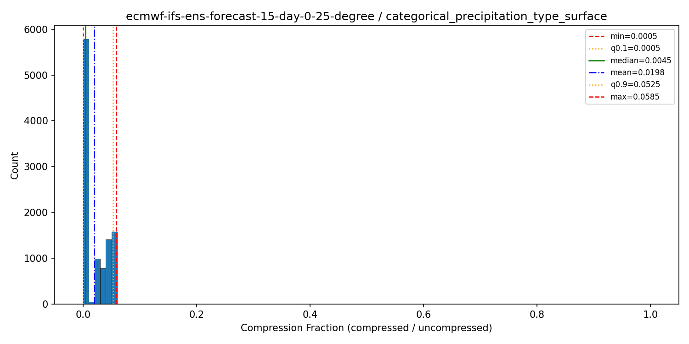

#### ecmwf-ifs-ens-forecast-15-day-0-25-degree / dew_point_temperature_2m

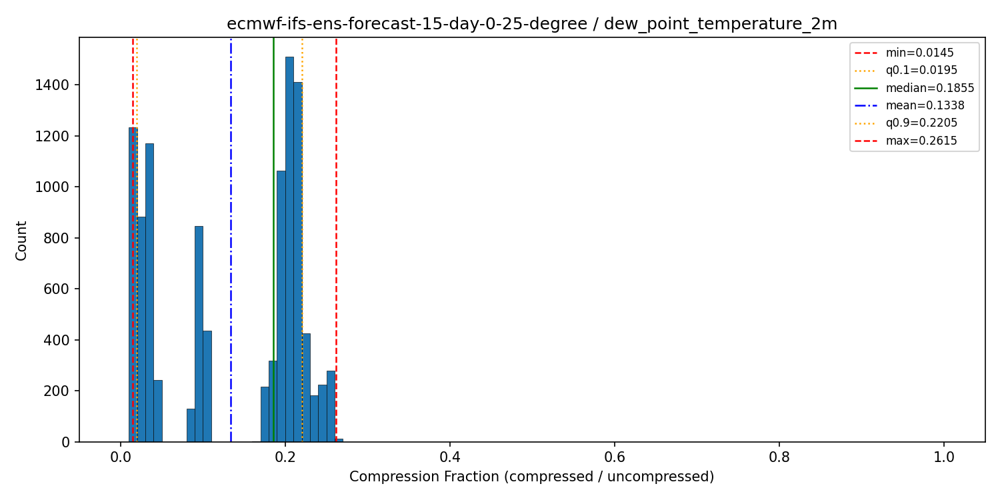

#### ecmwf-ifs-ens-forecast-15-day-0-25-degree / downward_long_wave_radiation_flux_surface

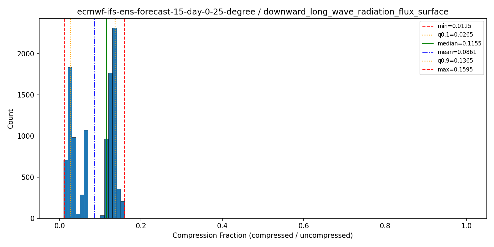

#### ecmwf-ifs-ens-forecast-15-day-0-25-degree / downward_short_wave_radiation_flux_surface

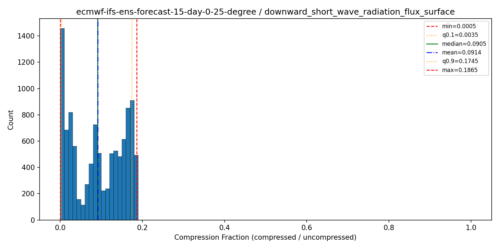

#### ecmwf-ifs-ens-forecast-15-day-0-25-degree / geopotential_height_500hpa

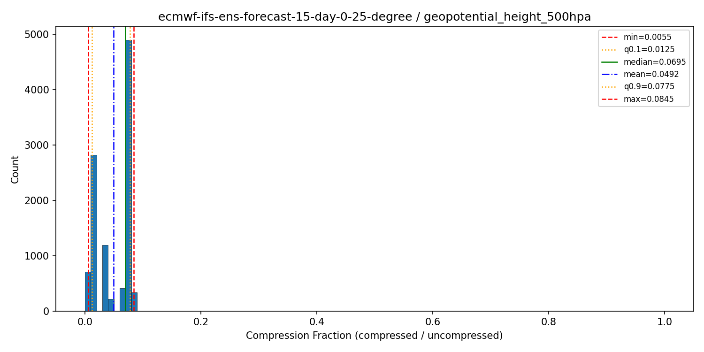

#### ecmwf-ifs-ens-forecast-15-day-0-25-degree / geopotential_height_850hpa

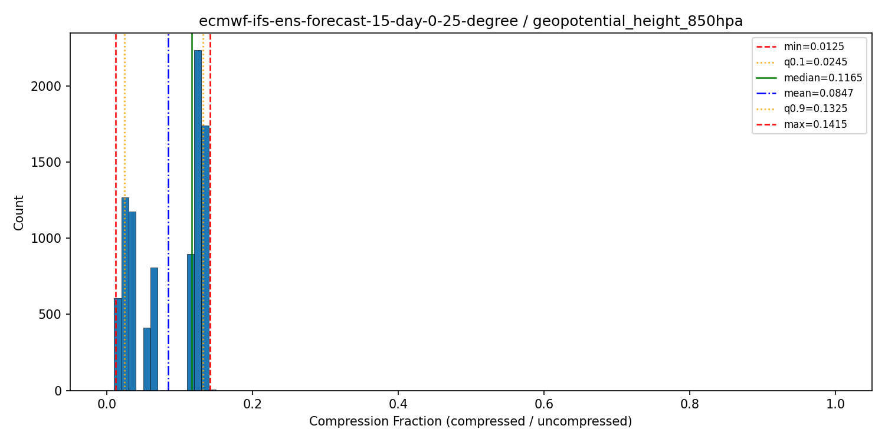

#### ecmwf-ifs-ens-forecast-15-day-0-25-degree / geopotential_height_925hpa


#### ecmwf-ifs-ens-forecast-15-day-0-25-degree / precipitation_surface


#### ecmwf-ifs-ens-forecast-15-day-0-25-degree / pressure_reduced_to_mean_sea_level


#### ecmwf-ifs-ens-forecast-15-day-0-25-degree / pressure_surface

#### ecmwf-ifs-ens-forecast-15-day-0-25-degree / temperature_2m


#### ecmwf-ifs-ens-forecast-15-day-0-25-degree / temperature_850hpa

#### ecmwf-ifs-ens-forecast-15-day-0-25-degree / temperature_925hpa


#### ecmwf-ifs-ens-forecast-15-day-0-25-degree / total_cloud_cover_atmosphere


#### ecmwf-ifs-ens-forecast-15-day-0-25-degree / wind_gust_10m


#### ecmwf-ifs-ens-forecast-15-day-0-25-degree / wind_u_100m


#### ecmwf-ifs-ens-forecast-15-day-0-25-degree / wind_u_10m


#### ecmwf-ifs-ens-forecast-15-day-0-25-degree / wind_v_100m


#### ecmwf-ifs-ens-forecast-15-day-0-25-degree / wind_v_10m


#### noaa-gefs-analysis / categorical_freezing_rain_surface

#### noaa-gefs-analysis / categorical_ice_pellets_surface


#### noaa-gefs-analysis / categorical_rain_surface


#### noaa-gefs-analysis / categorical_snow_surface


#### noaa-gefs-analysis / downward_long_wave_radiation_flux_surface


#### noaa-gefs-analysis / downward_short_wave_radiation_flux_surface


#### noaa-gefs-analysis / geopotential_height_500hpa


#### noaa-gefs-analysis / geopotential_height_cloud_ceiling


#### noaa-gefs-analysis / maximum_temperature_2m


#### noaa-gefs-analysis / minimum_temperature_2m

#### noaa-gefs-analysis / percent_frozen_precipitation_surface


#### noaa-gefs-analysis / precipitable_water_atmosphere


#### noaa-gefs-analysis / precipitation_surface


#### noaa-gefs-analysis / pressure_reduced_to_mean_sea_level


#### noaa-gefs-analysis / pressure_surface

#### noaa-gefs-analysis / relative_humidity_2m


#### noaa-gefs-analysis / temperature_2m


#### noaa-gefs-analysis / total_cloud_cover_atmosphere


#### noaa-gefs-analysis / wind_u_100m


#### noaa-gefs-analysis / wind_u_10m


#### noaa-gefs-analysis / wind_v_100m


#### noaa-gefs-analysis / wind_v_10m


#### noaa-gefs-forecast-35-day / categorical_freezing_rain_surface


#### noaa-gefs-forecast-35-day / categorical_ice_pellets_surface


#### noaa-gefs-forecast-35-day / categorical_rain_surface


#### noaa-gefs-forecast-35-day / categorical_snow_surface


#### noaa-gefs-forecast-35-day / downward_long_wave_radiation_flux_surface


#### noaa-gefs-forecast-35-day / downward_short_wave_radiation_flux_surface


#### noaa-gefs-forecast-35-day / geopotential_height_500hpa


#### noaa-gefs-forecast-35-day / geopotential_height_cloud_ceiling


#### noaa-gefs-forecast-35-day / maximum_temperature_2m


#### noaa-gefs-forecast-35-day / minimum_temperature_2m


#### noaa-gefs-forecast-35-day / percent_frozen_precipitation_surface


#### noaa-gefs-forecast-35-day / precipitable_water_atmosphere


#### noaa-gefs-forecast-35-day / precipitation_surface

#### noaa-gefs-forecast-35-day / pressure_reduced_to_mean_sea_level


#### noaa-gefs-forecast-35-day / pressure_surface


#### noaa-gefs-forecast-35-day / relative_humidity_2m


#### noaa-gefs-forecast-35-day / temperature_2m


#### noaa-gefs-forecast-35-day / total_cloud_cover_atmosphere

#### noaa-gefs-forecast-35-day / wind_u_100m


#### noaa-gefs-forecast-35-day / wind_u_10m


#### noaa-gefs-forecast-35-day / wind_v_100m

#### noaa-gefs-forecast-35-day / wind_v_10m


#### noaa-gfs-analysis / categorical_freezing_rain_surface


#### noaa-gfs-analysis / categorical_ice_pellets_surface


#### noaa-gfs-analysis / categorical_rain_surface


#### noaa-gfs-analysis / categorical_snow_surface


#### noaa-gfs-analysis / downward_long_wave_radiation_flux_surface

#### noaa-gfs-analysis / downward_short_wave_radiation_flux_surface


#### noaa-gfs-analysis / geopotential_height_cloud_ceiling


#### noaa-gfs-analysis / maximum_temperature_2m


#### noaa-gfs-analysis / minimum_temperature_2m

#### noaa-gfs-analysis / percent_frozen_precipitation_surface


#### noaa-gfs-analysis / precipitable_water_atmosphere


#### noaa-gfs-analysis / precipitation_surface


#### noaa-gfs-analysis / pressure_reduced_to_mean_sea_level


#### noaa-gfs-analysis / pressure_surface

#### noaa-gfs-analysis / relative_humidity_2m


#### noaa-gfs-analysis / temperature_2m


#### noaa-gfs-analysis / total_cloud_cover_atmosphere


#### noaa-gfs-analysis / wind_u_100m


#### noaa-gfs-analysis / wind_u_10m


#### noaa-gfs-analysis / wind_v_100m


#### noaa-gfs-analysis / wind_v_10m


#### noaa-gfs-forecast / categorical_freezing_rain_surface


#### noaa-gfs-forecast / categorical_ice_pellets_surface


#### noaa-gfs-forecast / categorical_rain_surface


#### noaa-gfs-forecast / categorical_snow_surface


#### noaa-gfs-forecast / downward_long_wave_radiation_flux_surface


#### noaa-gfs-forecast / downward_short_wave_radiation_flux_surface


#### noaa-gfs-forecast / geopotential_height_cloud_ceiling


#### noaa-gfs-forecast / maximum_temperature_2m


#### noaa-gfs-forecast / minimum_temperature_2m


#### noaa-gfs-forecast / percent_frozen_precipitation_surface


#### noaa-gfs-forecast / precipitable_water_atmosphere


#### noaa-gfs-forecast / precipitation_surface


#### noaa-gfs-forecast / pressure_reduced_to_mean_sea_level


#### noaa-gfs-forecast / pressure_surface


#### noaa-gfs-forecast / relative_humidity_2m


#### noaa-gfs-forecast / temperature_2m


#### noaa-gfs-forecast / total_cloud_cover_atmosphere


#### noaa-gfs-forecast / wind_u_100m


#### noaa-gfs-forecast / wind_u_10m


#### noaa-gfs-forecast / wind_v_100m


#### noaa-gfs-forecast / wind_v_10m


#### noaa-hrrr-analysis / categorical_freezing_rain_surface


#### noaa-hrrr-analysis / categorical_ice_pellets_surface


#### noaa-hrrr-analysis / categorical_rain_surface


#### noaa-hrrr-analysis / categorical_snow_surface


#### noaa-hrrr-analysis / composite_reflectivity


#### noaa-hrrr-analysis / dew_point_temperature_2m


#### noaa-hrrr-analysis / downward_long_wave_radiation_flux_surface


#### noaa-hrrr-analysis / downward_short_wave_radiation_flux_surface


#### noaa-hrrr-analysis / geopotential_height_cloud_ceiling

#### noaa-hrrr-analysis / percent_frozen_precipitation_surface


#### noaa-hrrr-analysis / precipitable_water_atmosphere


#### noaa-hrrr-analysis / precipitation_surface


#### noaa-hrrr-analysis / pressure_reduced_to_mean_sea_level


#### noaa-hrrr-analysis / pressure_surface


#### noaa-hrrr-analysis / relative_humidity_2m


#### noaa-hrrr-analysis / snow_area_fraction_surface


#### noaa-hrrr-analysis / snow_thickness_surface


#### noaa-hrrr-analysis / snow_water_equivalent_surface


#### noaa-hrrr-analysis / snowfall_surface


#### noaa-hrrr-analysis / temperature_2m


#### noaa-hrrr-analysis / total_cloud_cover_atmosphere

#### noaa-hrrr-analysis / wind_gust_surface


#### noaa-hrrr-analysis / wind_u_10m


#### noaa-hrrr-analysis / wind_u_80m

#### noaa-hrrr-analysis / wind_v_10m


#### noaa-hrrr-analysis / wind_v_80m


#### noaa-hrrr-forecast-48-hour / categorical_freezing_rain_surface

#### noaa-hrrr-forecast-48-hour / categorical_ice_pellets_surface


#### noaa-hrrr-forecast-48-hour / categorical_rain_surface


#### noaa-hrrr-forecast-48-hour / categorical_snow_surface


#### noaa-hrrr-forecast-48-hour / composite_reflectivity

#### noaa-hrrr-forecast-48-hour / dew_point_temperature_2m


#### noaa-hrrr-forecast-48-hour / downward_long_wave_radiation_flux_surface


#### noaa-hrrr-forecast-48-hour / downward_short_wave_radiation_flux_surface


#### noaa-hrrr-forecast-48-hour / geopotential_height_cloud_ceiling

#### noaa-hrrr-forecast-48-hour / percent_frozen_precipitation_surface


#### noaa-hrrr-forecast-48-hour / precipitable_water_atmosphere


#### noaa-hrrr-forecast-48-hour / precipitation_surface


#### noaa-hrrr-forecast-48-hour / pressure_reduced_to_mean_sea_level


#### noaa-hrrr-forecast-48-hour / pressure_surface


#### noaa-hrrr-forecast-48-hour / relative_humidity_2m


#### noaa-hrrr-forecast-48-hour / snow_area_fraction_surface


#### noaa-hrrr-forecast-48-hour / snow_thickness_surface

#### noaa-hrrr-forecast-48-hour / snow_water_equivalent_surface


#### noaa-hrrr-forecast-48-hour / snowfall_surface


#### noaa-hrrr-forecast-48-hour / temperature_2m

#### noaa-hrrr-forecast-48-hour / total_cloud_cover_atmosphere


#### noaa-hrrr-forecast-48-hour / wind_gust_surface


#### noaa-hrrr-forecast-48-hour / wind_u_10m


#### noaa-hrrr-forecast-48-hour / wind_u_80m


#### noaa-hrrr-forecast-48-hour / wind_v_10m


#### noaa-hrrr-forecast-48-hour / wind_v_80m


#### noaa-mrms-conus-analysis-hourly / categorical_precipitation_type_surface


#### noaa-mrms-conus-analysis-hourly / precipitation_pass_1_surface


#### noaa-mrms-conus-analysis-hourly / precipitation_pass_2_surface


#### noaa-mrms-conus-analysis-hourly / precipitation_radar_only_surface


#### noaa-mrms-conus-analysis-hourly / precipitation_surface


